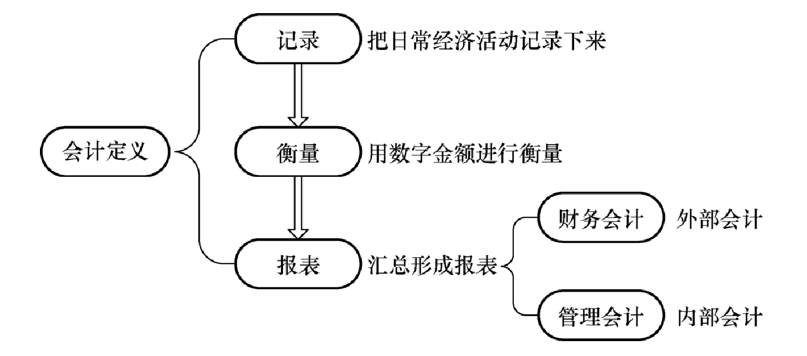
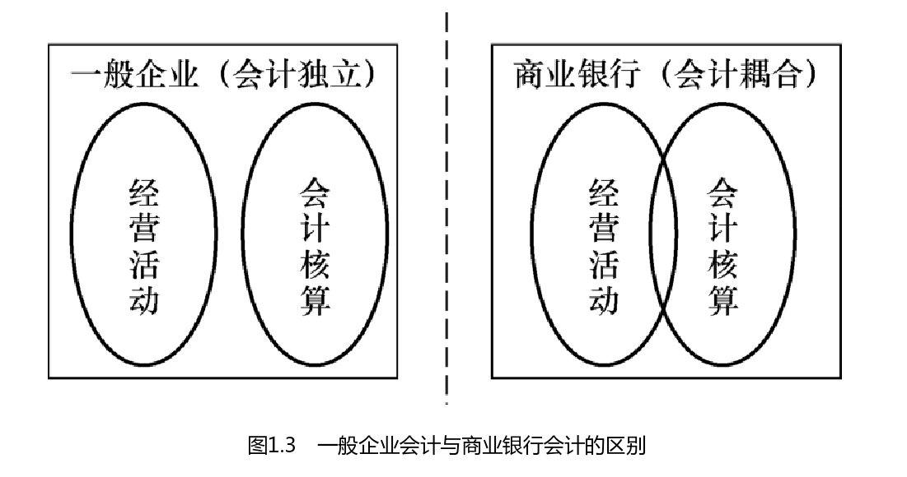

# 会计（Accounting）

## 定义

给会计下一个定义：把日常的经济活动记录下来，并用数字金额进行衡量，并最终汇总形成报表的过程。其中对外进行披露（Disclose）的会计被称为财务会计；而用于内部管理的会计被称为管理会计。

**总的来说，会计的产出是报表**。如果落实到代码，可以假象这么一个业务场景：

1. 有一张交易流水表t_transaction_log。
2. 根据特定的业务需求，将t_transaction_log的每一笔流水汇总，形成中间表t_transaction_temporary。
3. 按照财务会计的业务需求，将t_transaction_temporary的每一条记录汇总，形成t_accounting_disclose。
4. 按照管理会计的业务需求，将t_transaction_temporary的每一条记录汇总，形成t_accounting_internal。

## 会计与银行会计

并非只有银行才有会计，传统企业的业务实现过程要经过商品的生产和销售等过程，其业务部门是在第一线，会计部门在第二线，业务和会计是分开的，或者说：会计属于后勤业务的一部分。但是银行业务有一定的特殊性，主要围绕着“钱如何生钱”，其业务本身就是建立在会计之上，因此无法做到像传统企业那样的独立性。

## 银行业务与银行会计

总的来说，银行业务可分为4种：

1. 负债业务

   指银行筹措资金的业务，主要有存款类（Deposit）业务。比如客户A将一笔资金C按照1年定期1.5%的年利率存入银行，银行向A支付利息。对于银行来说，**如果对资金C不做任何处理，一年后将会欠A一笔钱，可以从这个方面理解“负债业务”的说法。**

2. 资产业务

   指银行运用资金取得收益的业务，主要有贷款类（Loan）业务。比如银行将一笔资金C按照20%的年利率借给客户A，A需要向银行支付利息。**可以理解为将`负债业务`中银行和A的角色互换**。截止目前（20230730）为止，我所开发的系统都属于资产业务类系统，包括case module and approval module of pre-loan system、high risk module and limit adjustment module of in-loan system、settlement  module of post-loan system。

3. 中间业务

   指银行替客户办理从中收取手续费的业务，如代理业务。比如客户A在该银行开设了股票交易账户。在股票交易过程中，银行向A提供交易执行、结算和清算等服务，并收取一定的交易手续费。这些交易手续费构成了银行的中间业务收入。**可以理解为银行作为中间商收取手续费。**

4. 表外业务

   指银行不影响银行资产与负债的业务，如担保业务。比如银行为某大型企业提供信用担保，以帮助该企业获得银行以外的融资。**银行从中收取一定的担保费或手续费**。但这个担保承诺并不直接反映在银行的资产负债表上，但它增加了银行的风险暴露。如果该企业未能履行债务，银行可能需要承担担保责任，对这个债务进行代偿。

   比起表外业务，同样是基于手续费盈利的`中间业务`看起来更安全一点，毕竟表外业务需要承担风险，而`中间业务`不需要。因此，银行在进行表外业务时会进行风险评估和控制（也就是风控流程），以确保其有足够的资本和流动性来应对潜在的风险。

有了银行业务的了解，再看一下银行会计：

1. 表内科目

   反映银行资金实际增减变化而**纳入资产负债表**内的科目。比如现金、存款、贷款、应收账款、债券。

2. 表外科目

   已经发生且尚未涉及资金的实际增减变化，或不涉及资金增减变化而**不列入资产负债表**的科目，**但与银行的业务和风险有关**，如信用担保、衍生品交易、委托业务。

可以看出，这个表内与表外，只要是针对`资产负债表`。**表内会因为事前约定，肯定会被纳入`资产负债表`。而表外与风险有关，实际情况无法提前预知，因此不会纳入`资产负债表`。**
