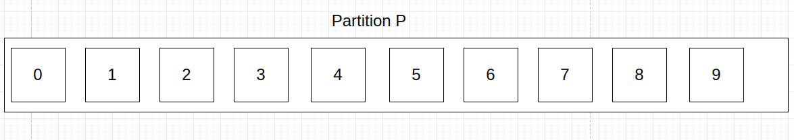

# offset

## 不同Group的offset提交

实际上，同一个Replica Leader可以提交不同Consumer Group的Consumer的offset，这一点和RabbitMQ不同，对于RabbitMQ来说一个Queue的消息被提交后就会被删除，而Replica Leader的消息被提交后，__consumer_offsets只会认为这个Consumer Group已经消费了这条消息，但其他Consumer仍可以消费。打个比方，某个Partition P有10条消息，offset分别从0-9：



假设有两个Group 分别为Group G1、Group G2，其中Group G1提交了offset = 4，Group G2提交了offset = 6的消息：


Consumer直接向Coordinator提交offset，Coordinator将offset提交到_consumer_offsets这个Topic里，以`Consumer Group ID, topicName, Partition ID`格式的Key来区分不同Consumer Group对相同Partition提交的offset。它们在 __consumer_offsets 主题中的记录仍然是独立的，可以区分开来。这样，消费者组 A 和消费者组 B 的 offset 就不会被混淆或互相影响。

当然，消息不会这么一直堆积下去，这会造成磁盘危机，因此需要配合Kafka的消息清除策略管理消息，当Consumer seek一个已被删除的offset会报错。

## offset覆盖

对于同一个Partition、同一个Group而言，上一次被Consumer Pull的消息必须要先Commit，下次Pull才能拿到后面的消息。打个比方，Group A1本次从Partition P pull 了200条消息，offset范围是0-199，要是Group A1下次想Pull到offset >= 200的消息，就必须在本次先commit 199，简答来说就一句话；本次connmit x，下次pull x+n。

值得注意的是，Kafka的offset提交代表提交<=offset的所有消息，可以理解为RabbitMQ的basicAck multiple = true，区别是Kafka不会删除消息，只会标记这个offset之前的消息已经被这个Group消费了，而RabbitMQ会给消息打上删除标记，等待后续进程的删除。也就是说：**当@KafkaListener使用多线程并发消费的时候，要注意commit offset的最终一致性问题，避免低offset的线程比高offset的线程先commit，否则下次会出现重复消费的情况**。

然而在实际使用中，往往消费者是一批一批地pull消息，假设以500为批次pull消息，在业务代码中通常会先处理完这500条消息再手动commit第500条消息的offset，如果第480条消息消费失败，可以先commit第479条消息的offset，**等下次pull的时候再获取到第480条及往后的消息**。

当然，如果因为不可抗力commit了一条在业务上消费失败的数据（假设offset = x）并且想重新消费它，可以通过Consumer的seek(x)方法重新以offset = x为起点消费消息，**当commit了x后__consumer_offsets对于这个Group的已消费offset就会重置为x，所以使用seek后要注意重复消费的问题。**

## 自动还是手动？同步还是异步？

区分offset自动提交和手动提交有2个关键的参数：`enable.auto.commit`和`auto.commit.interval.ms`，当前者为true时开启自动提交，当开启自动提交时，auto.commit.interval.ms控制自动提交的时间间隔。在开启自动提交后，poll获取的消息不需要手动commit，Consumer会在后台开启一个线程定期将手上最新的offset提交。自动提交有个问题：**假设本次poll的消息最大offset是500，在下次自动提交之前我进行第二次poll，有可能会poll到重复消息，即重复消费问题。因此实际项目中大多用手动提交。**而且自动提交还存在一个问题：只要Consumer一直启动着，它就会无限期地向位移主题写入消息。假设Consumer当前消费到了某个主题的最新一条消息，位移是100，之后该主题没有任何新消息产生，故Consumer无消息可消费了，所以位移永远保持在100。由于是自动提交位移，位移主题中会不停地写入位移=100的消息。

即使是手动提交，也分手动同步提交和异步提交，分别是commitSync()和commitAsync()。首先明确Kafka Consumer单次poll会拉取不同Partition的消息，然后维护每个Parition消息的最后偏移量，默认情况下commitSync()和commitAsync()会提交这个“最后偏移量”，区别是commitSync会同步等待Broker的响应，代表提交成功。而commitAsync()只会将偏移量提交到本地缓存，等待后台线程进行异步提交，这一点和Kafka Producer的send()很类似，也就是说：**使用commitAsync也会有自动提交那样的重复消费问题，如果在回调函数里实现重复提交，还会有重复提交覆盖前一次提交的offset的问题**。

除了commitAsync()可以添加回调函数外，commitSync()和commitAsync()都可以指定一个`Map<TopicPartition,OffsetAndMetadata>`用来控制每个Partition要提交的offset偏移量，**从而做到更细粒度的offset提交**。

## 偏移量的一致性与seek

在使用RabbitMQ的时候不用考虑太多细节，只是消息扔到Queue，采用push模型将消息推给Consumer，消息被消费完后打上删除标记即可。能够简单地实现“消息只被消费一次”。上面我说到，“可以通过Consumer的seek(x)方法重新以offset = x为起点消费消息”，Kafka的消息模型比较特殊，它不仅给一份partition维护了多个Group的不同偏移量，而且还采用了pull的消费模型，因此有必要再提一下偏移量的一致性。

首先对于Broker来说，它将**每个Group对于某个Partition的下次消费偏移量维护在__consumer_offsets里**，这是Broker层面的偏移量。其次对于Consumer来说，它将**自身对于某个Partition的下次消费偏移量维护在内存**里（落实到Java客户端的具体层面就是JVM的堆内存）。前者是Group层面的、广义的；后者是Consumer层面的，狭义的。两者之间的一致性维护尤为重要。

在正常情况下，Consumer通过第一次poll()确定了2件事：

1. 自己要消费的Partition。
2. 自身所在的Group在这个Partition的下次消费偏移量x（来自__consumer_offsets）。

于是，Consumer在内存标记这个Partition的下次消费偏移量是x，在下一次poll()的时候在FetchRequest里标记**期望在这个Parition的x开始拉取的消息**，Broker返回了这个Partition的一批消息，假设这批消息名为BatchA，BatchA的最后偏移量是y。在开启手动提交的前提下， Consumer会在处理完BatchA并调用commitSync或commitAsync后，在内存标记这个Partition的下次消费偏移量是y+1，于是在下一次poll()的时候在FetchRequest里标记**期望在这个Parition的y+1开始拉取的消息**。通过这样的方式，维护了Broker与Consumer偏移量的一致性。

在一些特定的场景下，我希望Consumer能够回到某个特定的偏移量消费消息，这时我可以采用seek(partition,offset)方法**重置Consumer在内存对partition标记的下次消费偏移量**。这样，经历了seek() → poll() → commit()后，Broker和Consumer维护的偏移量会重新保持一致性。

# Coordinator与Rebalance

总的来说，有3种情况会导致rebalance：

1. 有新的Consumer加入组，或者有旧的Consumer退出组都会通知Coordinator，于是触发rebalance。
2. Consumer和Coordinator的心跳超时，Coordinator认为Consumer已失活
3. Coordinator发现某个Consumer两次poll()的时间间隔超过max.poll.interval.ms，会认为该消费者消费能力弱，于是将它剔出消费者组。
4. **同1个Topic的Partition数发生变更**，会触发订阅该Topic的所有Group开启Rebalance。

1个Broker有1个Coordinator组件，可以将Coordinator认为是1个Broker，那么，Consumer Group如何确定为它服务的Coordinator在哪台Broker上呢？通过Kafka内部主题__consumer_offsets。目前，Kafka为某个Consumer Group确定Coordinator所在的Broker的算法有2个步骤。

1. 确定由__consumer_offsets主题的哪个分区来保存该Group数据：partitionId=Math.abs(groupId.hashCode() % offsetsTopicPartitionCount)。
2. 找出该分区Leader副本所在的Broker，该Broker即为对应的Coordinator。

首先，Kafka会计算该Group的group.id参数的哈希值。比如有个Group的group.id设置成了test-group，那么它的hashCode值就应该是627841412。其次，Kafka会计算__consumer_offsets的分区数，通常是50个分区，之后将刚才那个哈希值对分区数进行取模加求绝对值计算，即abs(627841412 % 50) = 12。于是就知道了consumer_offsets主题的分区12负责保存这个Group的数据。有了分区号，只需要找出consumer_offsets主题分区12的Leader副本在哪个Broker上就可以了，这个Broker，就是我们要找的Coordinator。

至于rebalance的过程和策略，之前的[笔记](https://github.com/9029HIME/Kafka_Note/blob/master/src/mds/05%20Kafka%E6%B6%88%E8%B4%B9%E8%80%85.md)已经整理过不再赘述，总的来说就是：

1. 由Coordinator选出一个Consumer Group Leader。
2. 由Consumer Leader指定消费方案，回传给Coordinator。
3. Coordinator落实消费方案，通知Group内每个Consumer。

需要注意的是：rebalance由所有Consumer实例共同参与，重新分配所有partition，在rebalance过程中，所有Consumer实例都会停止消费这个Topic的消息，等待Rebalance完成。**当然还有部分rebalance的情况，比如将Consumer A负责的Partition P1迁移给Consumer B进行消费，此时只有Consumer A停止消费Partition P1，其他Consumer照常消费各自的Partition。**

# Group Leader与分区策略

 一个Consumer想要加入Consumer Group时，它会向Coordinator发送JoinGroup请求。第一个加入Consumer Group的Conusmer将成为Group Ledaer。Leader从Coordinator那里获取群组的成员列表（列表中包含了所有最近发送过心跳的消费者，它们被认为还“活着”），并负责为每一个消费者分配分区。它使用实现了PartitionAssignor接口的类来决定哪些分区应该被分配给哪个消费者。

Leader会把分区分配信息发送给Coordinator，Coordinatorr再把这些信息发送给所有的Consumer。每个Consumer只能看到自己的分配信息，只有Leader会持有所有Consumer及其分区所有权的信息。每次再均衡都会经历这个过程。

**也就是说，在正常情况下，每个Consumer都要配置好相同的分区策略，或者写好相同的PartitionAssignor，以保证分区策略的唯一性，因为每个Consumer都有可能称为Leader（除非明确了启动顺序）。**

# 固定消费者

在默认情况下，Consumer的身份标识是临时的。当一个Consumer离开群组时，分配给它的Partition所有权将被撤销（Rebalance）；当该Consumer重新加入时，又会通过Rebalance为其分配一个新的成员ID和新分区。

Kafka提供固定消费者的特性，给Consumer分配一个唯一的**group.instance.id**，让它成为Group的固定成员。通常，当Consumer第一次以固定成员身份加入Group时，Coordinator会按照Rebalance策略给它分配一部分分区。当这个Consumer被关闭时，它不会自动离开群组，它仍然是群组的成员，直到会话超时。当这个Consumer重新加入Group时，它会继续持有之前的身份，并分配到之前所持有的分区。Coordinator缓存了每个成员的分区分配信息，只需要将缓存中的信息发送给重新加入的固定成员，不需要进行Rebalance。

固定消费者何时“真正消失”取决于**session.timeout.ms**参数。可以将这个参数设置得足够大，避免在进行简单的应用程序重启时触发再Rebalance，但又要设置得足够小，以便在出现严重停机时自动Rebalance，避免这些分区的读取进度出现较大的滞后。


# Poll可不是单纯地拉消息

poll不只是获取数据那么简单。在第一次调用poll()方法时，Consumer需要找到GroupCoordinator，加入群组，并接收分配给它的分区。如果Coordinator触发了Rebalance，则整个Consumer接收Rebalance后分配的分区策略的过程也会在轮询里进行，包括执行相关的回调。所以，除了业务上的消费逻辑，回调里可能出现的错误最后都会转化成poll()方法抛出的异常。

# Poll与回调

通过实现ConsumerRebalanceListener的回调方法，并且将ConsumerRebalanceListener对象通过consumer.subscribe()方法注入进去，从而实现自定义回调逻辑。

`public void onPartitionsAssigned(Collection<TopicPartition> partitions)`

会在获取重新分配分区之后以及消费者开始读取消息之前被调用。

`public void onPartitionsRevoked(Collection<TopicPartition> partitions)`

Consumer放弃对分区的所有权时调用，可能是因为Rebalance+Poll时调用，也有可能是Consumer主动关闭时调用。

`onPartitionRevoked`会在rebalance操作之前调用，一般用于提交偏移量，`onPartitionAssigned`会在rebalance操作之后调用，一般拉取新的分配区的偏移量。**值得注意的是，实例代码里的onPartitionsAssigned逻辑会在客户端Rebalance时默认执行（默认会在Rebalance后以Group对于这个Partition的最新偏移量为起点消费），无需显示定义，这里只是参考而已**：

```java
public class SaveOffsetOnRebalance implements ConsumerRebalanceListener {
    private Consumer<String, String> consumer;
    private Map<TopicPartition,Map<TopicPartition, OffsetAndMetadata>> need2BeCommited = new HashMap();
    
    public SaveOffsetOnRebalance(Consumer<String, String> consumer) {
        this.consumer = consumer;
    }
 
    @Override
    public void onPartitionsRevoked(Collection<TopicPartition> collection) {
        for(TopicPartition partition : collection){
            Map<TopicPartition, OffsetAndMetadata> toCommit = need2BeCommited.get(partition);
            consumer.commitSync(toCommit);
        }
    }
 
    @Override
    public void onPartitionsAssigned(Collection<TopicPartition> collection) {
        for (TopicPartition partition : collection) {
            // 获取这个分区在__consumer_offset的最新偏移量
            OffsetAndMetadata offset = consumer.committed(partition);
            // 更新本地偏移量，下次poll时从这开始消费
            consumer.seek(partition, offset.offset());
        }
    }
}
```

# 心跳间隔与心跳超时与poll间隔超时

心跳间隔是heartbeat.interval.ms，指的是**Consumer向Coordinator发送心跳的间隔**。

心跳超时是session.timeout.ms（上面的固定消费者），它指的是**Coordinator最大能容忍Consumer不发心跳的时间间隔**，当超出时间后，Coordinator将认为这个Consumer已下线，并触发Rebalance。

Poll间隔超时是max.poll.interval.ms，**它是由Consumer自己检测的，超时后给Coordinator发一个“离开群组”的请求**，让Coordinator知道自己已经“消费能力不足”，必须进行Rebalance。

# auto.offset.reset

在上面已经讲过，偏移量是以Consumer Group的形式进行区分，在同一个Partition内每个Consumer Group都有自己的偏移量，互不影响。也就是说：哪怕Consumer Group内因为Rebalance导致Consumer消费新的partition，这个Consumer也会以这个Group已提交的偏移量为起点继续消费。

但有一种情况是Consumer Group第一次消费这个Topic，而这个Topic的Partition内在之前已经有消息存在，那么这个Group在连接上Topic后该消费哪个数据呢？由auto.offset.reset配置决定：

1. latest（默认）：Group只消费建立连接后新到来的消息。
2. earliest：Group从这个Partition可追溯的第一条消息开始消费。

# offsets.retention.minutes

即使有了auto.offset.reset的情况下，也不代表这个配置在Group的生命周期只会使用1次。Coordinator虽然会保存Group对于某个Partition已消费的偏移量，但这个“保存”并非永久的，而是由offsets.retention.minutes确定的。当某个Consumer Group完全失联（Group内所有Consumer均下线）并超过这个阈值后，Coordinator会删除这个Group已消费的offset，**这样下次这个Group重启后，它也会像一个新的Group一样重新根据auto.offset.reset的设置进行消费**。

# 优雅关闭

通过shutdownHook线程调用consumer.wakeup()，它的作用是调用之后，consumer下次poll会抛出WakeupException，这时候就需要poll()逻辑进行特殊处理，通过catch WakeupException知道自己需要关闭，于是在poll线程调用consumer.close()，它的作用是提交还没有提交的偏移量（如果开启自动提交），并向消费者协调器发送消息，告知自己正在离开群组。Coordinator会立即触发再均衡，被关闭的消费者所拥有的分区将被重新分配给群组里其他的消费者，不需要等待会话超时。**如果没有开启自动提交也可以在catch逻辑里提交已处理的消息偏移量。**

总的来说，直接暴力关闭Consumer也是可以的（不考虑业务流程的兜底，仅考虑消息的兜底），顶多是rebalance后另一个Consumer可能会收到已处理的消息（重复消费）。**但wakeup()和close()这套组合拳有两大好处：1. 可以在poll阶段知道该关闭，并在catch代码块里执行优雅关闭逻辑 2. 主动通知Coordinator进行Rebalance，减少消息无法被处理的空档期。**
