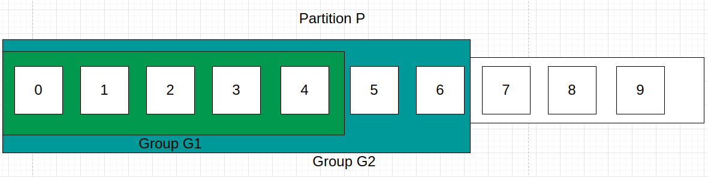

# offset

## 不同Group的offset提交

实际上，同一个Replica Leader可以提交不同Consumer Group的Consumer的offset，这一点和RabbitMQ不同，对于RabbitMQ来说一个Queue的消息被提交后就会被删除，而Replica Leader的消息被提交后，__consumer_offsets只会认为这个Consumer Group已经消费了这条消息，但其他Consumer仍可以消费。打个比方，某个Partition P有10条消息，offset分别从0-9：

假设有两个Group 分别为Group G1、Group G2，其中Group G1提交了offset = 4，Group G2提交了offset = 6的消息：

Consumer直接向Coordinator提交offset，Coordinator将offset提交到_consumer_offsets这个Topic里，以`Consumer Group ID, topicName, Partition ID`格式的Key来区分不同Consumer Group对相同Partition提交的offset。它们在 __consumer_offsets 主题中的记录仍然是独立的，可以区分开来。这样，消费者组 A 和消费者组 B 的 offset 就不会被混淆或互相影响。

当然，消息不会这么一直堆积下去，这会造成磁盘危机，因此需要配合Kafka的消息清除策略管理消息，当Consumer seek一个已被删除的offset会报错。

## offset覆盖

对于同一个Partition、同一个Group而言，上一次被Consumer Pull的消息必须要先Commit，下次Pull才能拿到后面的消息。打个比方，Group A1本次从Partition P pull 了200条消息，offset范围是0-199，要是Group A1下次想Pull到offset >= 200的消息，就必须在本次先commit 199，简答来说就一句话；本次connmit x，下次pull x+n。

值得注意的是，Kafka的offset提交代表提交<=offset的所有消息，可以理解为RabbitMQ的basicAck multiple = true，区别是Kafka不会删除消息，只会标记这个offset之前的消息已经被这个Group消费了，而RabbitMQ会给消息打上删除标记，等待后续进程的删除。也就是说：**当@KafkaListener使用多线程并发消费的时候，要注意commit offset的最终一致性问题，避免低offset的线程比高offset的线程先commit，否则下次会出现重复消费的情况**。

然而在实际使用中，往往消费者是一批一批地pull消息，假设以500为批次pull消息，在业务代码中通常会先处理完这500条消息再手动commit第500条消息的offset，如果第480条消息消费失败，可以先commit第479条消息的offset，**等下次pull的时候再获取到第480条及往后的消息**。

当然，如果因为不可抗力commit了一条在业务上消费失败的数据（假设offset = x）并且想重新消费它，可以通过Consumer的seek(x)方法重新以offset = x为起点消费消息，**当commit了x后__consumer_offsets对于这个Group的已消费offset就会重置为x，所以使用seek后要注意重复消费的问题。**

## 自动还是手动？同步还是异步？

区分offset自动提交和手动提交有2个关键的参数：`enable.auto.commit`和`auto.commit.interval.ms`，当前者为true时开启自动提交，当开启自动提交时，auto.commit.interval.ms控制自动提交的时间间隔。在开启自动提交后，poll获取的消息不需要手动commit，Consumer会在后台开启一个线程定期将手上最新的offset提交。自动提交有个问题：**假设本次poll的消息最大offset是500，在下次自动提交之前我进行第二次poll，有可能会poll到重复消息，即重复消费问题。因此实际项目中大多用手动提交。**而且自动提交还存在一个问题：只要Consumer一直启动着，它就会无限期地向位移主题写入消息。假设Consumer当前消费到了某个主题的最新一条消息，位移是100，之后该主题没有任何新消息产生，故Consumer无消息可消费了，所以位移永远保持在100。由于是自动提交位移，位移主题中会不停地写入位移=100的消息。

即使是手动提交，也分手动同步提交和异步提交，分别是commitSync()和commitAsync()。首先明确Kafka Consumer单次poll会拉取不同Partition的消息，然后维护每个Parition消息的最后偏移量，默认情况下commitSync()和commitAsync()会提交这个“最后偏移量”，区别是commitSync会同步等待Broker的响应，代表提交成功。而commitAsync()只会将偏移量提交到本地缓存，等待后台线程进行异步提交，这一点和Kafka Producer的send()很类似，也就是说：**使用commitAsync也会有自动提交那样的重复消费问题，如果在回调函数里实现重复提交，还会有重复提交覆盖前一次提交的offset的问题**。

除了commitAsync()可以添加回调函数外，commitSync()和commitAsync()都可以指定一个`Map<TopicPartition,OffsetAndMetadata>`用来控制每个Partition要提交的offset偏移量，**从而做到更细粒度的offset提交**。

# Coordinator与Rebalance

总的来说，有3种情况会导致rebalance：

1. 有新的Consumer加入组，或者有旧的Consumer退出组都会通知Coordinator，于是触发rebalance。
2. Consumer和Coordinator的心跳超时，Coordinator认为Consumer已失活
3. Coordinator发现某个Consumer两次poll()的时间间隔超过max.poll.interval.ms，会认为该消费者消费能力弱，于是将它剔出消费者组。
4. **同1个Topic的Partition数发生变更**，会触发订阅该Topic的所有Group开启Rebalance。

1个Broker有1个Coordinator组件，可以将Coordinator认为是1个Broker，那么，Consumer Group如何确定为它服务的Coordinator在哪台Broker上呢？通过Kafka内部主题__consumer_offsets。目前，Kafka为某个Consumer Group确定Coordinator所在的Broker的算法有2个步骤。

1. 确定由__consumer_offsets主题的哪个分区来保存该Group数据：partitionId=Math.abs(groupId.hashCode() % offsetsTopicPartitionCount)。
2. 找出该分区Leader副本所在的Broker，该Broker即为对应的Coordinator。

首先，Kafka会计算该Group的group.id参数的哈希值。比如有个Group的group.id设置成了test-group，那么它的hashCode值就应该是627841412。其次，Kafka会计算__consumer_offsets的分区数，通常是50个分区，之后将刚才那个哈希值对分区数进行取模加求绝对值计算，即abs(627841412 % 50) = 12。于是就知道了consumer_offsets主题的分区12负责保存这个Group的数据。有了分区号，只需要找出consumer_offsets主题分区12的Leader副本在哪个Broker上就可以了，这个Broker，就是我们要找的Coordinator。

至于rebalance的过程和策略，之前的[笔记](https://github.com/9029HIME/Kafka_Note/blob/master/src/mds/05%20Kafka%E6%B6%88%E8%B4%B9%E8%80%85.md)已经整理过不再赘述，总的来说就是：

1. 由Coordinator选出一个Consumer Group Leader。
2. 由Consumer Leader指定消费方案，回传给Coordinator。
3. Coordinator落实消费方案，通知Group内每个Consumer。

需要注意的是：**rebalance由所有Consumer实例共同参与，重新分配所有partition，在rebalance过程中，所有Consumer实例都会停止消费这个Topic的消息，等待Rebalance完成。**

