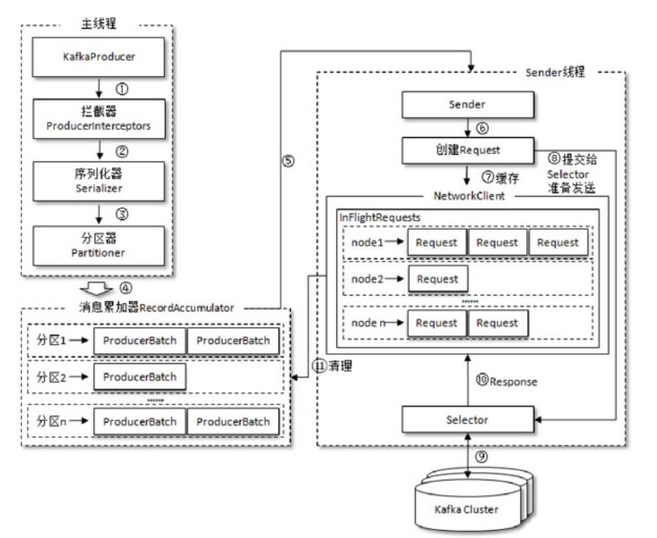

# 不要以为send()就万事大吉了

如果业务线程调用send()方法发送一条消息，这条消息经过Interceptor、Serializer、Partitioner处理后到达RecordAccumulator后，send()级成功返回了，消息剩下的流转交给sender线程进行。也就是说，**Kafka Producer的send()本质是异步的，当send()调用成功后，消息本质是在Producer的内存里，而不是发送给Broker，如果将send()结束视为“发送成功”就可能会丢失消息。**

那有什么办法可以保证消息的可靠性呢？同步发送或异步回调可以实现，如果采用同步发送：

```java
try {
    RecordMetadata metadata = producer.send(record).get();
} catch (Exception e) {
    // 处理异常，如记录日志、发送通知等
}
```

当调用send().get()后，业务线程会阻塞直到Broker响应ack（**即ProduceResponse，下面会介绍** ），我可以根据调用get()是否抛异常来判断消息是否发送成功。如果采用异步发送：

```java
producer.send(record, new Callback() {
    @Override
    public void onCompletion(RecordMetadata metadata, Exception exception) {
        if (exception == null) {
            
        } else {
            // 处理异常，如记录日志、发送通知等
        }
    }
});
```

在调用send()后，onCompletion()的逻辑会在Broker响应ack后执行，我可以通过exception是否为null来判断消息是否发送成功。值得注意的是，**onCompletion()的逻辑是由sender线程执行的，如果比较耗时有可能会导致`消息发送`与`其他消息的回调`执行阻塞。** 

不管是同步发送还是异步发送，最好在业务层面控制好消息的发送状态，比如：

1. 同步发送成功后将状态改为`发送成功`。
2. 异步发送后将状态改为`发送中`，异步回调后将状态改为`发送成功`。

而不是简单地调用了send()就认为`发送成功`，虽然发生概率的问题不大，可一旦发生将会导致数据的不一致。

# ProducerRecord的流转

一条消息的本质是ProducerRecord。通过业务线程调用send()发送后，ProducerRecord先经过Interceptor进行拦截处理、再经过Serializer进行序列化、最后被Partitioner确定最终发给哪个Partition Leader，然后被放进RecordAccumulator的InFlightBatch的RecordBatch里（也就是Dqueue）里，此时业务线程的发送行为就结束了。

当RecordBatch的阈值触发后，比如最大停留时间（queue.buffering.max.ms）、最大数据量（batch.num.messages）就会将多个RecordBatch打包成1个Request放进InFlightRequests队列里，最终达到max.in.flight.requests.per.connection的值，并按照FIFO的顺序从InFlightRequests里发送Request给Broker，然后等待Broker的ack，sender根据ack再确定是重发还是清除掉**InFlightBatch里的RecordBatch和InFlightRequests里的Request**。



这张图在我之前的笔记里出现过，当时引出了一个问题：它们之间的ER关系是什么？接下来解答以下：

1. 1个Producer 对应 1个RecordAccumulator。
2. 1个InflightBatch 对应 1个Partition Leader。
3. 1个inFlightBatch包含了多个RecordBatch，1个RecordBatch包含了多条ProducerRecord（消息）。
4. 1个InFlightRequest 对应 1个Broker。1个InFlightRequest里包含max.in.flight.requests.per.connection个Request。

**也就是说：1个Request包含了多个不同Parition Leader的RecordBatch**，这个关系有些坑在下面的两个章节介绍。

# Request与SequenceNumber

Request在Kafka客户端（Java）的体现类是org.apache.kafka.common.requests.ProduceRequest，要知道1个Request可以包含多个RecordBatch的消息，因为1个Request对应1个Broker，因此同1个Request里的RecordBatch可以是代表同一个Partition Leader，也可以是代表不同Partition Leader。

也就是说，在Producer开启幂等性的前提下，**同1个Request内发给不同Partition Leader的RecordBatch的sequence number不是连续自增的**。比如某个Requeust r，r只有2个RecordBatch r1和r2，首先r1内的message（也就是ProducerRecord）之间的sequence number是连续自增的，r2同理。但如果r1和r2不是发给同一个Partition Leader，那么r1和r2之间的sequence number不是连续自增的，反之则连续自增。

# Request与ProduceResponse

不管业务线程采用`同步send`还是`异步send`，最终sender会将消息打包成1个Request发给Broker（虽然Request内还有其他消息），Broker在接收到Request、处理完Request后会根据acks配置在特定时机**异步给这个Request响应1个ack，这1个ack也就是1个ProduceResponse对象**。它有一个`Map<TopicPartition, PartitionResponse> responses`属性，用来存储拥有不同Partition的RecordBatch的响应信息。

sender线程根据ProducerResponse对象找到对应的Request，再根据ProducerResponse的结果为Request的消息进行结果处理，可能是通知send().get()结束，也可能是回调onComplete()逻辑。

还是以上面的r、r1、r2举例，有可能r1被Broker处理成功，而r2被Broker处理失败，此时ProducerResponse会将2个不同的结果放在`Map<TopicPartition, PartitionResponse> responses`属性里，sender在发现r2处理失败后，会根据配置情况选择重发r2的消息或者走失败降级逻辑。**但不管怎么样，r1和r2的结果是分开处理的，不会因为r2在同一个Request失败而导致r1也失败。**

# 有序性没那么简单

这一点我认为有必要结合RabbitMQ来说，不管Kafka还是RabbitMQ，对于生产者消息的有序性总有那么一句话：同1个Producer给同1个Partition Leader / Queue发送消息的顺序，即消息在Partition Leader / Queue的顺序。我认为这句话是有歧义的，应该是：同1个Producer给同1个Partition Leader / Queue发送的消息**到达**Partition Ledear / Queue的顺序，即消息在Partition Leader / Queue的顺序。为什么？**因为发送行为有可能是异步的**。

以RabbitMQ举例：

1. Producer p 通过 Exchange e 异步发送  Message m1 到 Queue q。
2. Producer p 通过 Exchange e 异步发送  Message m2 到 Queue q。

站在p的角度，m1顺序应该早于m2，但如果：

1. m1因为特殊原因，进入队列q失败，于是Broker响应Basic.nack。
2. m2写入queue成功。
3. p接收到1.的Basic.nack，通过ConfirmListener执行nack策略，进行m1消息重发。
4. m1写入queue成功。

于是原本先m1后m2，因为异步+重发的原因，最终在queue里变成先m2后m1。


以Kafka举例：

1. Producer p给 Parition p1 异步发送 Message m1。
2. 包装m1的Request r1已成功发送给Broker。
3. Producer p给 Parition p1 异步发送 Message m2。
4. 包装m2的Request r2已成功发送给Broker。

站在p的角度，m1顺序应该早于m2，但如果：

1. m1因为特殊原因，写入p1失败，于是Broker响应的ProduceRepsonse记录了m1失败。
2. m2写入p1成功。
3. p收到1.的ProduceResponse，发现m1写入失败，执行onComplete()里的重发逻辑。
4. 重发后的m1写入queue成功。

于是原本先m1后m2，因为异步+重发的原因，最终在parition里变成先m2后m1。

也就是说：对于Kafka消息有序性敏感的场景，不能仅通过异步发送成功而认为上一条消息已发送，建议使用同步发送。如果实在想要异步发送，可以考虑以下3种方案：

1. 异步发送下一条消息前检查上一条消息的发送结果。
2. max.in.flight.requests.per.connection设为1。
3. 开启幂等性，通过幂等性的sequence number实现有序。

如果3个都不满足，2个Request之间的消息有可能会因为前面的写入失败，后面的写入成功，前面的重试发送而导致乱序。Producer默认是不开启幂等性的。幂等性是一项可选的功能，需要显式地在Producer配置中启用。

# 再谈Producer的幂等性

开启 Producer 的幂等性主要是为了防止由于生产者重试、网络问题等因素导致的消息重复发送。它在生产者发送消息时会生成并维护一个全局唯一的序列号（Sequence Number），以确保每条消息只会被写入分区一次。这种机制可以在生产者端提供一定程度的消息去重保证，减少了消息重复的可能性。

但是，不管Producer开不开幂等性，Consumer首先会根据消息里的业务唯一流水号（比如bizNo，orderId）进行消费幂等判断，因为Producer的幂等性是Producer与Broker之间的会话级别，有可能因为Producer的重启导致消息重新发送，所以Consumer再做一次幂等判断是毋容置质疑的。这种情况下 Producer 的幂等性机制在可能不再必要。开启幂等性机制会增加一些额外的开销，包括额外的元数据操作和序列号的管理，因此如果Consumer已经能够处理重复消息的情况，可以选择不开启 Broker 的幂等性，以减少系统的复杂性和开销。

# 元数据的一致性

Producer在启动时，它会通过向Kafka集群发送一个Metadata Request来获取最新的元数据信息。这样，Producer就能够了解到每个分区的Leader Broker，并将消息发送到正确的分区中。

Producer默认会定期更新元数据信息，刷新的时间间隔由配置参数 metadata.max.age.ms 控制。该参数表示元数据的最大存活时间（单位为毫秒），超过该时间后，Producer 会向 Kafka 集群发送一个 Metadata Request 来获取最新的元数据信息。

也就是说：**如果在下次刷新元数据之前更改partition的位置，Producer有可能会发送消息失败，不过在kafka2.4以上版本可以通过KafkaProducer#refreshMetadata()手动刷新一次元数据。**

实际上，结合03-深入Broker可以发现。当Broker元数据发生变更导致Client与Broker发生交互失败后，Client会主动刷新一次元数据，从而保证Client元数据与Broker元数据的最终一致性。