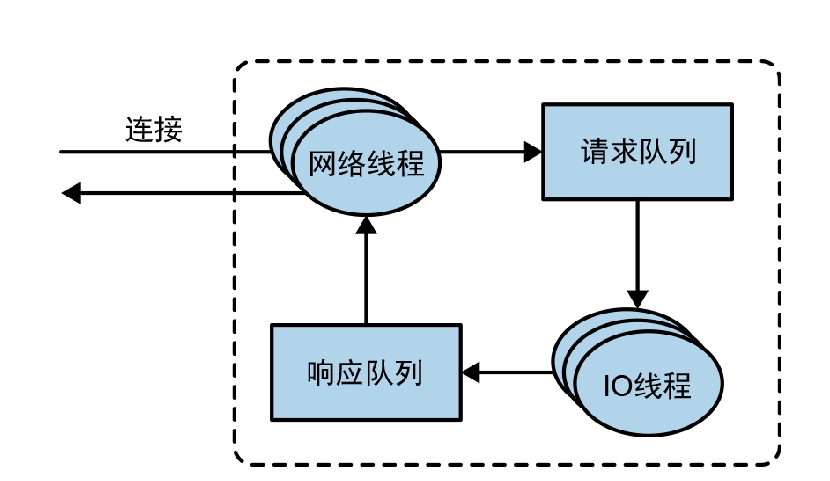
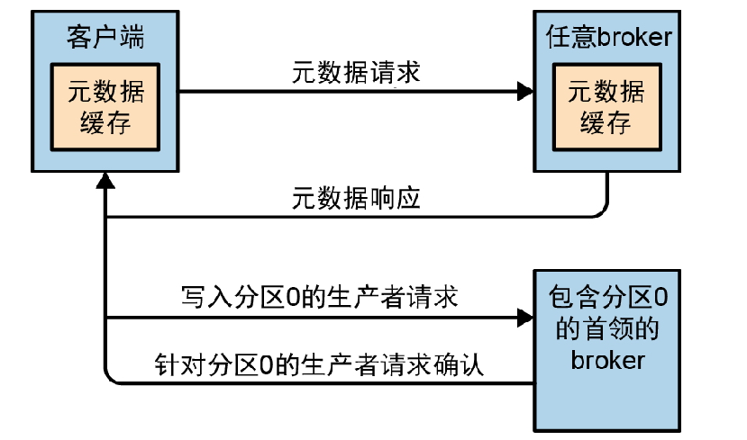
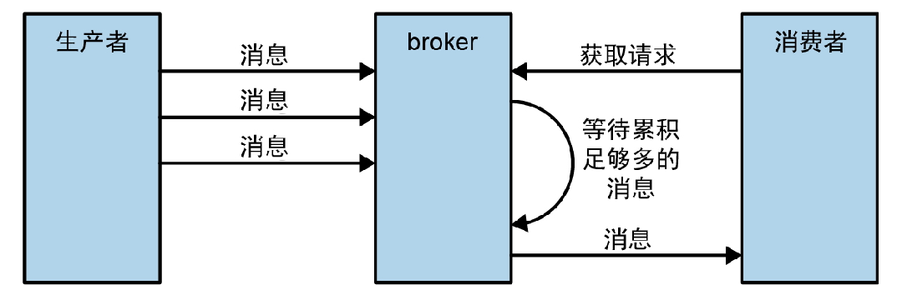
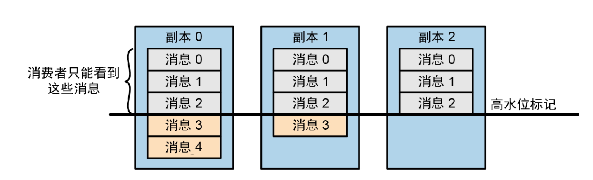

# 处理请求

## IO模型

Kafka使用的是经典的IO多路复用模型，通过1个线程accpet请求，将请求交给worker线程处理读和写，这个和Redis的IO模型十分类似：

为了保证口径统一，再说明一下Kafka的IO模型：

1. Broker在启动成功后，会有一个`接收器线程`监听端口，等待请求的到来（accpet）。
2. 建立connection后，Broker将这个connection交给网络线程池处理，1个连接交给1个`网络线程`。
3. `网络线程`获取连接的请求信息，将请求信息包装成1个`请求任务`，将`请求任务`放在`请求队列`里。并在`响应队列`获取这个`请求任务`的`请求响应`，通过write事件写回给客户端。
4. 然而，从`请求队列`获取`请求任务`并处理，再到写入这个`请求`的响应队列，是交给`IO线程`来做的。
5. 如果一些特定的`请求响应`需要延时响应，那么这些`请求响应`会被放在一个名为`炼狱（Purgatory）`里，直到可以被发送给客户端后再放进`响应队列`。

## 陷入误区：TCP连接的请求和响应

Restful接口是基于HTTP协议进行的，当客户端将一个HTTP请求发送给服务端后，客户端会等待服务端的响应，当服务端超过一定时间没有给出响应后，客户端会认为这个请求超时，并提示错误。

然而，这是HTTP协议规定的过程。对于单纯的TCP协议来说，客户端将一个TCP请求报文发送给服务端，为了保证可靠交付，服务端在接收到TCP请求报文后会响应1个TCP层面的ACK报文给客户端，并不需要显示的调用write方法给客户端写入一个响应。

我在研究Broker的IO模型时陷入了1个误区：Client发送一个请求（请求任务）给Broker后，需要阻塞等待Broker回写一个响应（请求响应）直至超时吗？实际上不需要，因为Kafka Client和Kafka Broker使用TCP协议进行交互，作为一个全双工协议，Client在发送请求后只会阻塞等待TCP层面的ACK报文，至于Broker什么时候给出这个请求的`请求响应`，完全可以交个Broker进行控制。**在这里我陷入了一个基础知识层面的误区，把HTTP和TCP搞混了**。

## 请求类别与元数据

1. 生产请求：

   Producer发送的请求，一般指发送的消息。

2. 获取请求：

   Consumer发送的请求，一般指poll消息的请求。

3. 管理请求：

   Management Client发送的请求，一般指元数据操作请求。

`生产请求`和`获取请求`必须发给Partition Leader所在的Broker，否则Broker会响应“非分区首领”。至于Producer和Consumer怎么知道Leader所在哪个Broker，则分别依赖`元数据请求`和`Coordinator`的信息维护，并将维护好的信息保存到内存中，通过定期更新的方式保证元数据的实时性。对于元数据请求，可以发送给任一Broker获取，因为随便一个Broker都通过Zookeeper知晓整个集群的元数据。

如果Broker的元数据发生变更，比如Partition扩容或者新Broker加入集群导致的Partition Leader的位置发生变更，Client发送读写请求会被响应“非首领分区”错误，此时Client会重新发起一次元数据请求，然后刷新本地缓存，保证元数据的最终一致性（[有点类似Redis Client收到MOVED或者ASK错误后重新发起请求](https://github.com/9029HIME/Emphasis/blob/master/redis_emphasis/md/03-%E4%BD%BF%E7%94%A8Redis%20Cluster%E6%97%B6%E8%A6%81%E6%B3%A8%E6%84%8F%E7%9A%84%E4%B8%80%E4%BA%9B%E5%9D%91.md)）。

## 生产请求

即Producer发送的请求。Broker会根据配置信息在特定实际给`生产请求`响应信息。打个比方，Broker在接收到请求后，会将请求内的消息分发到对应的Partition Leader上，如果Producer配置了acks=1或者0，Broker会认为这个请求内的所有消息都写入成功，于是立刻返回响应。**如果acks=all，那么这个请求则会被保存到炼狱（Purgatory）中，当特定数量的partition follower都同步了请求内的消息，Broker才返回响应**。

## 获取请求

即Consumer发送的请求。当客户端发送FetchRequest到Broker后，Broker会先校验指定的分区是否存在，指定的偏移量是否存在，如果不存在，则给Consumer响应错误。对于Consumer来说，使用的是：发送请求1，获取消息1，发送请求2，获取消息2的方式，而不是像Producer那样可以连发多个请求。目的是减少IO次数，`连发`和`请求-响应-请求-响应`的最终获取的消息数量是一致的，但后者的IO次数会更少一些：

值得注意的是，Consumer能够消费的消息必然是已经被同步到所有ISR内了，当一个Consumer尝试获取一个没有被同步到ISR的消息时会得到空响应，而不是错误。之所以这样设计，是因为**Broker认为未被同步到所有ISR的消息是不安全的**。

打个比方，假如MSG1被写入了Partition Leader，但还未被其他Follower同步到，Consumer A先读取到MSG1，随后Partition Leader发生崩溃，Leader被故障转移到另一个Partition Follower上，这个Follower并不包含MSG1，这样，如果Consumer A下次就读不到MSG1，前后消费不一致，因此Broker只会给Consumer返回高水位的消息：

当然，也不能一直等待同步，ISR同步得越久，生产和消费的延迟性就越高，因此可以通过replica.lag.time.max.ms来配置最大的延迟时间。

# 物理存储

直接看之前的[笔记](https://github.com/9029HIME/Kafka_Note/blob/master/src/mds/04%20KafkaBroker.md)

