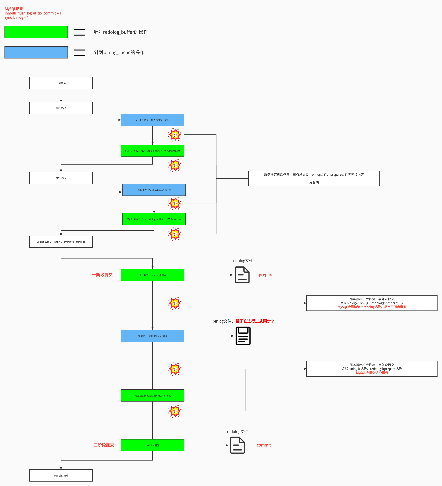

# 前言

网上一些介绍二阶段提交的文章，都会讲 

1. 执行sql
2. 将sql更改先写入redolog，状态为prepare
3. 再写binlog
4. 事务提交后，再更改redolog状态为commit

一开始看这4步，是没什么问题的，直到我看到双1策略：

innodb_flush_log_at_trx_commit=1：每次事务提交时都会把redo_log buffer刷盘。

sync_binlog=1：每次事务提交后将 binlog_cache 中的数据刷盘。

这两个知识该如何关联起来？感觉找不到关联的点。

# 下结论

可能过了一段时间之后，我又会搞混二阶段提交的过程，这里先下3个结论：

1. redo_log的二阶段提交，是发生在【发起事务提交】 和 【事务提交成功】之间的事。在执行sql过程中，只要未提交事务，就没有二阶段提交的概念。
2. MySQL主从同步是基于**binlog文件**进行的，和binlog缓冲区没什么关系。
3. 所谓双1策略，不管是redo_log的刷盘策略，还是binlog的刷盘策略，都会影响二阶段提交过程中，对redolog文件和binlog文件的写入。

# 流程图

