# 前言

上网的文章相似性太大了，我怀疑都是这抄那抄的，通篇结论就一句话：FOR UPDATE命中索引是锁行，不命中索引是锁表。

那我想问，如果是RC级别下和RR级别下，锁的粒度也是一样吗？翻阅了一下，没有满意的文章解答我这个问题，我不得不穷举一下。

我先下一个结论：

1. 要注意“锁”只针对当前读
2. RC隔离级别下，FOR UPDATE无论命不命中索引，都只会锁行（不让其他**当前读**操作锁住的记录）。
3. RR隔离级别下，FOR UPDATE命中索引锁行，不命中索引锁表。

接下来我就要验证我的结论。

# 数据准备

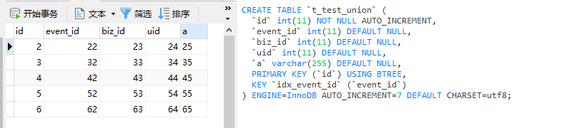

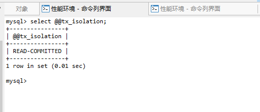

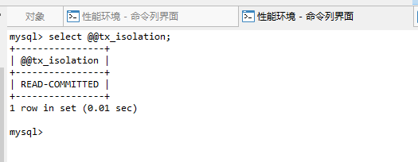

如图所示，这张表只有event_id字段加了索引

左边的tab我称之为左事务、右边的tab称为右事务（下同），**左事务先执行，右事务后执行**。

# RC隔离级别下

## 左事务FOR UPDATE命中索引，右事务FOR UPDATE命中索引

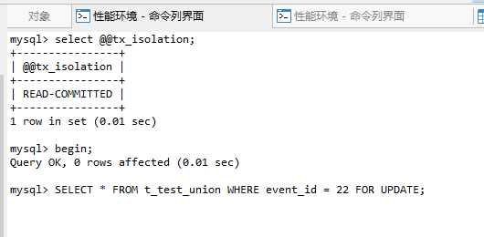

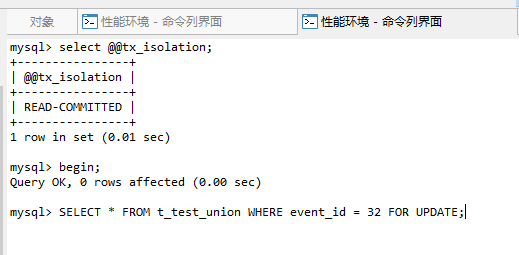

SQL如图所示，此时还未执行，执行后我猜测锁情况应该是这样的：

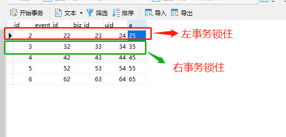

结果：

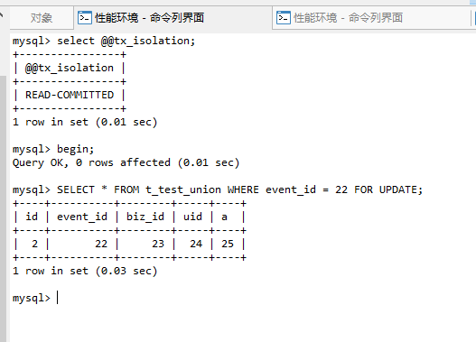

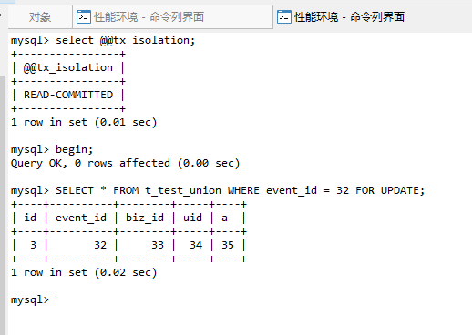

确实如此

如果右事务也FOR UPDATE，查询和左事务一样的结果呢？这是我的猜测：

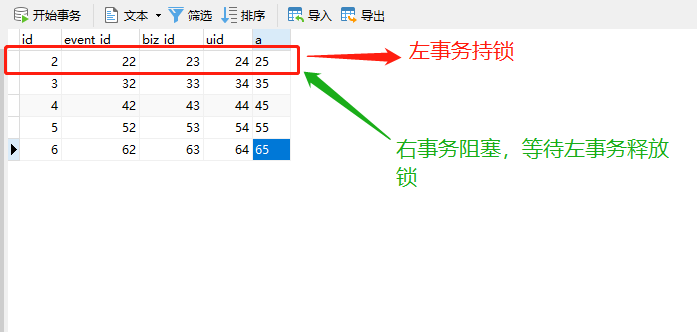

结果：

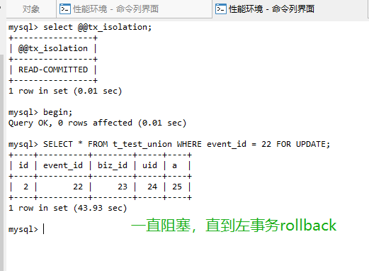

确实如此

## 左事务FOR UPDATE命中索引，右事务FOR UPDATE-全表扫描

猜测：

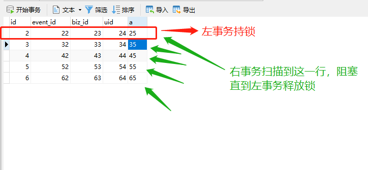

结果：

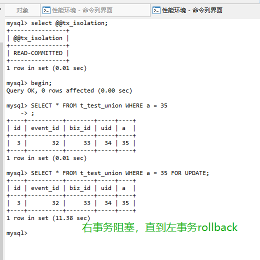

确实如此

## 左事务FOR UPDATE命中索引，右事务UPDATE-全表扫描

猜测：

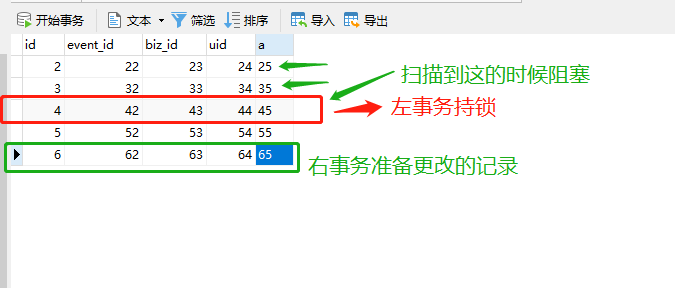

实际：

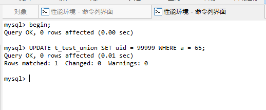

**看来右事务只要不是更新左事务锁上的行，是不会阻塞的。**

# ——————分割线———————

## 左事务FOR UPDATE全表扫描，右事务FOR UPDATE命中索引

重点来了，按照网上的说法，此时右事务FOR UPDATE应该是阻塞的：

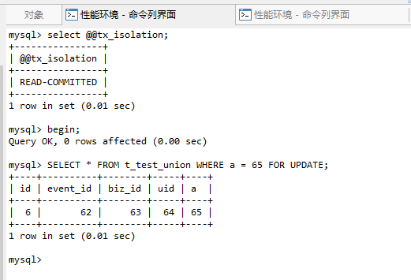

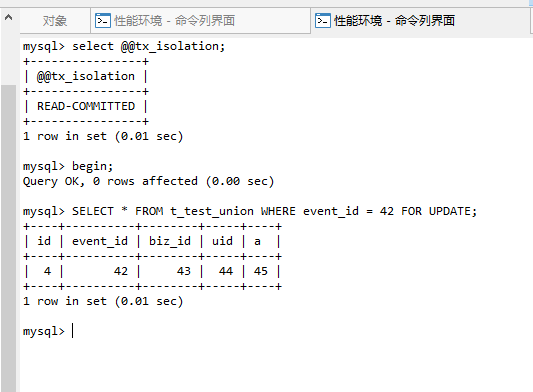

结果没有锁上

## 左事务FOR UPDATE全表扫描，右事务FOR UPDATE全表扫描

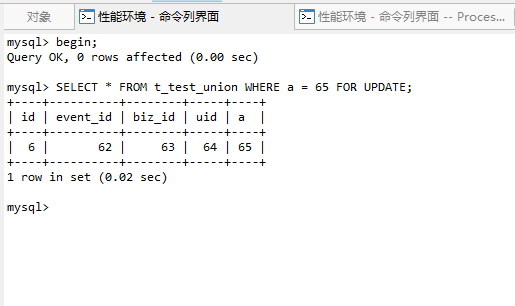

右事务倒是阻塞了，也就是网上的说法不太严谨，FOR UPDATE在全表扫描后，**只会阻塞其他全表扫描的FOR UPDATE**

## 左事务FOR UPDATE全表扫描，右事务UPDATE全表扫描（不改左事务的行）

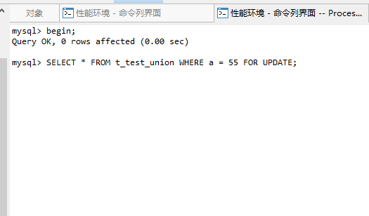

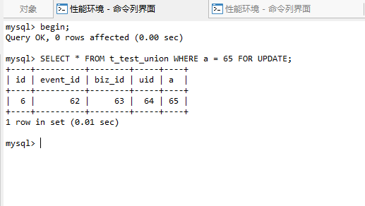

右事务没影响

## 左事务FOR UPDATE全表扫描，右事务UPDATE全表扫描（改左事务的行）

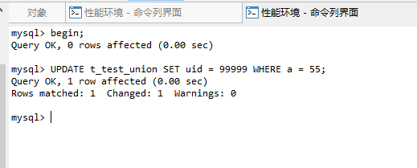

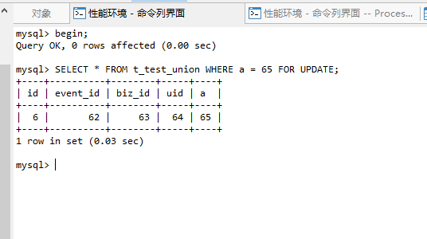

**看来即使左事务FOR UPDATE全表扫描，右事务更新只要不涉及左事务的行，也没有影响。**

# RR隔离级别下

