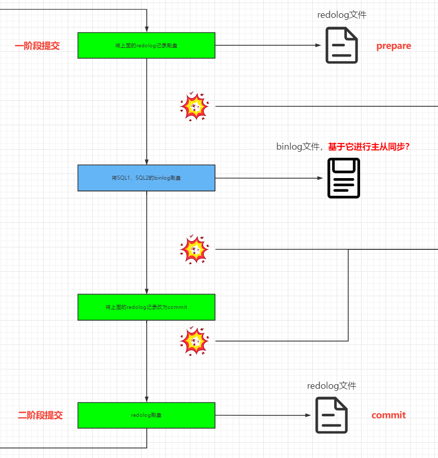
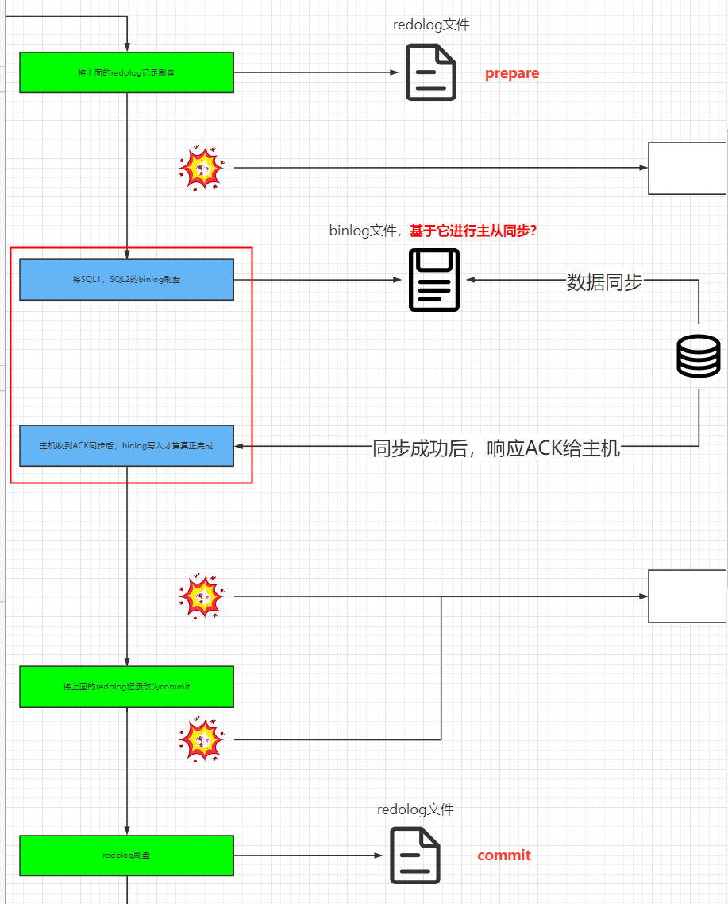
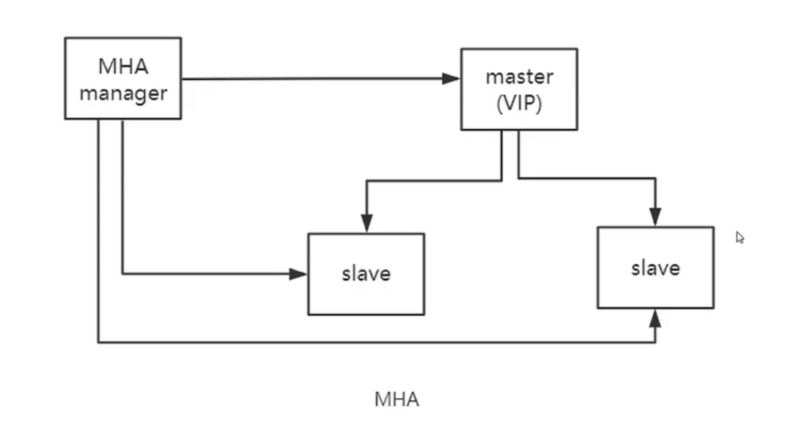
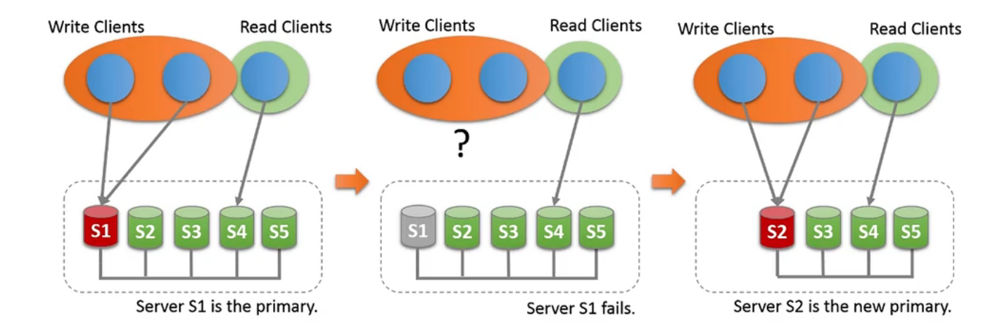

# binlog的同步，应该发生在哪个阶段？

现在主流都是使用AFTER-SYNC同步方案，在事务提交前进行主从同步并获取响应。回想起之前整理过redolog二阶段提交的过程，那AFTER-SYNC又是发生在哪一步呢？回顾一下之前画的redolog流程：

而AFTER-SYNC发生在**写入binlog阶段**，整个AFTER-SYNC完成后，**才会视作binlog写入完成，才会继续走第二阶段的提交**：

AFTER-SYNC会根据**主机等待从机ACK的个数**，分为半同步复制（至少N个从机）与全同步复制（所有从机）。虽然MySQL主从同步是slave pull模式，在半同步或者全同步的场景下，有可能因为slave pull的频率慢，导致ack响应慢，从而导致整个事务的commit过程变慢。

# 半同步复制的方案-结合MHA

MHA和半同步复制非常兼容的原因是，MHA在故障转移的时候，会挑与主节点同步率最高的从节点。

# 全同步复制的方案-结合MGR

MGR作为一个可以支持多主模式的集群模式（虽然我们一般采用单主），采用RAFT算法进行主机选举。只要集群中有还有(N/2) + 1个节点可用，整个集群仍是可用的。MGR通过MySQL插件实现，安装使用起来比较简单（留个坑，后续我会搭建）。

但是它仅支持INNODB，binlog需要再GTID模式下，日志格式为row格式。因为不支持间隙锁，所以事务隔离级别最高是RC。不支持显式表加锁，如lock table，unlock table。最多只支持9个节点。DDL语句在不同节点上不支持原子性，需要执行完自行检查是否一致（有可能主节点执行成功，从节点执行失败）。

# 一个主从同步的坑，虽然不明显，但很痛

在innodb存储引擎下，mysql8以前的版本是利用binlog日志的。如果有的表的列被设置为auto-increment的话，在执行INSERT操作时，如果没有显示的给auto-increment的列设置值，那么mysql会：
1. 如果插入的记录数量不确定在整个表上加一个AUTO-INC的锁，保证不同SQL语句执行时，列的自增性且值不重复。

2. 如果插入的记录数量确定，那么就可以加上一个AUTO-INC的轻量级锁（不是表锁）来保证自增列的准确。mysql中有个innodb_autoinc_lock_mode的配置项其值如下：

  0：只开启AUTO-INC的表锁来处理自增列的情况；

  1：混合模式，确定记录的插入用AUTO-INC的轻量级锁；不确定记录行数的用AUTO-INC的表锁

  2：只开启AUTO-INC的轻量级锁来处理自增情况；

如果配置的innodb_autoinc_lock_mode=2，**可能导致主库的自增列和从库的自增列的值不一致**。

