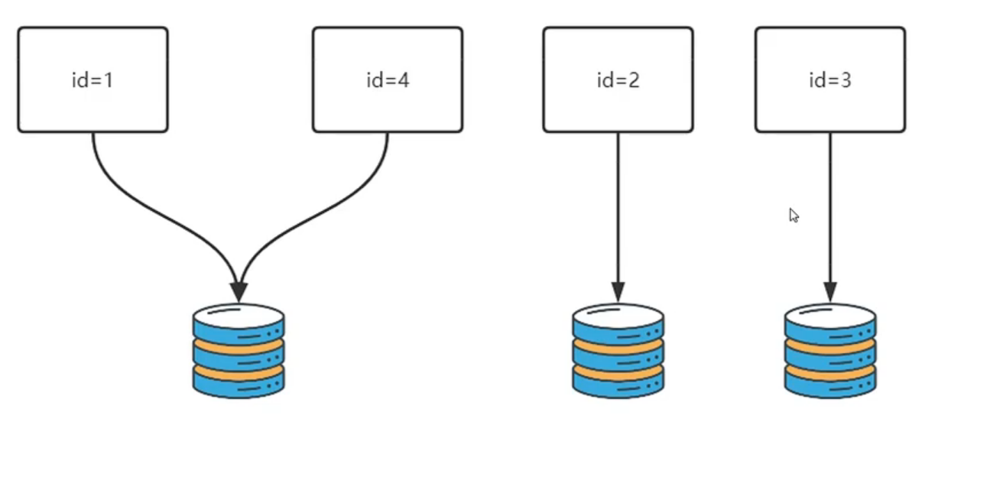
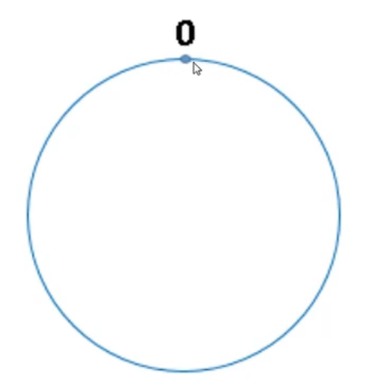
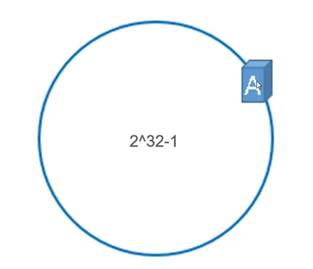
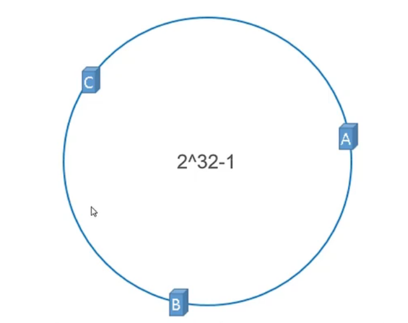
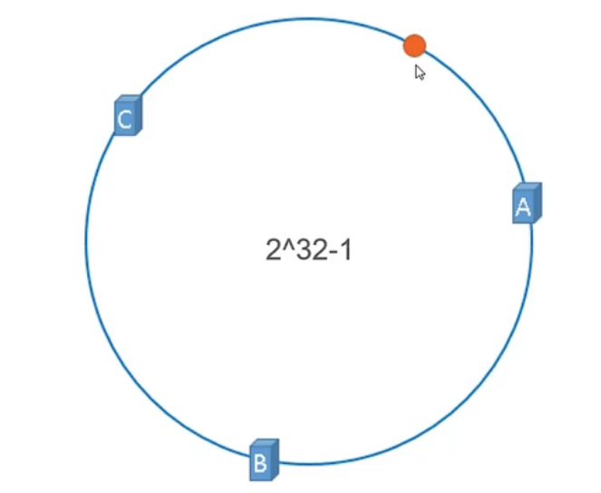
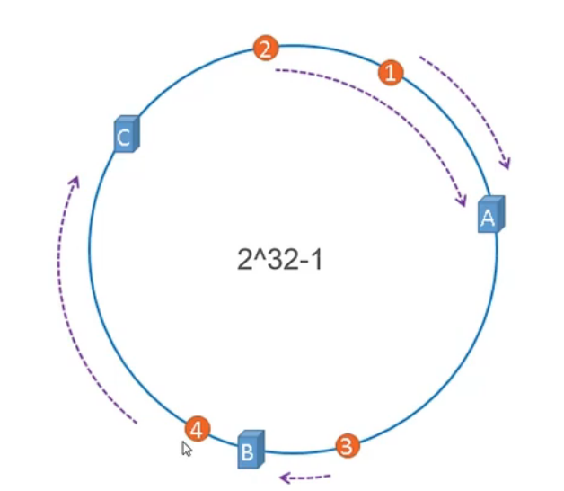
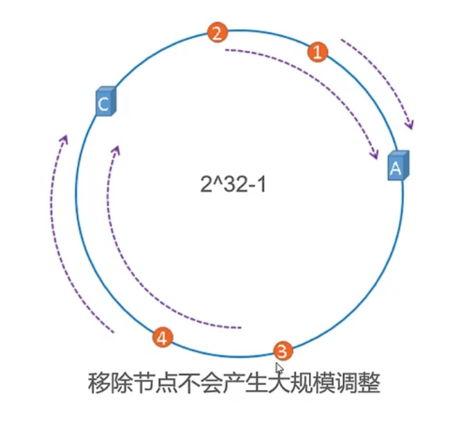
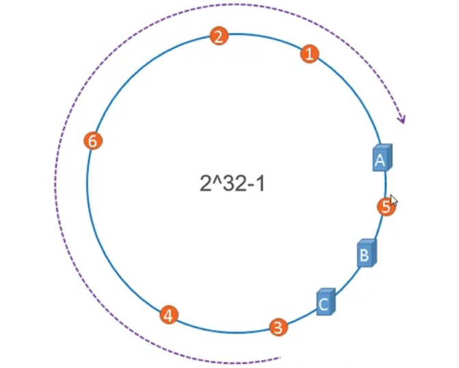
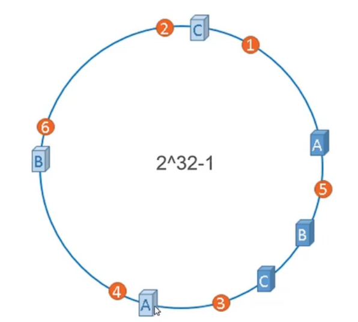
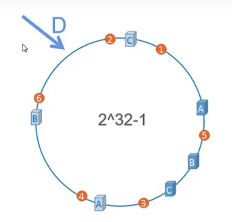

# 为什么要用hash来分库分表？

如果采用递增条件进行分库分表，比如id=1-1000000在表A，id=1000001-2000000在表B；或者时间在2022-01-01到2022-12-31在表A，2023-01-01到2023-12-31的数据在表B，**很容易会产生数据倾斜的问题**。大部分业务逻辑都是操作近期的数据，采用递增条件来分库分表，相对较新的的表会承载更多的新增、查询的请求，导致“分库分表”变成“备份库备份表”（因为旧表请求量较少）。因此**按递增条件分**更适合一些报表业务，而不是面向服务的业务。

对于面向服务的业务表，更适合采用hash进行散列分表。有点类似哈希表定位数据的方式，对数据进行操作前，根据特定条件进行hash运算取得哈希值，再根据分库分表粒度进行取模运算，得到所属的库表：

通过hash进行分库分表的结果，本身就是散列的，不会有数据倾斜的问题，请求能够均匀地打在不同的库表节点上。但是这种分库分表方案有一个很大的缺点：**扩容麻烦**。注意看上面的流程：**根据分库分表粒度进行取模运算**，也就是说数据存储的地方是固定的，而查询时路由的结果也是固定的，原本3台数据库节点存放不同的散列数据，现在要增加一台节点，新增的数据会按照hash%4定位节点。查询数据时如果以hash%4来定位节点位置，很容易会发生错误导致命中不到旧数据，如果查询数据还是以hash%3来定位节点，那么无法命中的就是新数据。不管怎么做都会有数据混乱的问题。

hash扩容后，为了避免数据混乱，一般会采取重新定位的方式，但用不着rehash，这一点和HashMap也是相似的。但是新加一个节点我就得对**全量数据**进行重新取模定位，这个时间成本是很难控制的，而且为了避免产生数据混乱问题，在这个过程中系统是不可对外提供服务的。

总的来说，递增条件划分数据，缺点是数据倾斜问题，优点是方便扩容；而哈希取模划分，缺点是难扩容，优点是没有数据倾斜问题。这两个方案是相反的。那么hash分库分表，有没有易于扩容的方案呢？

# 一致性hash算法

## 如何定位数据

一致性hash算法是用来解决**哈希分库导致的全量数据重新定位**带来的问题，注意它解决的是**全量数据**带来的重新定位耗时问题，而不是数据重新定位耗时问题，具体为什么下面会讲。

一致性哈希算法，是基于“环”进行的，一个环有2的32次方 - 1个点，环上的每一个点都能看作一个实例：

将数据库节点的关键信息进行哈希得到哈希值，这个哈希值 = 环上的某一个点：

假设现在有A、B、C三台数据库，通过hash(A)、hash(B)、hash(C)得到的点结果如下：

我要读或写一个id = x的数据，首先根据hash(id) % (2∧32 - 1)得到环上的位置，假设是下图的橙点：

一致性哈希算法会按照**顺时针优先原则**，找到顺时针离橙点最近的节点A，将节点A作为存储id=x数据的节点进行操作。

同样的，如果是以下的哈希结果，数据1、2会找节点A，数据3会找节点B，数据4会找节点C：

## 节点如何收缩

假设此时节点B因为一些原因，需要移除呢？节点B的数据就要顺时针继续移动，转移到节点C上：

在移除节点的时候，并不会引起**全量数据**的重新定位，而是直接将数据顺时针延续到下一个节点。

## 为什么需要虚拟节点

上面的节点ABC分布情况是在理想状态下的，但实际情况很有可能是：

大多数数据会定位在1、2、3、4、6这样的位置，会导致A承载了大部分数据请求，而B承载少量的数据，甚至C还有可能没数据，这种数据倾斜的问题对于hash策略来说是不应该的。因此可以在一致性哈希算法上引入虚拟节点的概念：

如图所示，浅色立方体代表虚拟节点，虚拟A、虚拟B、虚拟C均匀地分布在环上，从而分摊数据。而虚拟节点和物理节点保持着映射，数据实际存储在对应的物理节点上，这样就能避免上面数据倾斜的问题发生。

## 节点如何扩容

如图所示，假设我要在这个位置新增节点D：

此时D需要存储哪些数据？要存储BD这块区间的数据，而这块区间的数据原先存储在哪？存储在C节点上，也就是说：

1. 需要先暂停BD这个区间的数据，**在C节点上的读写操作**。
2. 将BD区间的数据，在C节点上转移到D节点。
3. 更新节点信息，D节点对外提供服务。

比起hash扩容的全量数据转移，现在一致性hash扩容只需锁住BD段的数据，并且将这段数据进行转移即可，**资源锁住的粒度变小了**。

# 一致性hash算法的问题

之所以说一致性hash算法解决**哈希分库导致的全量数据重新定位**带来的问题，是因为一致性hash算法通过环的特性，将数据分割成不同的段，每次扩容只需锁住一段数据即可。但是使用这个算法，需要面临以下难点：

1. 如何锁住数据？通过什么锁住？现成中间件嘛？
2. 锁住数据后，业务层的代码该如何处理兜底策略？
3. 数据迁移该如何做？通过shell脚本吗？有没有现成中间件？
4. 数据在节点上的分布是不固定的，还需要加一层代理，屏蔽这些细节（比如Sharding Proxy、ProxySQL）。对于客户端代码来说，操作代理就像操作单体数据库，而代理操作了多个数据库节点。

或者说，有没有一套完整的组件可以处理一致性hash算法的问题？即使有，代码层面也要考虑某一段数据不可用的时候，该如何进行兜底处理，这一部分还夹杂着业务层面的考量。