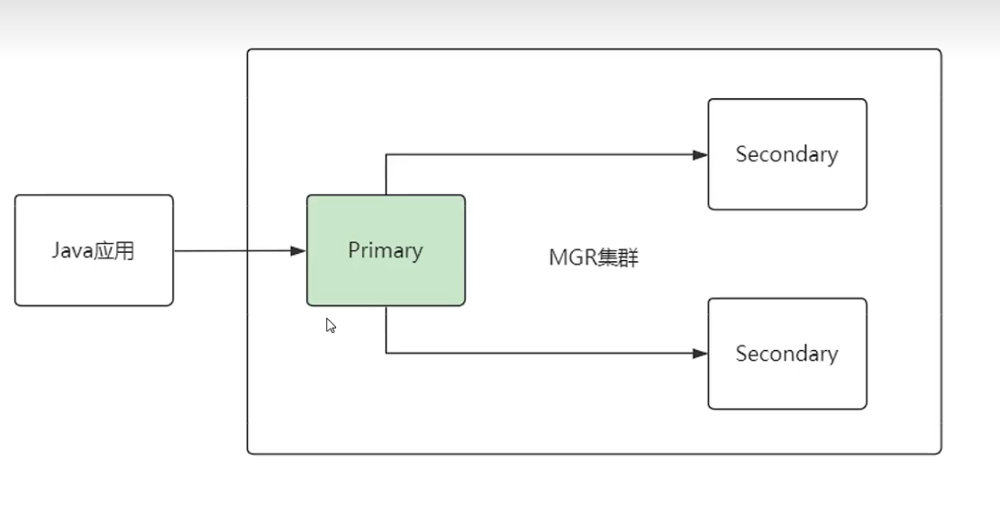
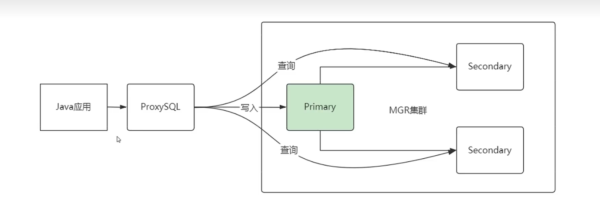
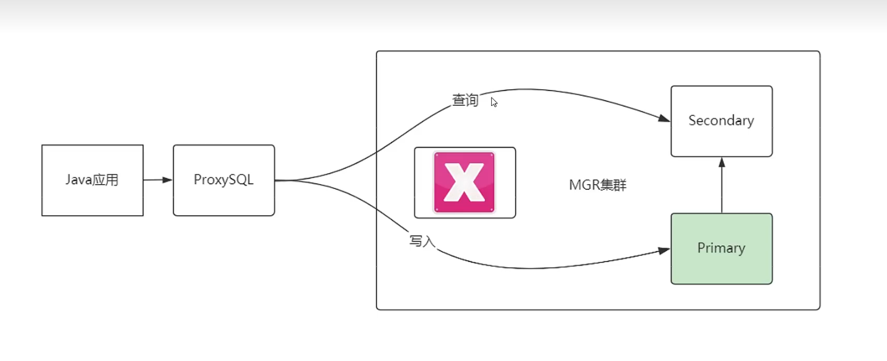
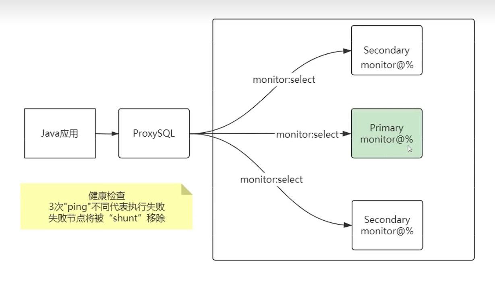
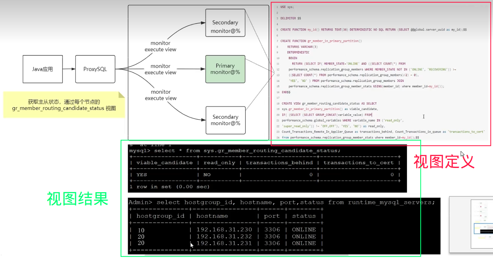

# 为什么要代理？

如果数据库采用读写分离，但不使用代理的话，客户端需要主动连接主库进行写入，主动连接从库进行读取：

假如主库因为不可抗力的因素发生了宕机，作为MGR集群会自动进行故障转移，选取某个从库成为新主库。那客户端如何感知这个变更？这是一个比较复杂的过程，因此需要在中间引入一个代理，给客户端屏蔽这些细节。对于客户端来说，操作数据库就像操作代理一样，代理自动完成了请求路由的过程。目前主流使用的MySQL代理有ShardingJDBC、ProxySQL以及MyCat，它们都是同一层概念的中间件：

# ProxySQL的代理原理

## 健康检查

对于ProxySQL来说，既然要监控一个MySQL集群，首先得有权限访问数据库。比如给集群中的每个MySQL都建立一个monitor用户，它拥有这个数据库非常大的权限，ProxySQL基于这个用户定期执行一条简单语句，从而对这些节点进行健康检查，当3次检查都失败后，会认为这个节点不可用：

## 节点属性

那ProxySQL如何知道哪些是主机、哪些是从机呢？其实用了一个很巧妙的实现。

首先得对节点数据库建立一个**固定结构的视图**，ProxySQL通过一个定时任务，以及健康检查的数据库用户，去执行这个视图来收集当前节点的运行状态，从而判断这个节点是主还是从：

因为MGR集群一般都是采用一主多从的架构，假设视图中read_only字段值为NO，代表这个节点是主节点，反之则是从库。

# 因为代理导致的读写一致性问题，该如何解决？

一般来说，有三种方案，但通常只考虑后两种：

1. 写操作执行后、自定义一个睡眠时间，待从库同步完成后，再进行读。
2. 搭建全同步集群（如MGR），写操作后，必须要从库全同步完成才算结束。
3. 强制走主库，通过代理的设置，将读语句强制路由到主库。