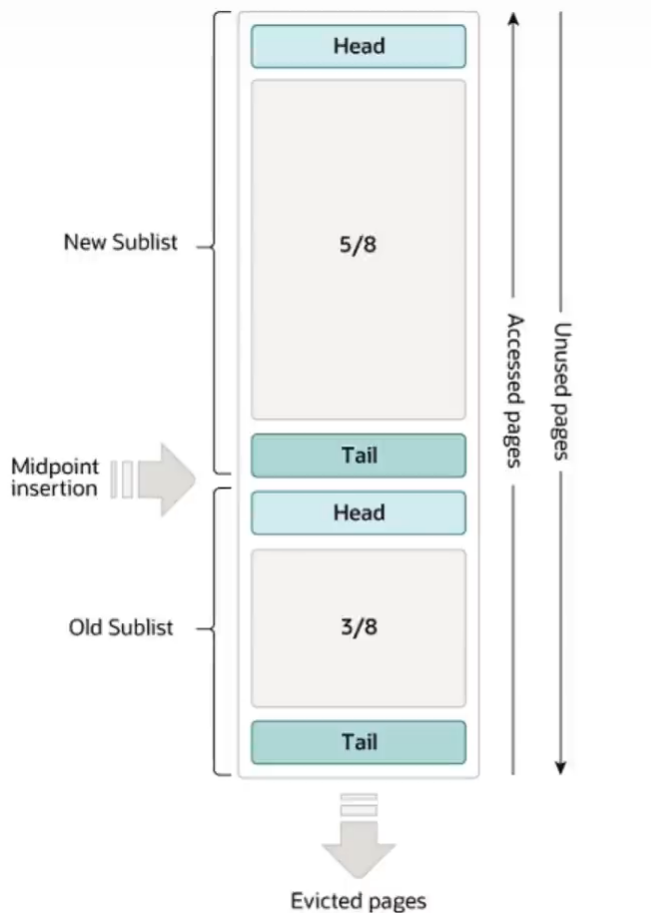

# BufferPool是什么？

它本质是Innodb引擎下的一个缓冲区，存储单位是Page，因为Page主要用来存储行记录和索引信息，所以也可以将BufferPool理解为**存储表数据与索引数据的缓冲区**。MySQL在查询表数据、索引数据时，会优先从BufferPool上查找，不存在则去查磁盘文件，然后添加到BufferPool内。它的存在能提高MySQL的查询效率。

这也是为什么在两次紧密时间查询sql时，第二次查询时间会比第一次快的原因。

# BufferPool的特点

BufferPool通过一个变种的[LRU](https://github.com/9029HIME/Algorithm/tree/master/leetCode/20221010_146_LRU_Cache)算法来管理缓冲中的Page，它是怎么个变种法呢？

1. 首先LRU列表有一个**中点**的概念，中点位于LRU列表从head到5/8列表长度的位置。
2. 中点到head的部分被称为New Sublist，反之中点到tail的部分被称为Old Sublist。
3. BufferPool的淘汰策略和普通LRU没什么区别，将Old Sublist最后一个Page给淘汰掉。
4. BufferPool的提鲜策略也和普通LRU没什么区别，将页添加到New Sublist的头部。不过只有用户读才会触发提鲜，**引擎预读不会改变页的位置**。
5. 但是！！！当有新页要放进BufferPool时（**包括用户读和引擎预读**），会直接将新页添加到中点位置，而不是New Sublist头部。

# 全表查询对BufferPool的影响

一个mysqldump操作或者一个不带where条件的全表扫描，会将大量的页加载进BufferPool内，同时淘汰同等数量的旧页，并且这部分新加进来的页很有可能不会再次使用，这样就会导致BufferPool的利用率和命中率下降。

# 与BufferPool相关的调优

1. 减少全表扫描带来的BufferPool刷新。
2. 缓冲区大小尽量地大，这样MySQL在查询层面能与内存数据库相当。
3. 将BufferPool拆成多个部分，减少淘汰页数与修改BufferPool的并发度。
4. 通过引擎预读，将一些数据提前放进BufferPool内，提高下次查询效率。
