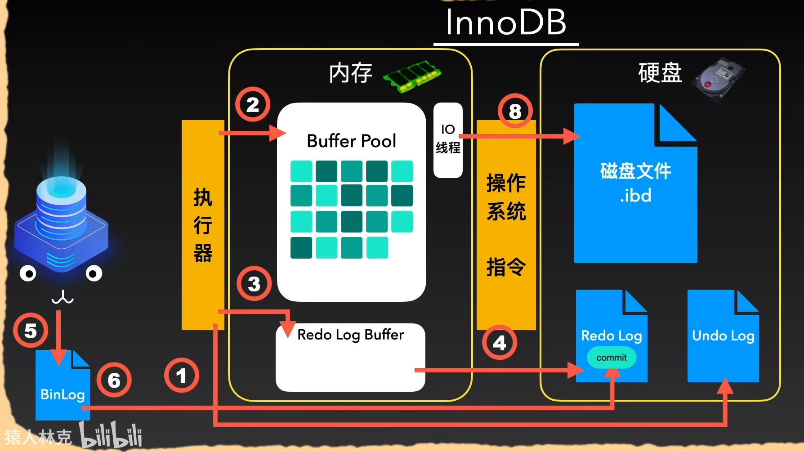
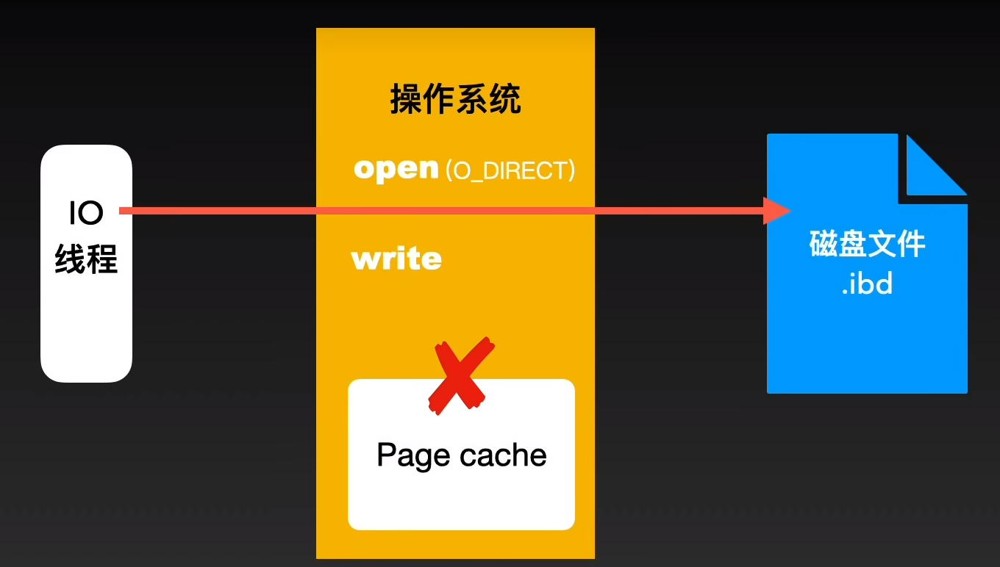

# 过程

1. 保存数据的undo_log，保证原子性。
2. 将数据优先写入Buffer Pool里的Page，并不会优先写入磁盘，提高MySQL的执行效率。
3. 写入Redo Log缓冲区，标记为prepare。

开始提交事务

4. 根据Redo Log的写入策略（假设为1），将3.写入Redo Log缓冲区的数据写进Redo Log文件，标记为prepare。
5. 根据Binlog的写入策略（假设为1），将数据写入Binlog文件。
6. 将4.写入Redo Log文件的数据，标记为commit。

提交事务成功

7. 执行器的IO线程，会根据写入策略，将2.写入Buffer Pool的数据刷盘，写进ibd文件，此时数据才算真正刷盘成功。

   

   InnoDB通过O_DIRECT函数，跳过Page cache，通过自己实现的缓存机制，完成数据的刷盘。

# 补充

步骤4-6就是之前整理的[二阶段提交过程](https://github.com/9029HIME/emphasis/blob/master/mysql_emphasis/src/md/07-%E7%9F%A5%E8%AF%86%E6%95%B4%E7%90%86-redolog%E7%9A%84%E4%BA%8C%E9%98%B6%E6%AE%B5%E6%8F%90%E4%BA%A4%EF%BC%8C%E5%88%B0%E5%BA%95%E6%98%AF%E6%80%8E%E4%B9%88%E4%B8%80%E5%9B%9E%E4%BA%8B%EF%BC%9F.md)，它能够保证MySQL在宕机后，能够根据数据在Redo Log文件和Binlog文件的状态，决定是继续刷盘还是丢弃数据，从而恢复数据。

# 疑问

1. 根据上面的过程，有以下总结：

   1. 为了提高MySQL的效率，提供了先写入BufferPool，通过MySQL的刷盘缓存机制进行刷盘。

   2. 为了保证MySQL的可用性，提供了二阶段提交机制，先写入Redo Log文件，再写入Binlog文件，再写入Redo Log文件。

   那为什么不直接在1.直接刷盘，而是在2.进行3次刷盘？

   **本质是因为，BufferPool、Binlog、Redo Log存储的数据不一样，Buffer Pool存储的是Page，而Binlog、Redo Log存储的是粒度更小的数据，比如页号、偏移量。如果每次写入Buffer Pool就直接刷盘，这意味着每次写入一条数据，都要刷盘一张Page，而且Buffer Pool的刷盘是随机写入。相比写多次小粒度的顺序写入Binlog、Redo Log，性能会差很多。**