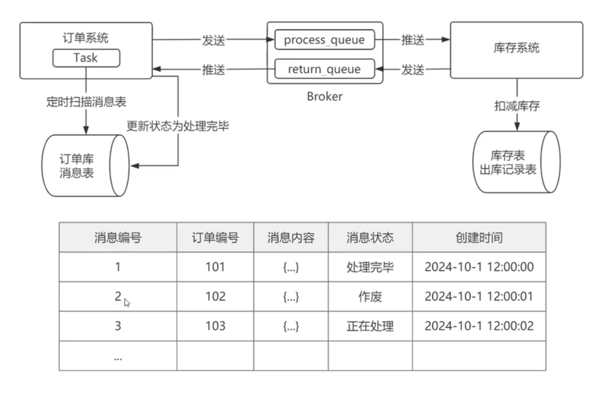

# 场景

还是以经典的下单-库存为例子，之前在分布式知识学习的过程中，已经学过Seata在XA和AT模式下对不同系统事务进行提交和回滚的操作。那么在Seata开源之前，就没有其他分布式事务方案吗？这里记录一个Ebay使用过的、一套非常经典的分布式事务解决方案：基于消息队列的分布式事务。再顺便看看它的优缺点。

# 流程设计

1. 订单系统，有两张表：订单表、订单消息表。初始状态分别为“出单中”、“未处理”。
2. 订单系统，新增订单时，先将订单数据插入订单表，再将订单数据插入订单消息表。**这两步为同一个事务，要么同时提交、要么同时回滚**。
3. 订单系统，有一个定时任务，定时扫描订单消息表，扫描那些【未被发出消息】的记录，然后将它们包装成消息，发给具体的MQ。
4. 库存系统，有两张表：库存表、出库记录表。
5. 库存系统，收到MQ的消息后，开始进行减库存操作，无论成功还是失败，都会写入到出库记录表，最后将出库消息发送给MQ。
6. 订单系统，收到MQ消息后，根据出库结果更新订单表状态为“出单成功”或“出单失败”，同时更新订单消息表的记录为“处理完毕”

# 要考虑的地方

1. 为什么订单系统 要设计定时扫描？ 其实订单系统是可以写入两张表后，直接发送消息，也是一样的。但需要考虑一件事：如果MQ挂了怎么办？作为整个流程的入口，如果入库成功，但写MQ失败了，意味着这条订单“丢单”了。因此需要一个兜底机制：定时任务，定时扫描那些未被发出消息的订单记录、**以及那些发出消息后，很久未收到出库结果的记录**。
2. 当然，如果只依赖定时任务来扫描，那出单速度就很难保证了，到底是5秒扫一次？还是10秒扫一次？不管几秒扫一次，在下一轮任务启动之前，这段空档期的订单是无法出单的。因此可以采用实时发 + 定时发的混合策略，入库的时候先实时发一次，并且备用一个定时任务，定期扫描那些因为不可抗力因素而发消息失败的订单，进行重新发送。
3. 为什么库存系统不用定时扫描？要注意，库存作为下单的“下游服务”，假设发送出库消息给MQ失败了，上游是收不到结果的，此时订单系统的定时任务发现有一笔订单隔了好久都没有出库结果，它是可以选择重发消息的。当库存服务的MQ可用后，出库消息就能重新到达订单系统了，**前提是要做好消费幂等处理**。

# 设计的优缺点

我觉得这套设计最大的优点是开发简单，无需引入Seata这种分布式事务框架，仅在现有消息中间件+业务流程设计的基础上，就能完成分布式事务了。

但缺点也是挺明显的，不同系统之间的事务结果通过MQ进行通信，首先就得考虑MQ的一些要点，比如消息积压、消息的可靠性、消息的一致性、消息幂等。最主要的痛点是：它需要一个临界状态，比如出单中。在某些业务场景下（比如秒杀、或者下单反馈实时性高）是不允许的，但在购票业务倒是挺适用的。