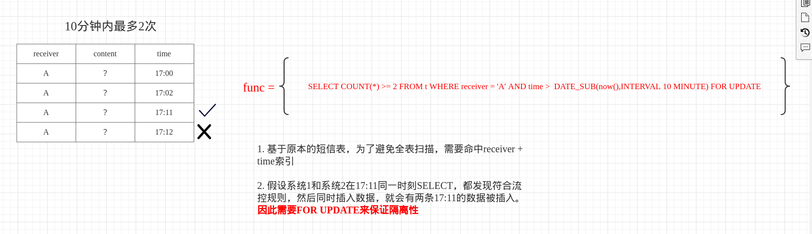
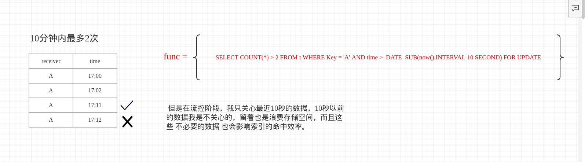
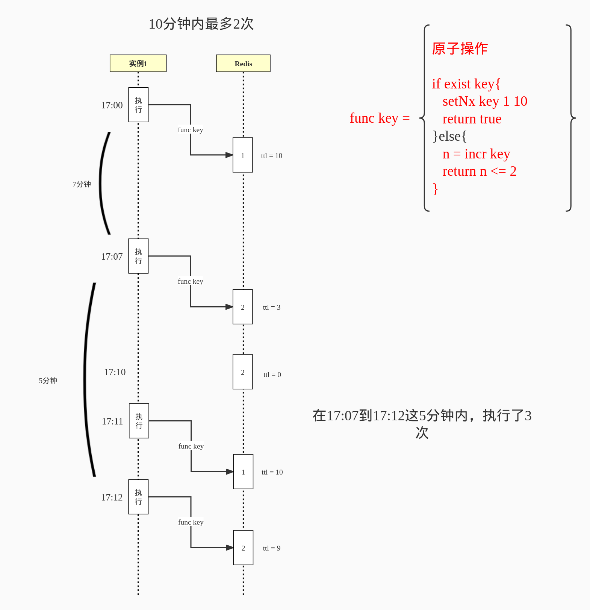
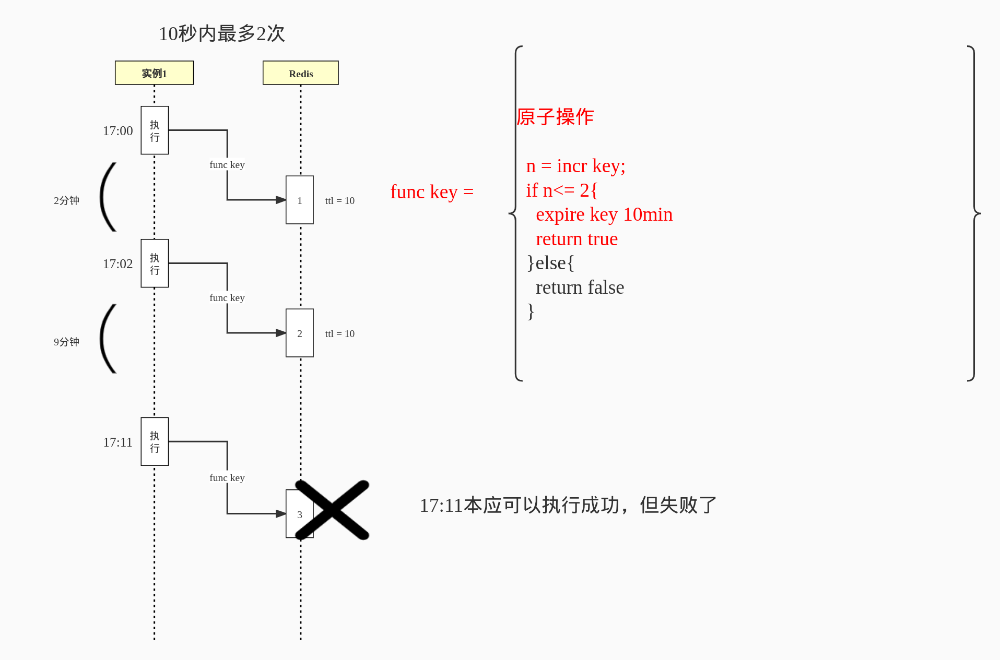

# 需求背景

因为一次生产事故，我们团队需要对消息的发送补充流控设计，具体形式为：**在T时间间隔内，对R这个接收者只能发N次消息。**

虽然项目中使用了Sentinel，Sentinel也支持热点参数的流控规则，但它仅根据参数索引+具体参数值进行规则流控，比如对参数1在值=Y的情况下，流控规则是XX秒内ZZ次。但是在消息发送场景下，我只有准备发送的时候才知道接收者是谁，是不能提前预知的，区别于Sentinel的静态资源流控不同，消息平台需要的是**动态资源流控**。

# 废案1-基于原有消息表进行流控

假设流控规则为：10分钟内对同一个接收者最多只能发2条消息，假设消息表的结构如下（节选）：



每条消息都会在消息表里进行保存，在给A发送新消息之前，通过语句判断10分钟内已发送的消息数量：

```sql
SELECT COUNT(*) >= 2 FROM t WHERE receiver = 'A' AND time >  DATE_SUB(now(),INTERVAL 10 MINUTE) FOR UPDATE
```

当结果返回true时，进行新消息的入库和发送逻辑。消息平台是水平扩容部署的，为了防止多个系统同时拿到结果=true的值后，同时进行新消息的发送，**需要使用FOR UPDATE同步阻塞**。

当整个流程结束后，提交事务，FOR UPDATE的锁解开，从而保证了COUNT(*)的数据可见性。

不选择它的原因：使用了FOR UPDATE会锁行（不命中索引的情况下还会锁表），可能会影响其他流程；比如实际消息下发、同步消息下发结果时，对**同接受者不同内容的消息**进行修改的时候可能会被FOR UPDATE阻塞。

# 废案2-新增一张流控表进行流控

假设流控规则为：10分钟内对同一个接收者最多只能发2条消息。有这么一张消息流控表（节选）：



每次发送完消息后，都会往这张表插入一条记录，记录这条消息的接受者和发送时间。那么在给A发送消息之前，需要语句判断10秒内已发送的消息数量：

```sql
SELECT COUNT(*) > 2 FROM t WHERE Key = 'A' AND time >  DATE_SUB(now(),INTERVAL 10 MINUTE) FOR UPDATE
```

其实和废案1的思想差不多，也是拿到最近10分钟的发送次数进行阈值判断，符合则往消息表、流控表插入记录，最终提交事务，释放FOR UPDATE锁。**重点是不会影响其他业务流程对消息表的操作，毕竟锁的是流控表，而且只有发消息前才会操作流控表。**

不选择它的原因：存放着无用记录，消息表是有必要存在那么多记录，但流控表我只关心最近一段时间的发送次数。举一个极端的例子，起码一年前的流控记录，我是不关心的吧？但表里还是存放着，久而久之会浪费数据库的存储空间，除非专门维护一个定时脚本，清除一段时间之前的流控记录。而且每次发送之前都要查一遍数据库，也是有一定**可观耗时**的。

# 废案3-基于Redis的setNx进行流控

假设流控规则为：10分钟内对同一个接收者最多只能发2条消息。

不选择废案1、2，主要是出于MySQL的锁机制、数据存储、请求耗时的考量，那有没有更高效的方案呢？其实我首先想到的是Redis，它有单线程原子性、基于内存存储、请求速度快的特点。

**假设我通过Lua脚本来保证原子性**，那我可以采用setNx + ttl的方式进行流控，Lua的伪代码如下（receiver的值是key）：

```
func(key) = {
	if exist key{
		setNx key 1 10min
		return true
	}else{
		n = incr key
		return n <= 2
	}
}
```

当程序代码调用上述Lua脚本年后，如果返回true，则代表流控通过，反之则不通过。乍一眼这么一看好像没问题，但其实缺陷很大，假设有这么一个流程：



可以发现，在17:07到17:12这5分钟内，执行了3次，所以这套方案并不符合要求，因为它不会将ttl超时前的次数统计进去，**也就是最近10分钟的次数统计少了**。

# 废案4-基于Redis的incr、expire进行流控

废案3不行，于是我改进了一下废案3的Lua脚本，伪代码如下：

```
func(key) = {
	n = incr key
	if n<= 2{   
		expire key 10min    
		return true   
	}else{ 
    	return false  
    }
}
```

结果我发现还是不行，假设有这么一个流程：



17:11的时候本应可以执行成功的，但执行失败了，**原因是最近10分钟的次数统计多了，将17:00的次数也统计进去了。**

# 选用方案-基于Redis的zset + 滑动窗口进行流控

