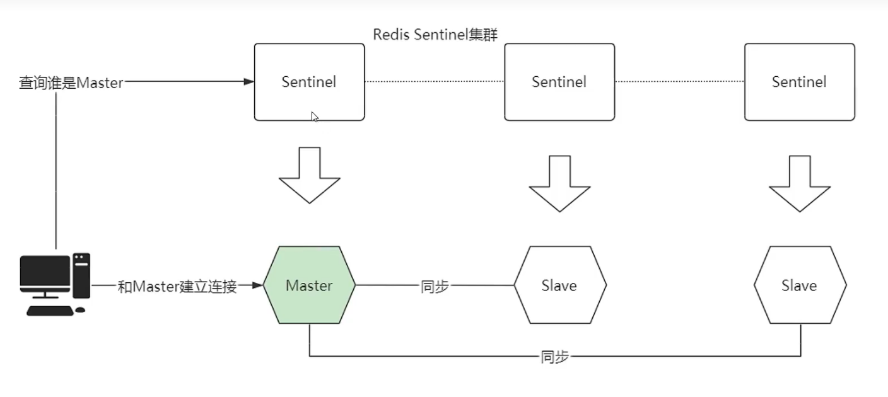
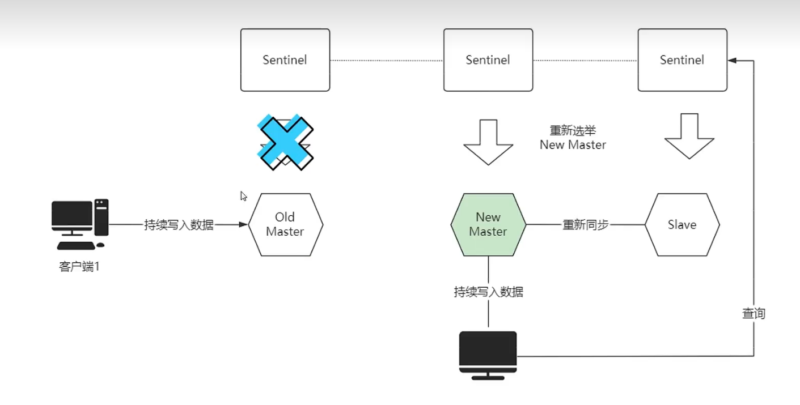

# Redis的脑裂

## 原因与影响

假设有这么一个Sentinel架构（回顾[part5_Redis高级.md](https://github.com/9029HIME/Distributed_System_Knowledge/blob/master/md/part5_Redis高级.md)）：



客户端通过Sentinel查询到主节点是谁，然后对主节点进行写操作，对从节点进行读操作，这是一个很标准的Redis + Sentinel + 主从复制架构。

假如某个时间段，主节点和整个Sentinel集群发生断连，但和从节点、客户端的连接正常，此时会触发Sentinel的**客观下线策略**，从剩余机器中选出一个新主节点，另一台机器作为新主节点的从节点：



那么此时，客户端依然对**旧主节点**进行写操作，对其他节点进行读操作；但是其他客户端却对**新主节点**进行写操作，对其他节点进行读操作，一个集群有着两个主节点，脑裂问题发生了。

等一下，为什么客户端还对**旧主节点**进行写？Sentinel不会通知客户端主节点已经客观下线了嘛？这涉及Sentinel架构的一个细节，客户端连接Sentinel获取主节点的地址进行写操作，如果客户端发现**主节点不可用，才会从Sentinel重新获取新主节点的地址**。在上面的情况下客户端与主节点之间可用，只是和Sentinel集群不可用才导致的客观下线，客户端是不会知道新主节点诞生的，而且Sentinel也不会主动通知客户端，这也是Redis脑裂的直接原因。

集群中有两个主节点，意味着有两套数据分别对主节点进行写入，必然会有**数据不一致的情况发生**。而且当**旧主节点**与Sentinel集群恢复连接后，旧主节点发现已经有一个**新主节点**后，会将自己降级为从节点，并且和**新主节点**重新同步数据（以新主节点的数据为准）。新旧主节点的数据同步会导致旧主节点的数据发生丢失，从而引发短暂的缓存穿透甚至缓存雪崩。

## 解决办法

通过2个参数配置主节点：

```
# 连接到master的最少slave数量
min-replicas-to-write 3
# slave连接到master的最大延迟时间
min-replicas-max-lag 10
```

如果这2个参数有1个不符合条件，Master会拒绝客户端的写入请求，**从而让客户端重新去Sentinel获取新主节点的地址**，避免了脑裂的发生。

但是这2个参数也不是万能的，假如主A和它的从A1、A2、A3....An都和Sentinel集群发生断连，从而引起脑裂，那么脑裂出来的两个主都拥有足够的slave数量并且都满足最大主从延迟时间，旧主依然对客户端可用，那还是无法解决脑裂的问题。

**只能根据实际的场景、服务器配置对这两个参数进行调优**。