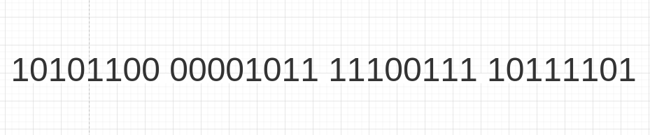
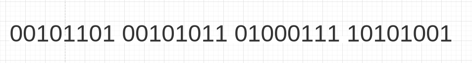
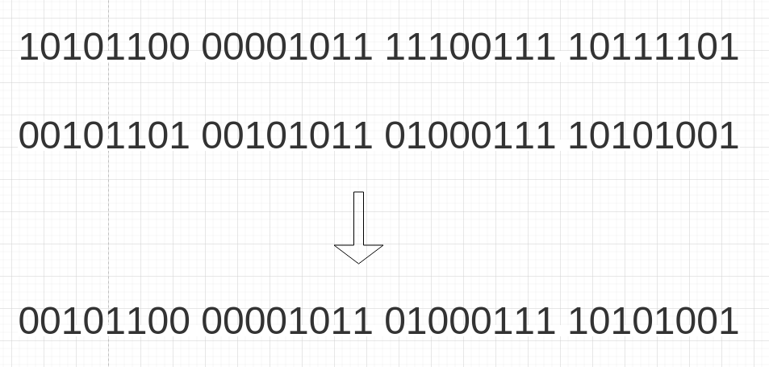

# 背景

需要对一些索引选择性差的条件进行查询，比如type=原始用户的数据，整个数据库就三种type：原始、信托、第三方。

# Bitmap的使用

## 基本含义

可以专门给 某个值 建立一个bitmap，1个Java整型长度4byte即32bit，假设为 原始用户 这个条件值建立一个bitmap，bitmap的第n位代表id=n的用户是否为原始用户，1-是，0-否。假设 原始用户 的第一个bitmap如下：

第1位是1，第2位是0，代表id=1的用户它是原始用户，id=2的用户它不是原始用户，以此类推。

也就是说1个4byte的bitmap可以存32个用户的原始用户状态，1个bitmap可以代表一个Java整型数，那么通过一个整型数组可以表示

[I1,I2,I3,I4]

I1代表第1-32个用户的原始用户状态、I2代表第33-64个用户的原始用户状态，以此类推。

## 条件值的交集、并集

可以通过bitmap二进制位运算的特性，快速得到**两个条件值**的交集、并集结果。假设有另一个条件值product_id，它在值=1的情况下有以下bitmap：

那么通过两个bitmap的与运算，可以快速获得**既是原始用户、又是产品id=1的用户**（前提是两个bitmap代表的用户id范围是一致的）：

# 局限性与相似性

使用bitmap存储数据，前提是数据主键必须是自增的，这样才能和bitmap的位数进行对应。并且不支持其他条件查询，仅支持bitmap自身的条件查询，所以作为知识点补充一下。

在早期硬件资源紧缺的环境挺好用，现在实际应用场景可能不太广。

不过布隆过滤器也是使用了相似的原理：通过 二进制的值 确定 是否命中条件值。