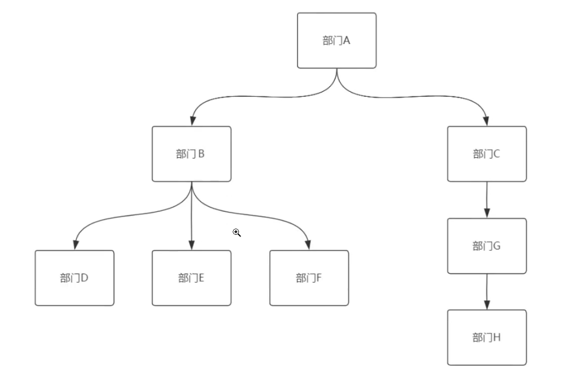
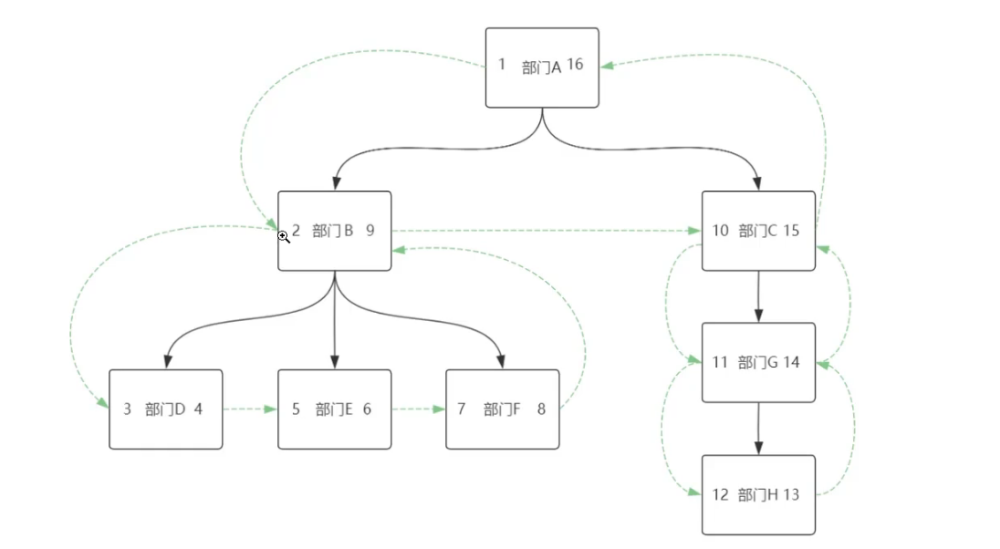
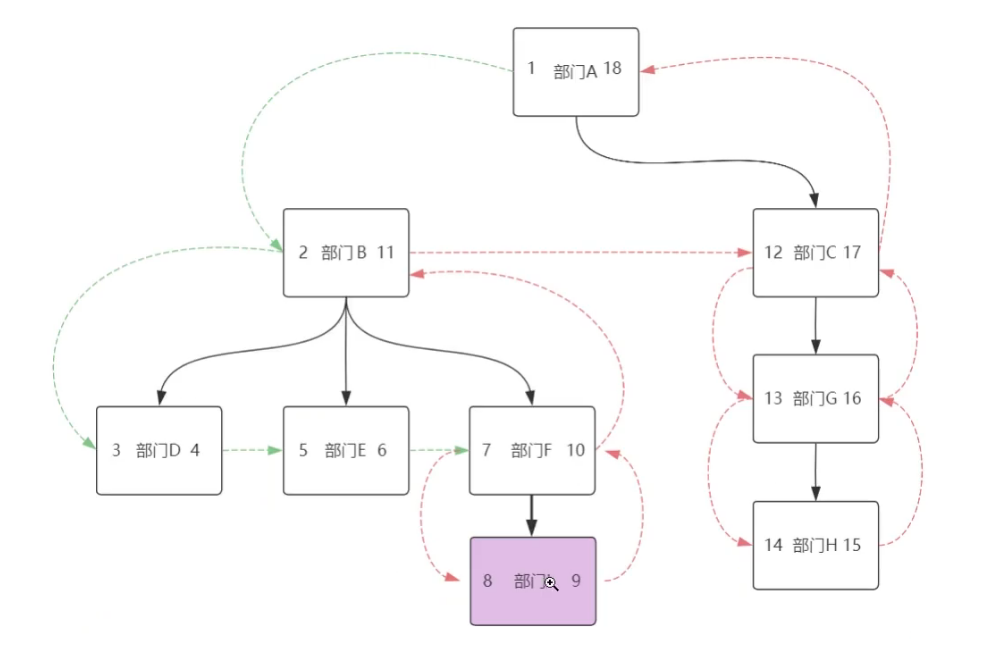

# 背景

在一些业务场景下，会从树形结构上的查询，比如部门查询：



对于以上的部门关系，我们通常使用t_department表的parent_id（父部门ID）、level（所属深度）、parent_path（从顶级部门到本部门的路径）字段记录：

| id   | dept_name | parent_id | level | parent_path |
| ---- | --------- | --------- | ----- | ----------- |
| 1    | 部门A     | null      | 1     | 1           |
| 2    | 部门B     | 1         | 2     | 1,2         |
| 3    | 部门C     | 1         | 2     | 1,3         |
| 4    | 部门D     | 2         | 3     | 1,2,4       |
| 5    | 部门E     | 2         | 3     | 1,2,5       |
| 6    | 部门F     | 2         | 3     | 1,2,6       |
| 7    | 部门G     | 3         | 3     | 1,3,7       |
| 8    | 部门H     | 7         | 4     | 1,3,7,8     |

一般来说，这种表定义用来满足**往上遍历**的需求，比如我已知部门E，我想找到E的父部门、祖父部分是比较方便的；直接通过parentId或者parent_path就能快速定位。

但如果我想往下遍历就麻烦了，比如我想找到部门C的所有下级部门、或者所有下级部门的个数，我得先通过C的id找到G的id,再通过G的id找到H的id。当然也有另外一种思路：找到包含部门C的id最长的parent_path，即1,3,7,8。通过从c-id开始截取得到7,8，最终能找到c的下级部门G、H以及个数2。**但是这种方式比较麻烦，还需要代码的参与，所以需要另外一种更加高效的遍历方式：预排序遍历树。**

# 预排序遍历树（MPTT）

还是以上面的部门为例子，对t_department新增left和right字段，它的含义是：对部门数进行**先深度再广度遍历时的左右序号**：



| id   | dept_name | parent_id | level | parent_path | left | right |
| ---- | --------- | --------- | ----- | ----------- | ---- | ----- |
| 1    | 部门A     | null      | 1     | 1           | 1    | 16    |
| 2    | 部门B     | 1         | 2     | 1,2         | 2    | 9     |
| 3    | 部门C     | 1         | 2     | 1,3         | 10   | 15    |
| 4    | 部门D     | 2         | 3     | 1,2,4       | 3    | 4     |
| 5    | 部门E     | 2         | 3     | 1,2,5       | 5    | 6     |
| 6    | 部门F     | 2         | 3     | 1,2,6       | 7    | 8     |
| 7    | 部门G     | 3         | 3     | 1,3,7       | 11   | 14    |
| 8    | 部门H     | 7         | 4     | 1,3,7,8     | 12   | 13    |

因为父部门left ＜ 子部门left、父部门right ＞ 子部门right，通过这样的数据结构比较left和right的大小，能够快速定位到**部门E的所有父部门**：

```sql
SELECT * FROM t_department WHERE left < 5 and right > 6;
```

快速定位部门B有哪些**子孙部门**：

```sql
SELECT * FROM t_department WHERE left > 2 and right < 9;
```

通过left和right结合parent_id、level、parent_path字段的使用，能够满足大部分业务场景下的树结构定位。

# 缺陷

MPTT非常适合读**操作多、写操作少的大数据**的树形结构。因为left和right的存在，它的更新操作是非常麻烦的。比如现在对部门F新增一个部门I：



新增部门I后，为了维护好整颗树的left和right关系，需要对部门F的right+2，以及部门F后续部门的left值和right值 + 2，即执行这条sql：

```sql
UPDATE t_department SET left = left + 2 WHERE left > 7;
UPDATE t_department SET left = right + 2 WHERE left >= 7;
// 插入部门I语句
INSERT INTO t_department values ...
```