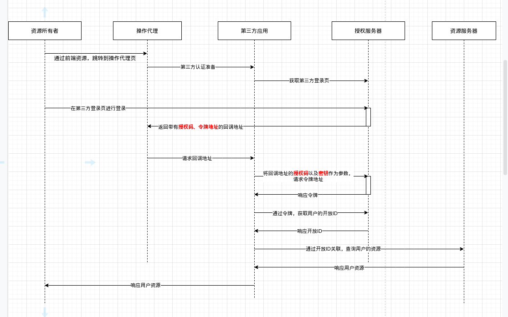

# OAuth2的四种模式

OAuth2作为一个第三方应用的认证授权协议，主要有4种模式。对于OAuth2的使用，可以在以下概念的认知前提下，再去了解：

资源所有者、操作代理、第三方应用、授权服务器、资源服务器。

单纯的文字太难理解了，以A网站通过QQ第三方授权，进行A网站登录为例：

1. 资源所有者：需要第三方授权的用户，如QQ号的所属者。
2. 操作代理：在A网站进行第三方授权时的页面。
3. 第三方应用：A网站本身的服务器，一般指的是后端服务器。
4. 授权服务器：QQ专门用来授权的服务器，给第三方应用进行QQ密码校验、返回令牌。
5. 资源服务器：A网站本身的服务器，用来存储QQ号所属用户在A网站的资源。

OAuth2的四种模式分别是：授权码模式、隐式授权模式、密码模式、客户端模式。**其中授权码模式最常见使用、密码模式基本不用**。

# 授权码模式

结合场景会比较好理解，假设有这么一个场景：

用户U打算使用服务B的账号，在服务A进行第三方登录，然后查看自身在服务A上的资源（如文章、评论、订单等）。落实到概念分别是：

1. 资源所有者 = 用户U。
2. 操作代理 = 用户在服务A进行第三方登录的前端页面（前端资源）。
3. 第三方应用 = 服务A。
4. 授权服务器 = 服务B。
5. 资源服务器 = 服务A。

在授权码模式下，服务A需要事先在服务B进行注册，向服务B提供自身的一个**回调地址**，使得服务B对服务A是“有认知”的。注册完成后服务A会获得服务B的一个**密钥**，这个密钥类似公钥，原则上不允许外泄。具体流程的时序图如下：

1. 用户U在通过服务A的前端资源，跳转到服务B的第三方登录页，完成登录。这时**具体的登录风险、密码风险、登录校验由服务B承担**。
2. 用户U登录成功后，服务B向服务A的前端资源响应**服务A的回调地址**，此时回调地址会带上2个URL参数，分别是授权码和令牌地址。
3. 服务A前端请求**服务A的回调地址**，服务A需要处理上述两个URL参数：将**密钥**和**授权码**作为参数，请求令牌地址，获得**令牌**。
4. 此时令牌存于服务A，服务A需要基于令牌，请求授权服务器获取用户的开放ID，通过开放ID关联用户U在服务A上的存在。
5. 既然有了开放ID，那么之后用户U只需使用开放ID与服务A进行资源交互即可。

当然，这只是OAuth2授权码模式的大致流程，实际不同的服务实现可能有偏差，比如授权服务器给第三方应用响应令牌的时候，直接将开放ID返回给服务A。