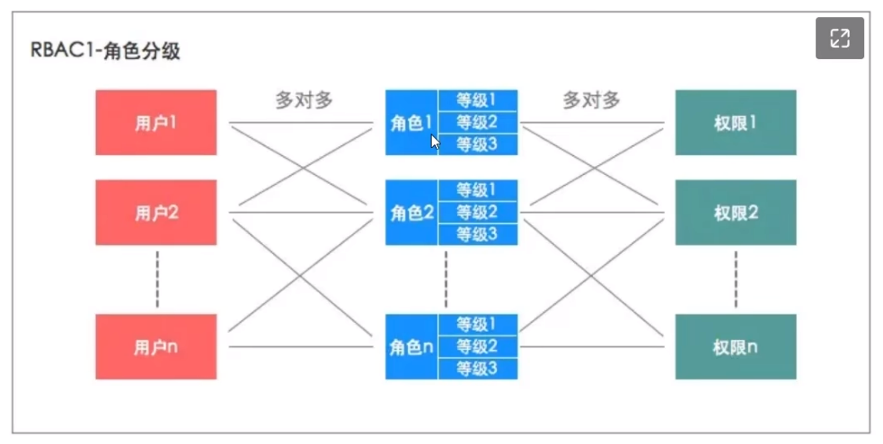

# RBAC

## 定义

即Role-Based Access Control，基于角色进行权限控制，目前（截止202211）在项目中使用这套权限设计。权限一般是细分到操作，比如页面操作（按钮、跳转）、接口操作（查询、提交），和权限直接关联的是**角色**，一个角色能有多个权限，用户与角色直接关联，从而间接关联权限：

比如User1，通过关联Catalogue-Associate这个角色，从而拥有Products-Read/Write权限。用于可以有多个角色，从而拥有多个权限，对于多个角色的多个权限之间的关系，可以视情况取并集处理。

## RBAC五表

一般来说，RBAC都是基于5张表进行控制的，分别是用户表、角色表、用户角色表、权限表、角色权限表：

## RBAC的4种等级

1. Level 0，最简单的RBAC形式，通过用户关联角色、角色关联权限来控制：

   

2. Level 1，在Level0的基础上，对角色进行分层设计，通过**角色分层**关联权限：

   

3. Level 2，在Level0的基础上，添加职责分离

   职责分离又细分静态分离与动态分离，静态分离主要有角色互斥（同一个用户在两个互斥角色中只能选择一个）、基数限制（同一个用户拥有的角色数有上限）、先决条件（拥有高级角色的前提是拥有低级角色）。动态分离主要是用户可以有多个角色，但使用权限时，只能让其中一个角色生效并鉴权。

4. Level 3，即Level 1 + Level2。

## RBAC的延伸：用户组

一般RBAC会搭配用户组进行使用，是“再加一层”的体现，与角色关联的不再是用户，而是用户组。通过用户 → 用户组 → 角色 → 权限进行鉴权，当然这一般是用在复杂的系统上，中小型系统是没必要的。

# ABAC

## 定义、与RBAC的区别

即Attribute-Based Access Control，与RBAC不同的是，它是基于属性进行权限控制。用一个最直观的例子来说明他俩的区别：

1. 如果是RBAC，用户在拥有“运营人员”权限的前提下，可以查看、操作运营数据相关的页面的所有数据。
2. 如果是ABAC，用户在拥有“合作公司A”权限的前提下，在运营数据相关页面只能查看与操作**合作公司A相关的数据**，除此之外的数据没有访问权限。

RBAC的粒度比较大，它一般是用在页面级别、或者按钮级别的权限。而ABAC粒度更细，它更关注**读写数据的类别、属性、以及操作环境**。

RBAC更注重对一组资源**能不能读写**，ABAC更注重对一组资源**能读写的范围**。

## 具体实现

在ABAC的权限配置页，操作人员可以给指定用户配置ABAC权限，这些权限是限定用户可操作的范围或者前提。

当用户进行操作时，代码会根据用户的ABAC权限，动态拼接SQL，使用户查看的数据范围在权限的控制之内。

## 为什么不使用ABAC

主要还是太复杂了，对于大多数业务场景，将用户权限细分到页面、按钮的RBAC已经足够使用了。如果使用ABAC的话，代码还需要考虑如何进行数据隔离，而数据隔离和业务几乎是强绑定的，如果是迭代迅速、变化较大的业务场景下，使用ABAC会导致维护成本变高。

因此ABAC更适合那些早期有时间规划，后续不会变更太大，但是权限粒度划分要求比较细的系统。