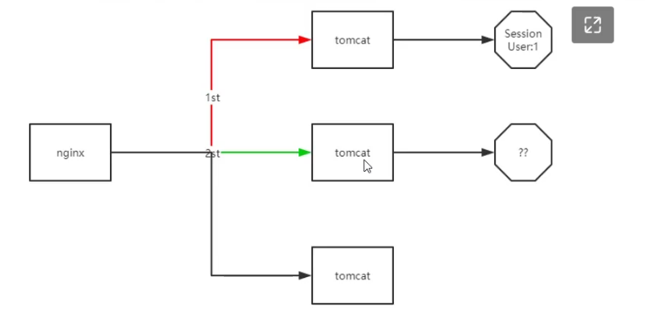
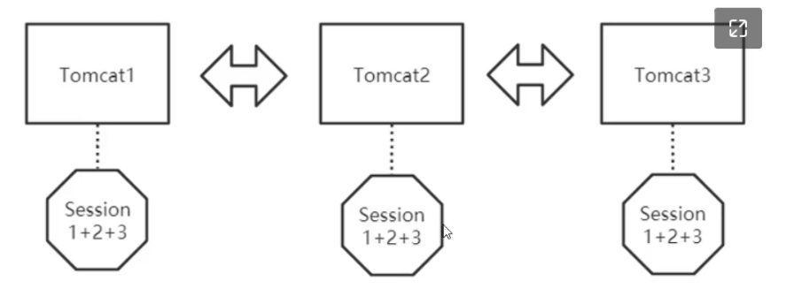
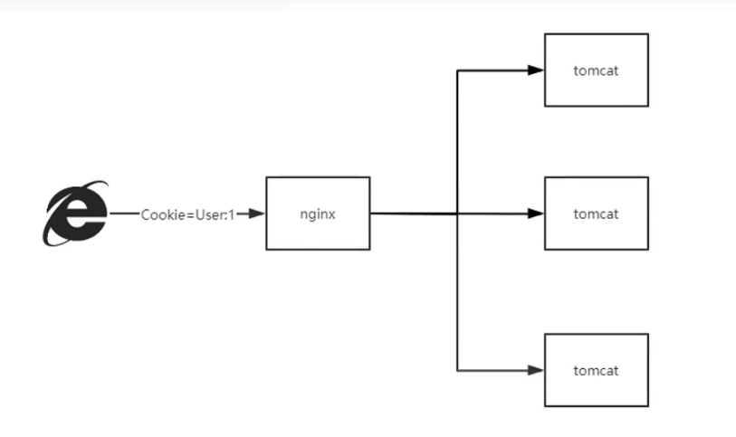
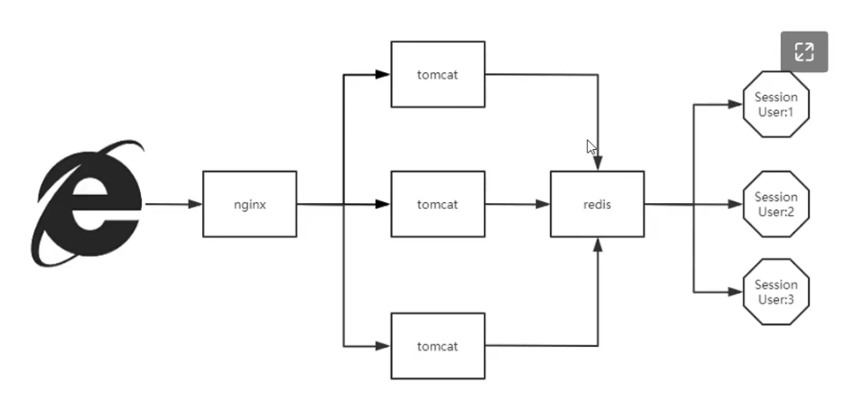
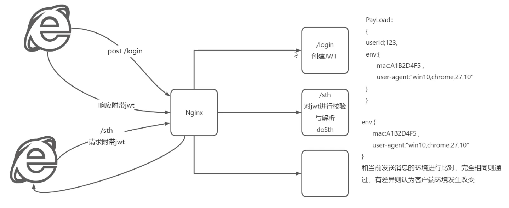

# 为什么要无状态化？

即使是最普通的单体架构，也会采用水平扩容+负载均衡的方式提高系统的吞吐量，假如用户A在Servlet容器1完成了登录，生成了“标识”，此时标识只存在于容器1。在有状态化的场景下，用户无法通过标识请求容器2，因为容器2根本不知道这个标识是什么。

# 废案1-Session同步

基于Servlet容器（Tomcat）实现的方案，在某个容器生成了Session后，会同步到其他容器内，从而保证Session在全局系统中可见。

但是Session同步本质是CP模式的，在容器数量多的场景下会产生不必要的网络消耗，并且同一个Session却要冗余N份，属实浪费内存。

# 废案2-普通客户端存储

服务端将登录后的用户信息返回给客户端，客户端保存到本地（或Cookie），下次请求的时候带上。这样应用根据客户端传过来的用户信息，判断是哪个用户，再处理具体的业务逻辑。

这个方案是最老、也是最不安全的方案了，毕竟用户信息存在本地。如果此时客户端被入侵，黑客拿到用户信息进行篡改发起请求，会引起业务异常。主要是两个大问题：篡改和盗用。

# 使用方案-加密客户端存放 + 后端统一存储

也就是目前最主流使用的JWT，通过JWT的验签特性，可以防止请求篡改。另一个问题：盗用，也可以通过验证环境来避免。

比如目前（202211）在生成JWT令牌的时候，**会基于客户端的一些属性作为防盗用参数，比如MAC、比如一些请求头信息**。将生成后的JWT存储在Redis，并返回给客户端存储。

客户端携带JWT发起请求，请求到达后端系统，会有统一的拦截器将**请求属性**和**JWT里面的防盗用参数**进行比较，如果相等才进行放行。

当然，如果黑客连这一步也做到了，那该怎么办呢？目前来说没有办法，毕竟客户端被入侵到这种程度了，其实和本人操作没多大区别了，**需要更注重社会工程学层面的防范**。