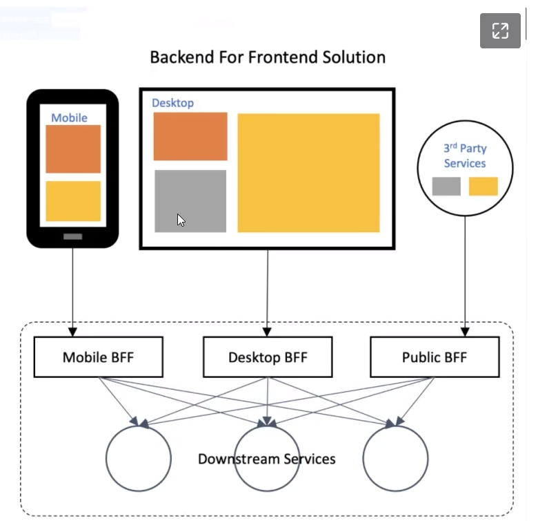

注意！BFF是一套接口设计模式，并不是一套具体落地实现的方案

# 背景

一般来说，不管是C端还是B端应用，都有多种客户端，不会局限于网页。比如网页端、电脑客户端、APP端、甚至电视端，其中APP端还包含Android、IOS、甚至Windows Phone。不同的客户端由于自身的限制，在页面上展示的内容、格式可能会有变化（当然，和具体的业务也有关系）。

有些时候，不同客户端对同一个接口的**响应格式要求**甚至不一样。对于后端来说，这种问题可以采用提供两个接口方案来解决，比如客户端A提供A接口，客户端B提供B接口，AB两个接口的业务逻辑是一致的，只是响应方式不太一样。

这样的方式比较简单粗暴，而且在同一个系统内，会产生大量的接口冗余，不太利于后期的维护。于是就产生了**新加一层**的方案：BFF。

# BFF的作用

简单来说，就是在前端和后端之间**再加一层**，对于后端系统来说，该怎么做就怎么做，但是前端不再直接请求后端，而是请求中间层BFF，不同的前端类型对应不同的BFF。

BFF将请求转发到后端，拿到原始的响应内容，经过自己的转换后，形成符合前端需求的响应格式，再返回。

对于BFF来说，不仅能做到格式转换，还能实现数据剪裁的功能。像一些客户端只需要接口A的部分数据，而不是全部，那就可以通过BFF完成数据的过滤，将没必要的数据去除掉，仅给客户端返回它需要的数据。

# BFF的好处与问题

其实BFF最大的好处是：不直接影响后端系统的设计。

但多加一层，就意味着多维护一层，比如后端系统需要提供一个新接口N，N接口想要被其他客户端所使用，就必须在客户端的所有BFF上再套上一层，开发量仍然没有减少，只是将改动挪到BFF层而已。

但反过来想，后端系统承载着业务逻辑，频繁修改不利于系统的迭代，假如**某个客户端**的数据需求发生了变更（比如活动需求、或者一些数据迭代），仅需要在**客户端对应的BFF层**进行修改就好了，对于后端系统来说是**无感知**的。

目前（截止202211）我了解到一些采用BFF设计的公司，大部分是后端工程师完成接口开发与BFF生成，前端工程师在后续维护BFF层，分工更加地明确。这么看来BFF的存在还是有一定用处的。