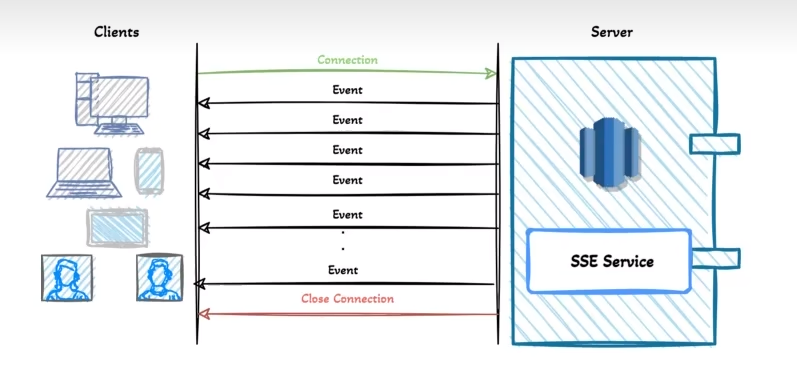

# 为什么有WebSocket，还要搬出SSE？

WebSocket太重量级了，而且SSE的普及率、兼容性比较高，除了IE以外基本所有浏览器都支持，而且主流的Servlet容器像Tomcat，也支持SSE。

不过SSE技术是基于单工通信模式，只是单纯的客户端向服务端发送请求，这点是比不上WebSocket的。

# SSE是什么？



**它是一个在HTTP上层的应用层协议**，前端向后端发起一个HTTP请求，建立连接后，后端不断地向前端推送消息，SSE协议对消息有严格的格式规范，必须是data: 开头，两个回车符(\n\n)结尾：

```
curl http://localhost:8080/sseTest
data: 消息1

data: 消息2

data: 消息3
```

# SSE的使用(demo级别)

## 前端

```javascript
var sse = new EventSource('http://localhost:8080/sseTest');
sse.onmessage = function(evt){
    var el = document.getElementById('sse');
    el.innerHTML = evt.data;
}
```

## 后端

1. 将响应的content-type标记为"text/event-stream"。
2. 直接将数据返回，注意数据格式以data: 开头，以\n\n结尾。

# 使用场景

目前在项目中，还没有比较好的使用场景，因为我们不能单独暴露一个接口，作为前端的SSE连接入库，**后端需要采用异步的方式给前端响应SSE消息**，不知道SpringBoot有没有现成的SSE组件可以集成。**因此仅作为一个知识点了解**。