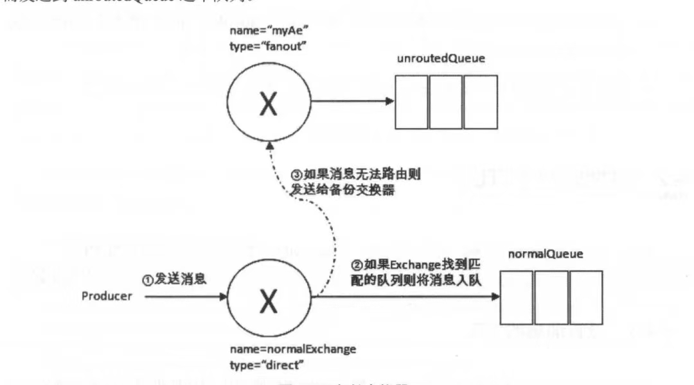
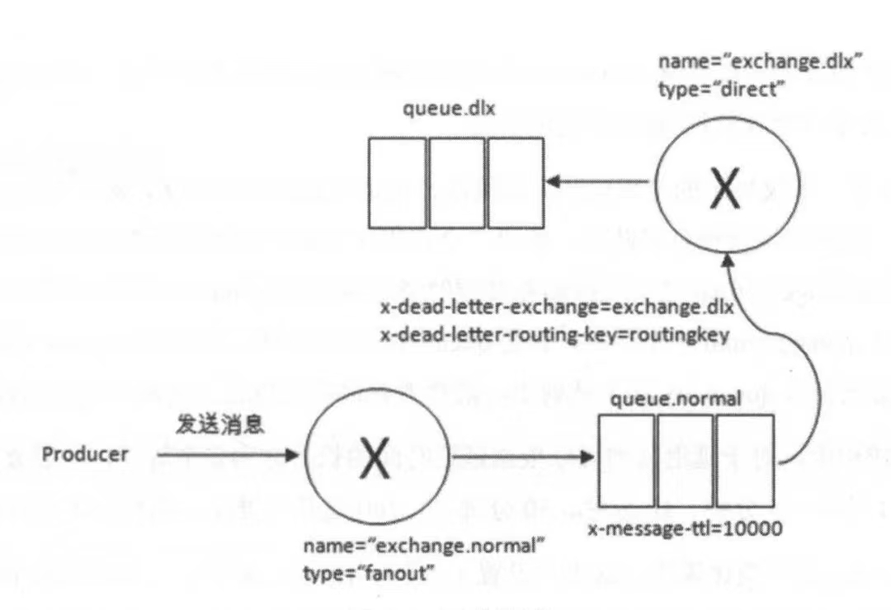
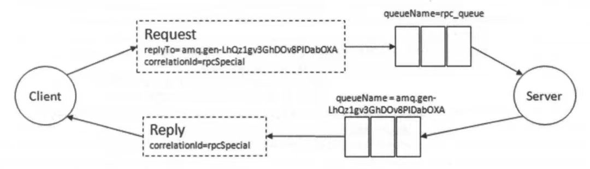

**知识点整理自《RabbitMQ实战指南》---朱忠华**

# 消费确认与并发消费

在RabbitMQ中，Broker在得到消费确认后，会在内存或者磁盘将这条消息打上删除标记，在特定时间删除。当autocheck为true时，Broker会在消息发出去的时候将消息删除。在Rabbitmq UI可以看到queue里ready和unack状态的消息，分别对应未投递给consumer的消息数和已投递但未ack的消息数。

Reject的本意是consumer不想消费这条消息，它需要指定2个参数：deliveryTag和requeue。前者是消息在生命周期中的id，后者是reject后消息会不会重新入队。当requeue=true，Broker会将消息重新入队，等待下次投递，反之则删除消息或扔到死信队列。而nack是reject的增强，它可以指定multiple参数，一次性reject这个deliveryTag之前的所有unack的消息。

和Kafka不一样，Broker维护了每个Consumer的offset状态，ConsumerA在提交offset确认消息后，Broker会将ConsumerA Offset里的这个offset之前的消息都标记为已提交，但不会删除消息（除非触发了kafka的消息删除、消息压缩）。其他Consumer还能读到这个消息，只是在ConsumerA眼里已经不可读了。

而RabbitMQ不是这样，**对于RabbitMQ来说，已提交的消息就会被打上删除标记**。假设Consumer A commit了deliveruTag=100的消息，那么Consumer B也不会读到这条消息，这种情况下multiple=true同样有效。

**也就是说：**

1. **对于Kafka，多消费者组的并发消费问题不大，只要考虑单Consumer多线程消费的offset一致性问题即可。并且同一条消息可以被不同组的Consumer消费。**
2. **但是对于RabbitMQ，同一个queue可以绑定多个消费者，但一条消息只能被一个Consumer消费（仅考虑常用的direct模式），并且被ack后，消息会被删除。**

# 忘了ack，会发生什么

还是那句老生常谈的话：“RabbitMQ的消息被ack后，会走入销毁生命周期，而Kafka只是标识这个消息对于这个Consumer Group不可见了而已”。也就是说，RabbitMQ需要确保消息投递、消息确认、消息删除的一致性。

回顾一下消息的状态：

1. ready：消息可以被投递给某个消费者。
2. unacked：已经被投递给某个消费者，但未被ack。
3. acknowledged：已被消费者确认，接下来会被Broker异步走销毁流程。
4. nacked：消费被拒绝，但重新入队。
5. rejected：消息被拒绝，明确不会重新入队。

当消息被投递给Consumer后，这条消息会被标记为unacked状态，如果Consumer因为代码缺陷一直不ack，那么这条消息就会一直保持unacked状态。但这样不行啊，因为unacked的状态不会发给其他Consumer（防止重复消费），好在Broker和Consumer维护了心跳状态，当Broker发现Consumer的心跳断开后，会将这个Consumer的unacked消息回到ready状态，**并重新入队尾**。

也就是说，因此即使在业务上认为这条消息消费失败了，也要显示调用nack/reject并requeue，或者ack但走监控告警流程。消息被nack/reject并requeue后会被标记为nacked状态，并**重新入队尾**，在合适时机变为ready状态重新发送给Consumer。

# 从Prefetch Count和消息拒绝的角度，再看消费的有序性

之前在Kafka的[advance aspects](https://github.com/9029HIME/Emphasis/blob/master/kafka_advance/md/02-%E5%86%8D%E5%88%B0%E7%94%9F%E4%BA%A7%E8%80%85.md)也整理了一下关于RabbitMQ生产的有序性，接下来说说RabbitMQ消费的有序性。

## Prefetch Count

什么是Prefetch Count？这个参数在使用Spring RabbitMQ的时候好像没什么感觉，因为Spring RabbitMQ把这个值设为1。它的意思是Broker对于Consumer**在一个channel内能传输的最多未确认（包括ack、nack、reject）的消息数**。有点难理解，我换个说法，假设Consumer通过basicQos(10)设置prefetch count = 10，在开启channel后Broker会从queue一条一条地传输10条消息过去，如果这10条都没有被ack或者nack或者reject，此时Broker不会继续推消息给Consumer，直到Consumer ack多少条，Broker才推多少条。有点类似于[滑动窗口流控机制](https://github.com/9029HIME/Emphasis/blob/master/project_emphasis/src/main/mds/12-%E5%BC%80%E5%8F%91%E7%BB%8F%E9%AA%8C-%E6%B6%88%E6%81%AF%E5%B9%B3%E5%8F%B0%E7%9A%84%E5%8A%A8%E6%80%81%E8%B5%84%E6%BA%90%E6%B5%81%E6%8E%A7%E8%AE%BE%E8%AE%A1%E8%BF%87%E7%A8%8B.md)。

## 消费拒绝

假设在单queue单Consumer的前提下，并且设置了prefetch count = 4，Broker会按照msg1,msg2,msg3,msg4这样的顺序将消息推给Consumer处理，Consumer也会按照msg1,msg2,msg3,msg4的顺序处理消息，这是RabbitMQ能保证的最大程度的有序性。

在上面的`忘了ack，会发生什么`我强调了很多遍“重新入队尾”，假如Consumer在消费msg1的时候选择了nack/reject并requeue，msg1只会重新入queue的队尾，等待下次重发。**但对于Consumer来说，这和接下来处理msg2没有半毛钱关系。如果业务上对于msg1和msg2的消费顺序敏感，最好在消费msg2时判断一下业务上游流程是否已结束，如果未结束最好nack/reject并requeue msg2，这样msg2会重新入queue的队尾，并排在msg1后面，等待重试就好了**。

此时可能会想，我将prefetch count设为1不就好了？实际上，当接收了msg1的nack/reject并requeue确认后，Broker会将msg1重新入队尾，并开始投递msg2给consumer，从结果上看还是一样的。

# 再提一下Prefetch Count

Prefetch Count是Channel级别的参数，如果Consumer在1个Channel内消费多个Queue，只要Consumer对于其中1个Queue的未确认消息到达Prefetch Count，Consumer将收不到另一个Queue的消息。

在Spring RabbitMQ的源码（org.springframework.amqp.rabbit.listener.SimpleMessageListenerContainer）可以看到，prefetch count = 1。这样不会对多个@RabbitListener的消费有影响吗？实际上，默认情况下每个@RabbitListener独立使用各自的channel，互不影响。

# mandatory与immediate

mandatory与immediate都是控制消息投递后不可达的处理方式。区别是：**mandatory用于交换机到队列不可达，而immediate用于队列到消费者不可达**。

当设置mandatory为true时，如果消息key无法被路由器路由到指定队列，Broker会通过Basic.Return将消息送回给Producer，同时Producer通过绑定在channel的自定义ReturnListener处理Broker的Basic.Return消息。如果mandatory设置为false，当发生不可达情况时，Broker会丢弃该消息。

而immediate在3.0版本后被RabbitMQ舍弃支持，官方解释是：immediate参数会影响镜像队列的性能，并增加了代码的复杂性。建议采用TTL + 死信交换机的方式替代。

# AE备份交换机

Alternate Exchange，即备份交换机。**在mandatory设置为false的情况下（即使为true，AE也会覆盖madatory）**，交换机到队列不可达的消息会丢失，如果设置了madatory，我们还需要额外添加ReturnListener的代码逻辑。如果既不想消息丢失，也不想额外添加逻辑，可以使用备份交换机的特性。AE有点像死信交换机，消息从交换机到队列不可达时，消息会被路由到交换机绑定的AE里。

AE本质上就是一个交换机，和普通交换机同级，所以AE一般使用fanout方式路由，如果使用direct方式，有可能会导致原消息key不匹配，最终导致消息丢失：

# TTL

RabbitMQ有2种TTL：消息的TTL、队列的TTL

## 消息TTL

对于消息的TTL，当消息在队列中存活TTL时间还未被消费者消费，Broker会认为该消息已过期，并自动清除。

值得注意的是，**如果不设置消息的TTL，那么消息将永不过期**。消息的TTL有两种设置方式：全局设置，单条设置。全局设置后，每条消息的TTL是相同的，一旦消息过期，就会从队列中抹去，因为RabbitMQ只需定期从队头扫描时候有过期的消息即可。

而单条设置的情况下，每条消息的TTL都不同，RabbitMQ无法完全感知哪些消息该剔除，哪些消息不该被剔除，除非定时扫描整个队列，性能比较差。因此RabbitMQ对这些消息的剔除策略是：消息即将被投递到消费者时，再判断是否过期。

## 队列TTL

对于队列的TTL，当队列在生命周期中超过TTL时间未被使用，Broker会认为该队列已过期，并自动清除。一般很少使用，仅了解即可。

# 死信队列

这个不再赘述了，稍微补充一下死信定义和死信流程

1. 死信的定义：

   1. TTL超时的消息。
   2. 被消费者reject、nack，且requeue为false的消息。
   3. 队列容量满后，被额外投递进来的消息。

2. 死信流程：

   

值得注意的是，死信交换机 和 AE一样 ，也是普通交换机，所以实际使用中，需要考虑与队列的匹配模式。

# 优先级队列

**这个在生产中也比较少用，仅作为了解。**

可以通过x-max-priority参数设置队列的优先级，假设队列优先级为Pq。

往优先级队列投递消息时，需要指定消息的优先级，假设值Pm。

Pm默认最低为0，最高为Pq，队列中Pm高的消息会被优先消费。这一点和数据结构中的优先级队列是等价的。

# RPC

这个功能更少用，简单理解为系统A与系统B之间，可以使用RabbitMQ作为桥梁，从而实现RPC的功能：

# 消息可靠的3板斧：Producer Confirm, Broker Durable, Consumer Ack

其实不管是Kafka还是RabbitMQ，我认为消息队列想要保证可靠性，都需要从这3方面入手。Kafka具体看之前做的[笔记](https://github.com/9029HIME/Kafka_Note/blob/master/src/mds/02%20kafka%E7%9A%84%E6%B6%88%E6%81%AF%E4%B8%A2%E5%A4%B1.md)，在这里重点介绍RabbitMQ。

## Producer Confirm

Producer将channel设置成confirm模式，一旦channel进入confirm模式，Producer在这个channel上推送消息时都会赋值1个唯一消息ID（**即deliveryTag**），当消息被Broker路由到指定队列后，Broker会给Producer发送一个包含唯一消息ID的Basic.Ack消息。Producer通过Basic.Ack的唯一消息ID确认这条消息成功到达Broker。**我们可以通过代码判断Producer未收到ack的超时时间，认为消息不可达，然后重新发送（和Kafka不一样，Kafka Producer有原生的重试机制，RabbitMQ只能通过额外的代码自行处理）**。

和Kafka类似，Broker向Producer ack消息时，需要指定消息的deliveryTag，同时可以指定multiple参数，当multiple参数=true时，会ack这个deliveryTag之前的所有nack的消息，当multiple参数为false时，只会ack这条消息。**这一点不管是Broker Ack还是Consumer Ack都是一样的。**

对于Producer接收Borker Ack，有同步处理和异步处理两种方式。不管是哪种方式，都要将channel设置为confirm模式：

1. 同步处理：通过channel.basicPublish发送消息后，调用channel.waitForConfirms等待Broker Ack。
2. 异步处理：在channel新增ConfirmListener，它有两个方法handleAck和handleNack，分别处理两种不同情况。

## Broker Durable

RabbitMQ的持久化分为交换机、队列、消息持久化，这里不赘述交换机和队列的持久化，生产环境中都会默认配置，接下来重点讲消息的持久化。

消息持久化在Producer发送阶段指定，Broker接收到deliveryMode=2的消息，并转发到队列后，会将消息写入Page Cache，至此消息的持久化工作就算完成。

那么问题来了，如果RabbitMQ在写入Page Cache后，fsync之前发生宕机，消息不就会丢了吗？这需要配合Producer Confirm解释：**当channel设置为confirm模式后，RabbitMQ会将持久化消息fsync后才发出Basic.Ack**。如果在写入Page Cache后发生宕机，可以依赖Producer的重发机制保证消息的可靠性。

## Consumer Ack

和Broker Ack一样，Consumer Ack也是基于deliveryTag和multiple进行消息提交。为了保证消息可靠性，建议处理完消费逻辑后，再进行ack。即使因为特殊原因需要nack这条消息，也要指定requeue参数为true。

# 幂等性

和kafka不同，RabbitMQ的Broker不支持幂等性，如果因为网络原因Producer重新发送消息，那么Broker会存在2条相同的消息。其实不管是Kafka还是RabbitMQ，都没有完美的解决方案保证消费者只收到一次消息，因此消费端的幂等是必须要考虑的。

