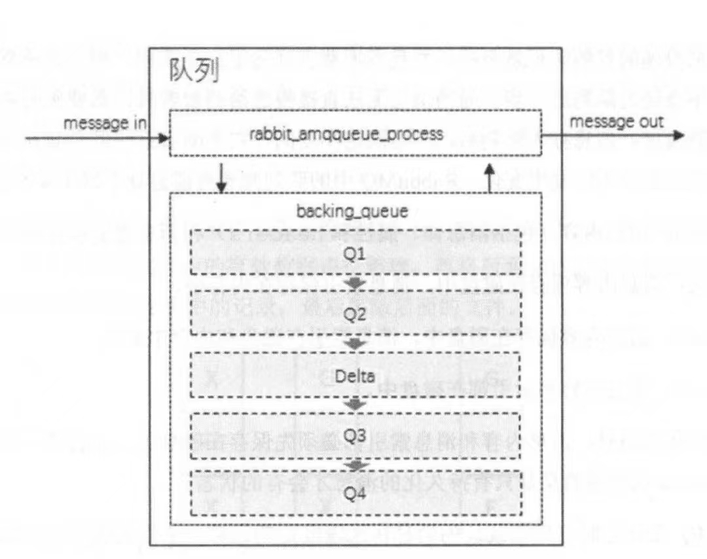

# 存储

## 持久层

在Broker眼中，消息是否存储到磁盘 与 消息是否开启持久化没有直接关系。开启持久化的消息到达队列后会被fsync，并且在内存容量允许的情况下，这个消息还会在内存停留一段时间，这样消息被使用时就不用从磁盘获取了，这一点和Kafka使用Page Cache和磁盘是类似的。没有开启持久化的消息一般只保留在内存中，在内存空间不足时会fsync到磁盘，这样做是为了保证消息在被ack之前仍能够被Consumer消费。当然，不管是否开启持久化，消息被ack后就会被Broker删除。从消息的存储到删除，都是交给RabbitMQ的**持久层**完成。Kafka有稀疏索引和顺序写入，RabbitMQ有什么呢？

RabbitMQ的持久层可以分为两部分：rabbit_queue_index和rabbit_msg_store。rabbit_queue_index维护消息的落盘元数据，比如消息的存储位置、是否已被发送给Consumer，是否已被Consumer Ack，每个queue都有自己的rabbit_queue_index。而rabbit_msg_store只要以KV形式存储消息，它是Broker级别的、所有队列共享1个rabbit_msg_store。rabbit_msg_store还能被再细分为msg_store_persistent和msg_store_transient，前者负责持久化消息的持久化，重启后仍在。后者负责非持久化消息的持久化，重启后丢失。简单来说：

1. rabbit_queue_index:
   1. 队列级别。
   2. 维护消息的存储位置、是否已被发送给Consumer，是否已被Consumer Ack等信息。
2. rabbit_msg_store：
   1. 以KV方式存储消息
   2. msg_store_persistent：
      1. 负责持久化消息的持久化，Broker重启后消息仍在。
   3. msg_store_transient：
      1. 负责非持久化消息的持久化，Broker重启后消息丢失。

rabbit_queue_index和rabbit_msg_store可以在$RABBITMQ_HOME/var/lib/mnesia/rabbit@HOSTNAME/下找到，注意rabbit_msg_store会以msg_store_persistent和msg_store_transient的形式区分存储。

## 消息的存储选择

RabbitMQ允许消息被存储到rabbit_queue_index或rabbit_msg_store中，但只能选择其一，至于怎么选择交给queue_index_embed_msgs_below来配置，默认是4096Byte。当消息大小**（包括消息体、属性、headers的整体大小）**＞ 阈值时，存储在store，反之存储在index。

存储在index的好处显而易见，将index当作聚簇索引使用，减少回表查询store，但消息太大还存储在index会导致index膨胀，最终导致index定位效率低，所以还需要阈值来进行分流。

## index

有点类似kafka的消息存储，RabbitMQ中的index按照顺序分割成segment进行存储，文件名从0开始累加，后缀为.idx。每个segment包含SEGMENT_ENTRY_COUNT（默认16384）条索引记录。值得注意的是，每个index想从磁盘中读取消息时至少要该index其中一个segment被加载到内存中（我猜segment之间有prev和next指针，只要其中一个在内存中就能快速定位到前后的segment），所以设置queue_index_embed_msgs_below时要谨慎，一点点增大也会导致segment的内存占用扩大16384倍。

## store

同样地，store也是按照顺序分割成segment进行存储，文件名也是从0开始累加，后缀为.rdq。每个segment的大小超过file_size_limit后（store通过占用大小划分，index通过索引数量划分），会关闭这个文件再递增序号创建一个新的文件进行写入。在消息进行存储时，Broker会在Erlang Term Storage表中记录消息在文件中的index值和文件的相关信息。

## 队列结构与消息流转

官方定义的queue是一个整体，实际上它由rabbit_amqqueue_process和backing_queue两部分组成。前者负责Broker上下游间的协议相关的处理，涵盖接收消息、交付消息、处理confirm与ack等。而后者是消息存储的具体形式与引擎，并向rabbit_amqqueue_process提供相关API调用。**可以理解为：backing_queue是消息的存储引擎与底层API提供商，rabbit_amqqueue_process基于backing_queue完成上下游的处理逻辑。**

对于普通队列来说，如果不设置优先级和镜像队列，backing_queue的默认实现是rabbit_variable_queue，它包含了5个子queue：Q1, Q2, Delta, Q3, Q4来体现消息的流转，一个普通队列在结构上可以被视作：

如图所示，消息来到队列后，经过rabbit_amqqueue_process的处理，从Q1 → Q2 → Delta → Q3 → Q4流转，最终发出给消费者。在流转的过程中，消息经过以下状态：

1. alpha：消息 和 索引都只在内存。
2. beta：消息只存在于磁盘，索引只在内存。
3. gamma：消息只在磁盘，索引在磁盘 和 内存。
4. delta：消息和索引都只在磁盘。

各个子队列与消息状态的对应关系是：

1. Q1：alpha（均在内存）
2. Q2：beta（消息磁盘，索引内存）、gamma（消息磁盘，索引内存磁盘）
3. Delta：delta（均在磁盘）
4. Q3：beta（消息磁盘，索引内存）、gamma（消息磁盘，索引内存磁盘）
5. Q4：alpha（均在内存）

由此可见，消息处于alpha阶段最消耗内存，但最不消耗CPU和磁盘IO，而delta最不耗内存，但最消耗CPU和IO。

一般情况下，消息会经历Q1 → Q4的流转，但不一定所有消息都会这样，因为Q1 → Q4本质是消息和索引从内存到磁盘，再从磁盘到内存的流转过程，消息的具体流转取决于消息的配置、Broker的负载、消息数据量等客观因素。在正常负载时，一般消费速度 ＞ 生产速度，如果消息持久化为false，此时消息基本处于alpha状态，**即基本存在于Q1队列，不会下沉到Q2、Delta、Q3、Q4队列**。但开启了消息持久化后，它一定会处于gamma阶段，只有gamma阶段的消息才会被Broker响应ack。但消费速度足够快，内存也足够充足的前提下，消息可能在Q2就被消费了，不会下沉到Delta往后的子队列。

在系统负载比较高的情况下（生产速度 ＞ 消费速度），消息可能产生堆积，进而下沉到更深的队列里，从而恶性循环，Broker把更多的CPU时间片花在磁盘IO上，使Broker的处理能力大大降低。

## 惰性队列

即Lazy Queue，它惰性就体现在**Broker在接收到这条消息后，不管消息是否持久化，都会消息写入磁盘**，由此可见，惰性队列和持久化消息的适配性更高。queue具有2种模式，默认是default即普通队列，当设置queue模式为lazy时，queue会转变为惰性队列

# 告警

当Producer的生产速度远大于Consumer消费速度时候，大量的消息堆积在Broker上，占用Broker的内存和磁盘空间，在剩余内存和剩余磁盘空间低于配置的阈值时，**Broker会block Producer和Consumer的连接**，从而避免服务器宕机。Broker的block也是有区别的，在rabbitmectl list_connections可以看到两种block的state：

1. blocking：代表block Consumer Connection，此时Consumer和Broker和连接还能正常运行，正常消费和响应ack。
2. blocked：代表block Producer Connection，此时Producer无法向Broker发送消息和心跳检测。

值得注意的是，在RabbitMQ Cluster中，其中一个Broker开始存储告警降级后，会引起整个集群的Broker一起告警降级。因此最理想的情况是当Broker告警降级后，只影响Producer的消息发送，不影响Consumer的消息消费。然而在AMQP协议中，1个信道Channel可以同时承载Producer和Consumer，1个Connection也可以同时承载若干个Producer和Consumer的Channel，因此一旦Broker降级后block connection就达不到理想的Producer与Consumer分隔降级，因此在实际生产环境中还是将Producer和Consumer分摊到独立的Connection上。

### 内存告警

RabbitMQ有一个内存告警阈值，默认是0.4，假设RabbitMQ可用虚拟内存是4GB，那么它的内存告警阈值是 4 x 0.4 = 1.6G，当内存使用量到达1.6G后会执行3步操作：

1. 尝试将内存中的非持久化消息刷盘，将内存中持久化消息清除。
2. **产生内存告警并阻塞所有Producer的Connection，此时Producer无法发送消息**。
3. 当消息逐渐被消费完，或者被刷盘完直到低于1.6G后告警解除。

这个内存告警阈值仅针对Producer发送的消息，不包含Erlang虚拟机本身占用的内存，在最坏的情况下，Erlang GC可能会导致2倍的内存消耗即3.2G，因此对待阈值设置不要太过乐观。内存告警可以通过配置或rabbitmqctl设置。对于消息积压严重的场景，可以通过rabbitmqctl将阈值设置为0，此时Producer将停止发送消息。

### 磁盘告警

与内存告警阈值一样，也有磁盘告警阈值，假如设置阈值为50MB，那么磁盘在可用空间低于50MB时Broker会阻塞Producer发送消息，并且停止Broker在内存的刷盘操作。这个阈值可以减少磁盘用尽的可能，但不能避免，极端情况下可能在2次磁盘空间检测期间磁盘就满了。Broker会每10秒检查一次磁盘情况，随着剩余空间逐渐接近阈值，检查频率会增加。当剩余空间与磁盘阈值非常相近时，检测频率会上升到1秒10次。

# 流控

除了存储告警外，RabbitMQ还引入了流控机制确保Broker稳定，从`告警`到`流控`的字样可以看出，告警更多是降级处理，而流控则是减缓消息的发送速度。**告警是针对全体Connection的，而流控是针对单个Connection，一个是全局级别的降级处理，一个是单Connection级别的事先预防**。