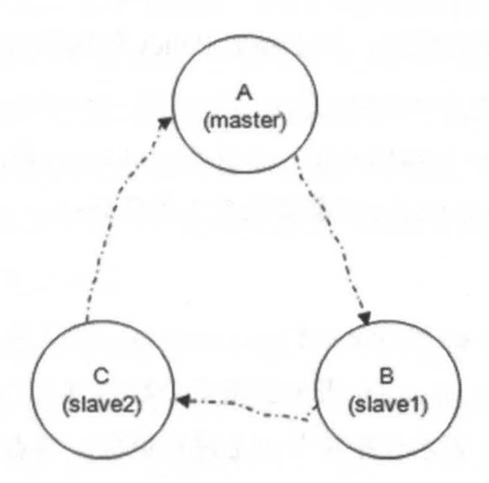

# 镜像队列

在普通集群队列中，queue slave只保留队列的元数据，不会实际存储queue master的消息，它的作用是提高RabbitMQ的消费吞吐量。而在镜像队列中，queue slave不仅保留队列的元数据，还会存储queue master的消息，在保证消费吞吐量的前提下，还能提高整个集群的可用性。

以下是一个典型的镜像集群架构，值得注意的是，Master和Slave的关系是针对queue来说的，对于同一个Borker来说，可能里面的Q1是Master，Q2是Slave：

Producer将消息发给Master，Master将消息和执行的命令同步给Slave，Consumer从Master获取消息进行消费，在commit消息后Master会将commit的情况同步给Slave。

## 客户端与镜像队列

和普通集群队列一样，镜像队列仅支持master写，对于Producer来说，如果不开启publish confirm机制，消息到达Exchange时就代表发送成功了，Producer并不关心后面路由消息到队列，消息从master同步到slave等操作。**开启publish confirm机制后，master会在刷盘消息后将消息同步给slave，并且slave刷盘消息后会通知master，当master和slave都刷盘成功后，才会给Producer响应ack。**

原则上，写和读都应该基于Master进行，但读也可以发生在Slave。实际上，从Slave上读也是从Master上进行消费，比如Consumer和Slave建立TCP连接后执行Basic.Get命令时，都是Slave转发这个Basic.Get到Master获取消息，再将Master返回的消息转发给Consumer，这一点和普通集群很像，都是为了增强消费的吞吐量。

## 镜像队列与分片集群

通过合理分配镜像队列，可以实现类似Kafka、Elaticsearch那样的分片+副本集群，如图所示：

Q1的Master在Broker1，2个Slave在Broker2和Broker3。Q2的Master在Broker2，2个Slave在Broker1和Broker3。Q3的Master在Broker3，2个Slave在Broker1和Broker2。通过这样均匀地**人为设置Master和Slave的方式**，变相实现RabbitMQ的分片+副本集群。

但是，和Kafka、Elasticsearch不同，Producer和Consumer对这种人为设置无感知，如果在生产环境中这样设置镜像队列，代码层面还要考虑针对不同队列的主从路由，或者在代码外添加中间层进行路由。

## 镜像队列与backing_queue

镜像队列的backing_queue比较特殊，实现方式是rabbit_mirror_queue_master或rabbit_mirror_queue_slave。它们都基于默认的rabbit_variable_queue进行了封装加强，额外实现了消息和ack从Master复制到Slave的能力：

1. master_queue：由rabbit_mirror_queue_master、coordinator、GM组成，由GM进行广播通信、数据同步，由coordinator进行Slave同步成功后的回调处理。
2. slave_queue：由rabbit_mirror_queue_slave、GM组成，由GM接收Master的消息，通知rabbit_mirror_queue_slave进行数据同步。

GM本质是一个可靠的组播通信协议，它能够保证组内的成员**要么都收到消息要么都收不到消息，提供镜像队列中原子性的保障**。在GM眼里，所有节点（包括Master）组成了一条环形链表，每个节点都会监控自己左右两边的节点。这条环形链表是一个GM Group，GM Group的信息保存在Mnesia文件夹中。当命令从Master的GM发起广播后，命令沿着链表的顺序传送到下一个节点B，节点同步完命令后再将命令传送到下一个节点C，以此类推，最终命令传到Master，这时候Master就知道这条命令已经被同步到所有Slave上了。

## 故障转移

和Redis集群、Kafka集群这些分布式主从集群类似，镜像队列也会发生故障转移。Slave会按照Master执行命令的顺序复制执行，这样Slave和Master的状态应该是相同的，假设Master因为不可抗力发生宕机，那么同步情况最好的Slave会被选举成新的Master。

当Slave挂掉后，除了和Slave连接的客户端连接全部断开外，没有任何影响。当Master挂掉后，会触发以下流程：

1. 与Master连接的客户端连接全部断开（Producer + Consumer）。
2. 剩余Slave通过一致性协议（未知是什么），选举同步情况最好的Slave为新Master。
3. 新Master重新将unack的消息入队，这些nack消息可能已经被Consumer Ack了，但ack在传输给旧Master时旧Master发生宕机，也有可能旧Master已经收到了，但ack消息还未被其他Slave同步成功。**所以当新Master对外服务后，大概率会引起重复消费**。
4. 如果Consumer连接的是Slave，并且在连接Slave时指定了x-cancel-on-ha-failover参数，那么Master宕机后Consumer会收到一个Consumer Cancellation Notification通知，并且Consumer会回调Consumer接口的handleCancel方法。

可以看到，Master宕机除了消息重复外，可以从三方面分析影响：

1. Consumer：如果连接的是Slave，Master宕机期间无法消费（因为消费Slave本质是消费Master），新Master选举成功后可以继续消费。
2. **消息：可能还停留在内存，Master就宕机了，此时只能配合Publish Confirm机制保证消息可靠。**
3. Producer：即使新Master对外服务，Producer也无法感知。可以通过Producer同时连接Master和Slave的方式，在接收到Slave的Consumer Cancellation Notification后，主动查询新Master并重新连接，让接下来的消息继续发送下去。

## 镜像队列的设置

镜像队列的配置有3个重要参数：

1. ha-mode：指定镜像队列的模式，包括all、exactly、nodes，默认为all。

   1. all：所有节点。
   2. exactly：特定个数的节点（随机）。
   3. nodes：指定节点名称。

2. ha-params：为不同ha-mode的配置指定参数。

3. ha-sync-mode：控制新节点加入集群后的同步方式，有效值为automatic和manual，默认是manual。

   当ha-sync-mode为manual时，新Slave加入集群后，其他Slave不会将消息同步到新节点上，**除非显示调用同步命令rabbitmqctl sync_queue ${queueName}**。调用同步命令后，这个队列在整个集群中阻塞，不可读写，直到消息在新节点上同步完成。当ha-syc-mode为automatic时，集群会默认同步消息到新加入的Slave，**也就是说默认阻塞整个队列**，因此生产环境中使用哪种模式需要酌情考虑。

   通过rabbitmqctl list_queues ${queue_name} slave_pids synchronised_slave_pids命令可以看到${queue_name}有哪些Slave已经同步完成，当同步耗时太久想要取消时，也可以使用rabbitmqctl cancel_sync_queue ${queueName}完成。

## 优雅转移与强制转移

在所有Slave都处于未同步状态，并且ha-promote-on-shutdown设置为when-synced（默认）时，如果Master由于主动原因停机（比如rabbitmqctl stop或正常庀Master），Slave也不会竞争新Master，此时整个集群将不可用（除了那些连接Slave的Consumer）。只有Master由于不可抗力因素宕机时，Slave才会进行故障转移选举新Master。但如果ha-promote-on-shutdown设置为always时，无论Master因为什么原因停机，都会触发故障转移

两种模式各有优点，前者更注重一致性但集群不可用，后者更注重高可用性但消息可能会丢失**（如果配合Publish Confirm+重发机制可以保证最终一致性）**。