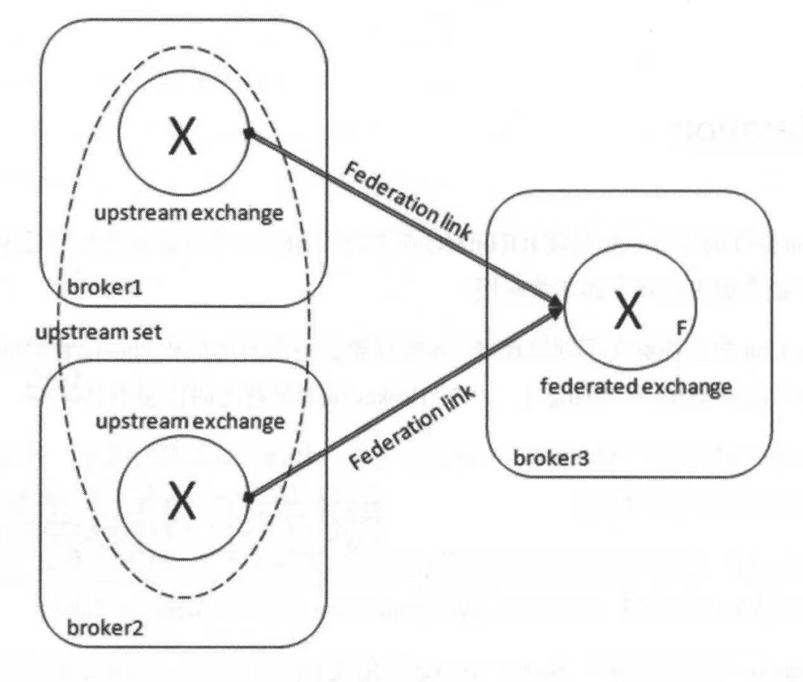
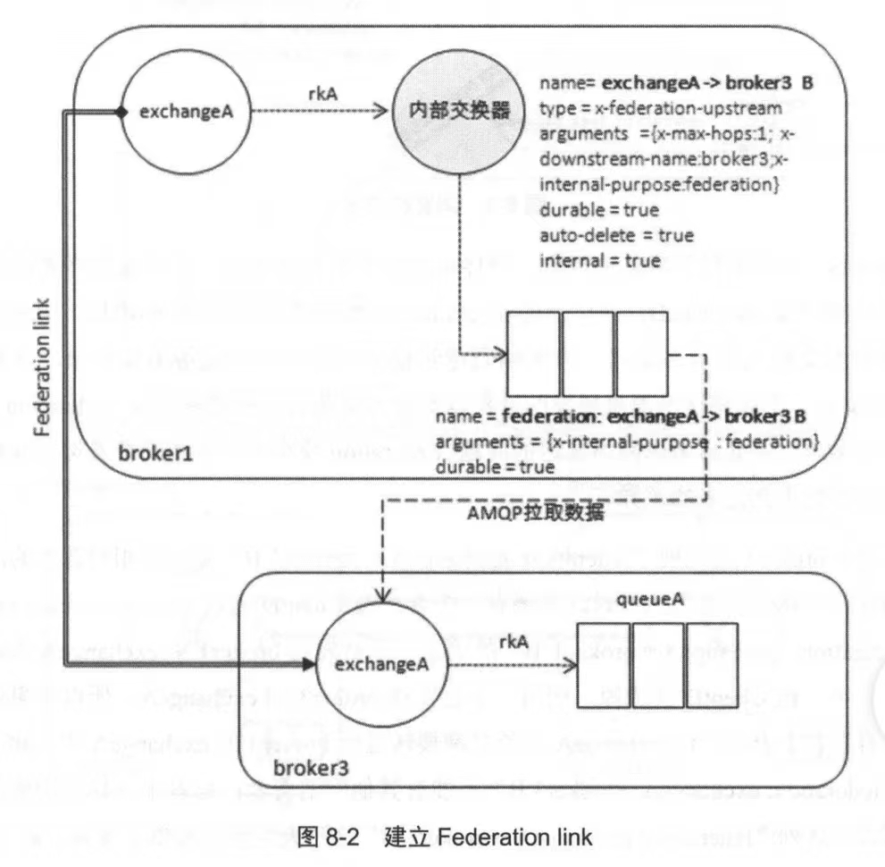
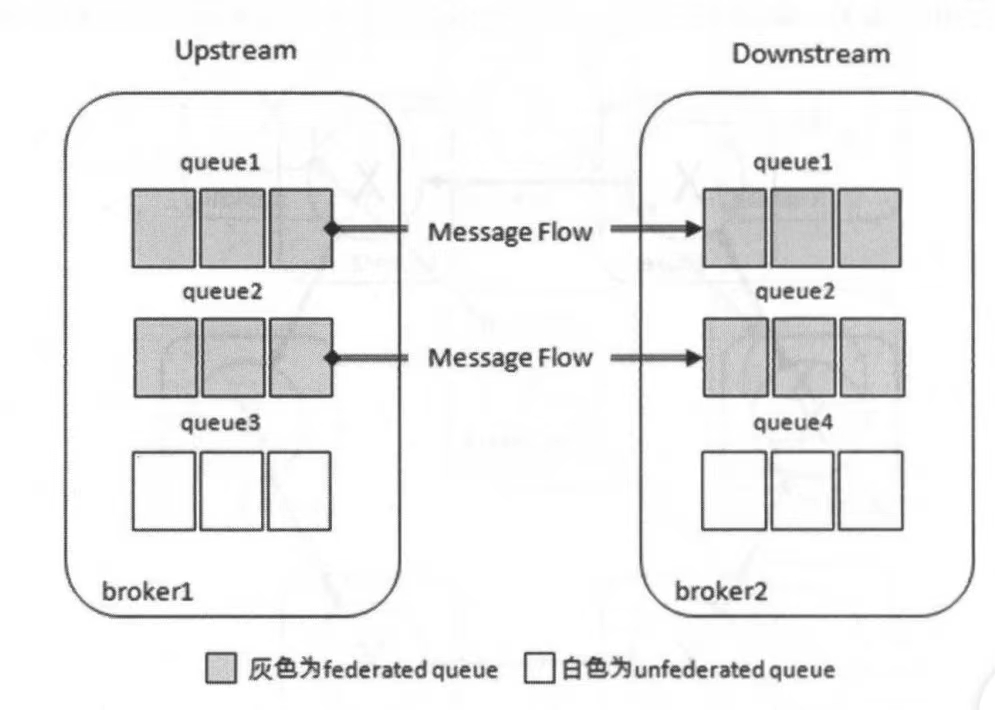
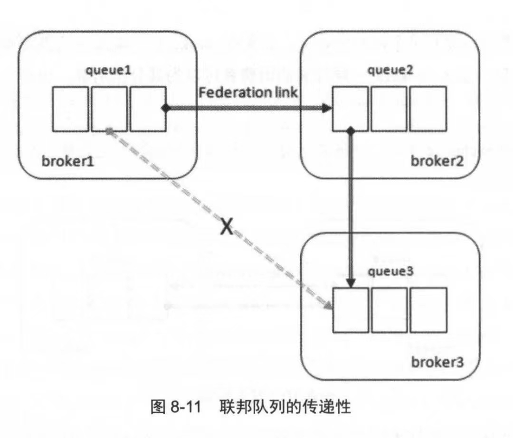

# Federation

`联邦`配合`上游`使用，将`联邦组件`和`上游组件`进行绑定，上游组件将数据转发到联邦组件，再由联邦组件进行获取消息后的操作。RabbitMQ有2种联邦组件，分别是`联邦交换机`与`联邦队列`。

## Federation Exchange

这种上下游的转发有什么用？假设有3台Broker，其中Broker1部署在北京，Broker2部署在上海，Broker3部署在广州，此时在北京的ProducerB需要向Broker3发送消息，在物理距离较大的情况下网络延迟带来的影响很大。此时可以将Broker1建立一个上游交换机，Broker3建立一个联邦交换机，两个交换机之间建立一个Federation Link。ProducerB直接将消息发送到Broker1的上游交换机，由**上游交换机确定消息的持久化与ack**，对于ProducerB相当于采用低延迟的方式就近将消息发出去了。接着上游交换机通过Federation Link将消息转发到联邦交换机，再由联邦交换机将消息投递给Broker3就近的Consumer进行消费：

如图所示，此时北京的Producer和上海的Producer，只需将消息就近发送给Broker1、Broker2即可，消息最终会被Federation Link转发到Broker3，再交给广州地区的Consumer进行消费。

宏观上看，这套消息转发框架好像只有上游交换机、联邦交换机、Federation Link三部分组成，实际上它的真实构造是这样的：

假设Broker3有一个exchangeA，它通过rkA绑定queueA，接着我希望Broker1作为上游将exchangeA变成联邦交换机。此时Federation插件会在Broker1新建一个同名的exchangeA（默认同名，可配置），并且Broker1根据rkA的绑定关系从exchangeA关联到一个内部交换机`exchange→broker3 B`。`exchange-broker3 B`直接关联一个队列`federation: exchangeA→broker3 B`，`federation: exchangeA→broker3 B`再与Borker3种的exchangeA建立连接。

最终的数据流向是：`Producer` → `Broker1的exchangeA` → 根据消息key路由 →  `exchange→broker3 B` → `federation: exchangeA→broker3 B` → `Broker3的exchangeA` → 根据消息key路由 → `Broker3的queueA` → `Consumer`。

`exchange→broker3 B`本质是一个普通交换机，`federation: exchangeA→broker3 B`本质也是一个普通队列，在它们两个的基础上叠加其他拓扑信息是没问题的，**也就是说：要是有其他Consumer直接消费`exchangeA→broker3 B`，被消费成功的数据不会被转发到联邦交换机**。

## Federation Queue

和联邦交换机有点像，不过从`上游交换机` → `联邦交换机`变成`上游队列` → `联邦队列`：

如图所示，Broker2的queue1和queue2作为Broker1的queue1与queue2的联邦队列，上游队列和联邦队列可以是独立的存在，**Consumer可以单独消费上游队列和联邦队列**。当联邦队列的没有可消费的消息时，它会通过Federation Link从上游队列拉取消息到本地，再让联邦队列的Consumer进行消费。

我认为联邦队列可以使用在2种场景：消息积压，增长队列

1. 消息积压：当队列Q1发生消息积压时，可以在下游绑定多个联邦队列，并由多个Consumer消费联邦队列，增加消息的消费吞吐量。
2. 增长队列：Consumer只消费联邦队列，将联邦队列和上游队列看成一个完整的队列，可以增加队列的消息容量。

值得注意的是，联邦队列的联邦关系没有传递性，典型的“我的附庸的附庸不是我的附庸”。
