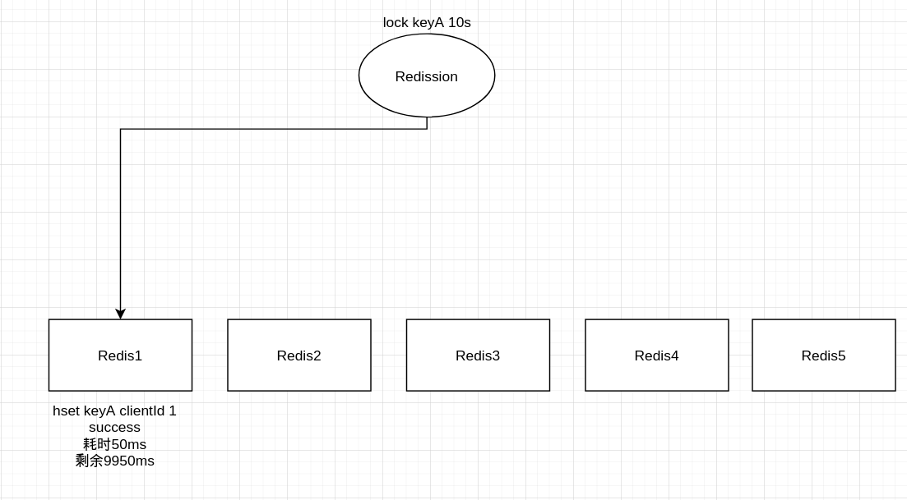
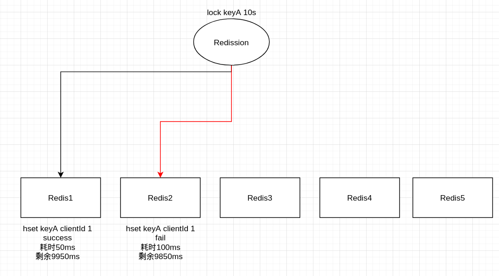
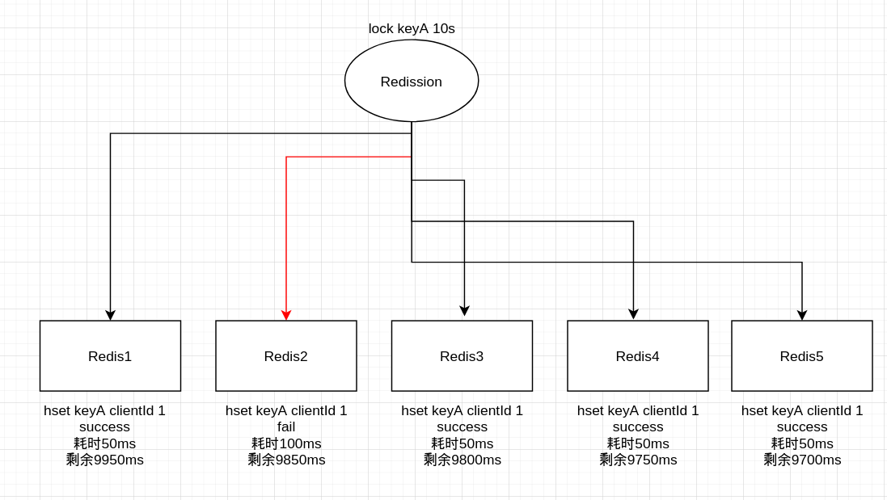
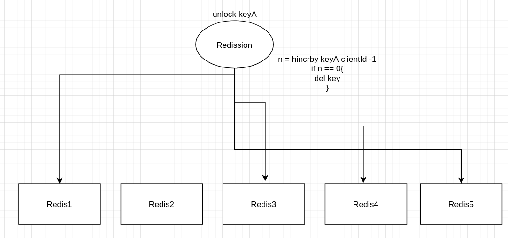

# setNx

目前在项目中（截止202211）使用的就是它，大致使用方式如下：

```java
public boolean lock(String key, Object value, long timeout, TimeUnit timeUnit) {
        if (timeout < 0) {
            timeout = 60;
        }
        boolean flag = valueOperations.setIfAbsent(key, toJson(value), Duration.ofSeconds(timeout));
        if (flag) {
            redisTemplate.expire(key, timeout, timeUnit);
        }
        return flag;
}
```

项目会这样使用，我猜原因是项目中的大部分锁竞争一般发生在同一时刻，对同一个key不会有**交替时间段重复竞争**的场景，并且**没有重入锁**的业务场景。不会面临以下问题：

1. 进程1上锁成功，ttl为60秒，锁超时后进程1还未结束任务，进程2上锁成功（没有锁续期，导致进程1和2同时进行任务）。
2. 进程1上锁成功，需要重入上锁，重入上锁失败（不可重入）。

如果要解决以上两个问题，需要使用Redission提供的锁机制。

# Redission

## 使用

大致使用方式如下（Java）：

```java
public void testRedission(){
    RedissoionClient client = new RedissionLock().newClient();
    RLock lock = client.getLock("lock_xxxxx_yyyy");
    lock.lock();
    // 执行安全的业务操作
    lock.unlock();
}
```

有点类似ReentrantLock的用法，在lock()和unlock()代码块之前执行线程安全的操作，Redission加锁核心依赖一段Lua脚本，通过这个脚本保证加锁的原子性，它的大致逻辑是：

1. 每个Redission客户端在启动时，会生成一个唯一客户端ID（前置条件）。
2. 判断锁名在Redis是否存在，如果存在且客户端ID不是自己，则返回失败，直至lockTimeout超时。或者订阅一个redis事件，等待锁过期。
3. 如果锁不存在，给锁key赋值一个哈希结构，key是客户端ID，value是重入次数，默认锁过期时间30秒。

## 锁续期

那Redission是如何实现锁续期呢？Redission有一个专门的watch dog线程，**它在没有指定锁ttl的时候才会触发**。watch dog会每10秒执行一条Lua脚本，大致逻辑是：

 	1. 判断某个key存不存在
 	2. 如果存在，则刷新这个key的ttl为30秒，返回true
 	3. 如果不存在，返回false

因为Redission是需要手动解锁的，只要任务还没执行完，锁会一直存在，watch dog也会一直续期。

## 可重入

当Redission进行lock操作时，会判断锁是否存在，如果哈希结构存放的客户端id与自己的id相等的话，Redission会将value值+1，反之解锁会-1，从而实现重入锁的功能。

## 问题

虽然Redission通过Lua脚本以及watch dog机制解决了锁续期和可重入的问题，但是在Redis主从故障转移的场景下，还是有可能会发生**锁丢失**的情况。比如锁是加上了，但同步给从节点之前主节点发生了宕机，从节点晋升主节点后是没有锁的，这时候其他进程上锁成功的话，会引发业务不安全问题。

对于锁丢失的问题，可以通过red lock来**尽量避免**。

# Red Lock

先下一个结论：因为红锁的Redis实例要求、以及无法进行锁续期等问题，生产上基本不使用红锁，最好采用Redission + 兜底补偿机制避免锁丢失问题

## 上锁过程

假如Redis集群有5个**独立的Redis服务**（这一点就说明红锁更多是理论层面，实际不可能会这样搭建），Redission想锁上keyA这把锁时，会依次往每个节点上锁：



上锁的耗时包含在锁过期时间内，假如Redis1上锁成功，耗时50ms，那么锁过期时间还有9950ms，接下来给Redis2进行上锁：



假设Redis2因为比如节点断连、或者keyA的uuid不匹配导致上锁失败，耗时100ms，那么锁超时时间还剩下9850ms，假设接下来的Redis3、Redis4、Redis5均上锁成功，均耗时50ms：



锁过期时间最终剩余9700毫秒，并且由于超过半数节点(≥ 5/2 + 1)个节点获取锁成功，此时Redission会认为上锁成功，**否则会删除节点上已经创建好的锁**。

Redission 的Red Lock获取锁的超时时间是100ms。

## 解锁过程

排除锁过期时间到达后自动消失的情况，Red Lock的主动解锁过程如下：



对每一个成功上锁的实例，执行一段Lua脚本，大致逻辑如下：

1. hincrby keyA clientId -1，获取-1后的值n
2. 如果n == 0，代表可重入次数已经没了，直接删除这个key

## 红锁的问题

1. 无法进行锁续期（没有watch dog机制）。
2. 需要独立的Redis实例，不适用于分片集群和主从集群。 

