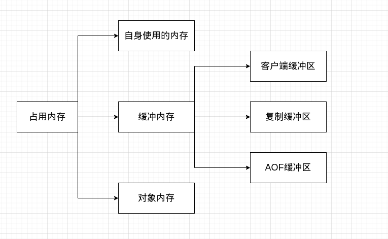

# Key的设计

1. 不要太长，尽量不要超过44字节，保持embstr编码存储。对于＞44字节的key，Redis采用raw编码存储，需要分配两次内存空间。
2. 尽量简洁，比如key=username:kjg:02021，可以改为key=u:kjg:02021进行存储。
3. 尽量不要包含特殊字符，比如空格、换行符、引号。

# 对象的存储与Redis数据结构

对于普通对象来说：

 	1. 通过json序列化组件，将对象序列化为json字符串，json字符串作为value保存到redis。比较简单粗暴，但是无法修改局部数据，要整个修改。**一般用在整体使用的缓存数据。**
 	2. 通过特性序列化手段，将属性名:属性值映射到hash结构进行保存。可以精确修改值，但序列化、反序列化过程要手动实现。**一般用在频繁修改的缓存数据，但实际项目上也少用（截止202211）.**

对于集合对象来说：

1. 通过json序列化组件，将对象序列化为json字符串，json字符串作为value保存到redis。需要考虑数据量的大小、以及有效时长，对于那些变化频率较高的不建议存到Redis。**像日更的报表数据就适合这种， 那些5min更新一次的大盘数据就不适合了**。

# Redis的内存回收策略

当Redis使用内存超出最大内存后，会执行内存回收策略，目的是**从内存清除部分数据，腾出足够的空间存放新数据**。在这一步涉及到数据的删除操作，有些数据可能不应该在此刻被删除，但还是被删了。主要有以下几种策略：

1. noeviction：默认策略，新写入操作会报错。**不建议**。
2. allkeys-lru：在键空间中，移除最近最少使用的 Key。**目前项目使用的就是它（截止202211）。**
3. allkeys-random：在键空间中，随机移除某个 Key。**不建议**。
4. volatile-lru：在设置了ttl的键空间中，移除最近最少使用的 Key。**很少用**
5. volatile-random：在设置了ttl的键空间中，随机移除某个 Key。**很少用，且不建议。**
6. volatile-ttl：在设置了ttl的键空间中，按过期时间顺序，删除即将过期的key。如果没有对应的key，则回退到noeviction策略。**很少用，且不建议。**

可以看之前写的[LRU](https://github.com/9029HIME/Algorithm/tree/master/leetCode/20221010_146_LRU_Cache)和[LFU](https://github.com/9029HIME/Algorithm/tree/master/leetCode/20221014_HARD_460_LFU_Cache)，复习一下它们的区别。

# Redis的内存大致划分

要知道Redis的内存使用，主要分为以下部分：

客户端缓冲区：存放工作线程待执行的指令、以及准备响应给客户端的结果。

复制缓冲区：主从同步期间，用来暂时保存同步数据的缓冲区。

AOF缓冲区：暂时存放aof指令的缓冲区，要么eversecond写入文件，要么交给OS自动写入文件。

对象内存：实际存储数据的区域。

# Redis的内存使用情况（查阅用）

在客户端通过info memory命令，可以获取redis内存使用情况，指标含义如下：

1. used_memory：通过libc或者jemalloc方法分配的字节数大小
2. used_memory_human：将used_memory格式转化为人类可读的值，以MB为单位
3. used_memory_rss：常驻集大小（resident set size，简写为rss）指的是在操作系统中看到的内存分配，以及通过UNIX工具top显示的结果
4. used_memory_peak：redis使用的峰值内存，以字节为单位
5. used_memory_peak_human：将used_memory_peak格式转化为人类可读的格式。以MB为单位
6. used_memory_lua：redis的lua子系统使用的字节数
7. mem_fragmentation_ratio：used_memory_rss与used_memory的比率

# 一些运维层面的安全建议（了解就好了）

1. 注意内外网访问权限，不要完全放开
2. 不要使用6379端口
3. 非root启动
4. 设置强密码