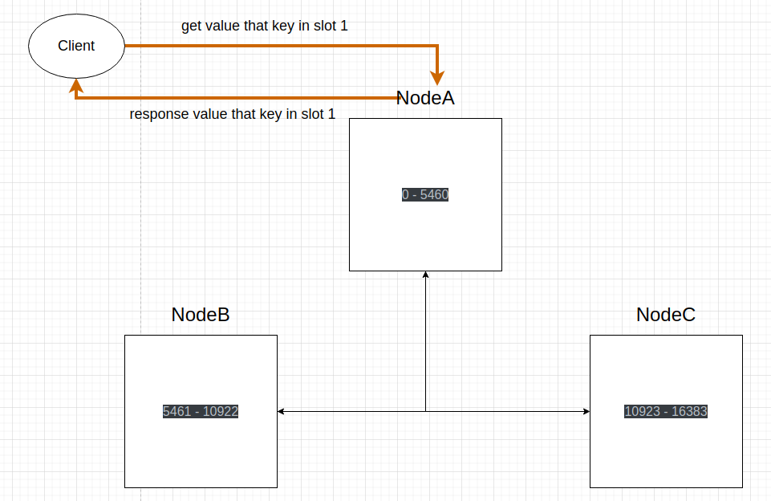
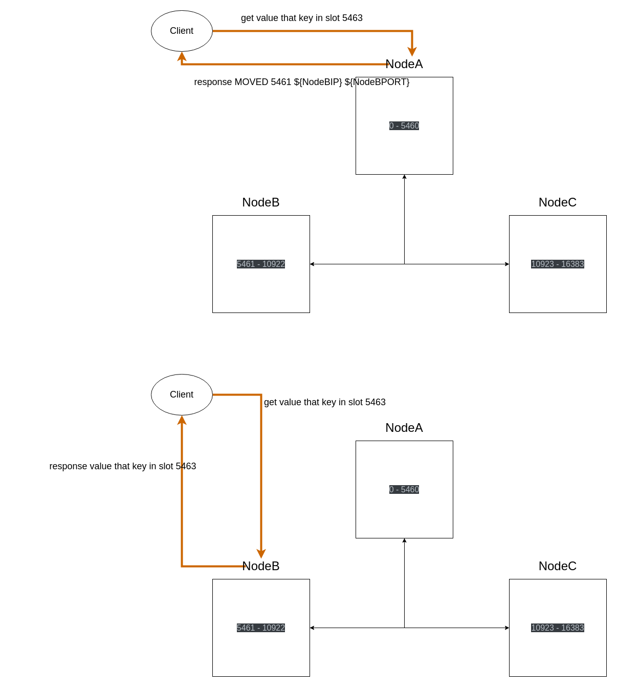

# 定义一个Redis Cluster

集群名叫R-Demo，有必要强调一点：Redis Cluster只是提供了数据分片能力，本身是不提供数据备份能力的，R-Demo的每个节均无配置从节点。

| 节点名 |   Slot范围    |
| :----: | :-----------: |
| Node A |   0 - 5460    |
| Node B | 5461 - 10922  |
| Node C | 10923 - 16383 |

# 客观下线与故障恢复领导者

在R-Demo中，Node之间会定期进行心跳检测，以维持集群的状态信息和高可用性。也就是说，每个Node都会定期向其他Node发送PING消息，其他Node在接收到PING消息后会回复PONG消息。如果一段时间内，一个Node没有回应其他节点的PING消息，或者没有主动发送PING消息，那么这个节点可能被认为是不可达或者宕机了。

假设NodeA发生了宕机，或者网络故障，NodeB和NodeC无法与NodeA通信，B和C发给A的PING请求没有及时得到PONG响应，它们将开始疑问NodeA的状态。这种情况下，NodeB和NodeC会将NodeA标记为"疑似下线"(PFAIL)。

然后，NodeB和NodeC将NodeA的PFAIL消息通过集群的**Gossip协议**告知其他节点。如果集群中超过半数的主节点**（在R-Demo中只有NodeB和NodeC）**在给定的时间窗口内也标记NodeA为"PFAIL"，那么NodeA将会被标记为"FAIL"，即确定下线。

当NodeA被标记为FAIL后，R-Demo会开启Slot迁移，将NodeA的Slot迁移到其他节点上，通常这个过程由第一个发现NodeA下线的节点，这个节点也被称为**故障恢复领导者节点**，这里假设为NodeB。

# Slot迁移（故障）

## 无从节点

具体的Slot重新分配策略可以有不同的实现方式。一个简单的策略是均匀分配，也就是将NodeA的Slot平均分配给其他的节点。在上面的的场景中，NodeA的5461个槽将被均匀分配给NodeB和NodeC。这样，每个节点最后将大致拥有相同数量的槽。

| 节点名 |    Slot迁移    |
| :----: | :------------: |
| NodeA  | 已下线，无slot |
| NodeB  |    0 - 8191    |
| NodeC  |  8192 - 16383  |

然而这只是其中一种情况，通过配置还可以实现这种效果，将NodeA所有的slot迁移到特定的节点上。

| 节点名 |    Slot迁移    |
| :----: | :------------: |
| NodeA  | 已下线，无slot |
| NodeB  |   0 - 10922    |
| NodeC  | 10923 - 16383  |

如果对迁移的不满意，可以通过命令的方式**指定slot的分布情况**或者**手动rebalance重新均匀分配（借助redis-cli）**

## 有从节点

还是那句话：Redis Cluster只是提供了数据分片能力，本身是不提供数据备份能力的。在无从节点的案例中，R-Demo只是将Slot的分布迁移到其他节点上，被迁移的Slot的数据还是存储在NodeA上，**也就是说当Slot迁移完成后原先存在于Slot的数据会丢失**，这是在生产环境中不希望看到的。

除了在创建R-Demo时会节点的从节点信息会被其他节点接收以外，在R-Demo运行期间为某个节点（NodeA）新增从节点时，新从节点的信息会随着心跳报文和Gossip传播到其他节点。这样，当NodeA宕机时，故障恢复领导者可以根据NodeA的从节点的偏移量状态选出一个新NodeA，新NodeA将会接管NodeA的所有Slot，同时新NodeA会作为原NodeA主从集群的Master，**这意味着Redis Cluster还承载了Sentinel Cluster的主从切换功能**。

值得注意的是，NodeA的新从节点信息随着心跳包文和Gossip传播到其他节点的**这个过程是AP行为**，可能由于网络原因NodeB接收不到这个心跳，如果在下一次心跳报文周期之前NodeA发生了宕机，而恰好NodeB又是故障恢复领导者，此时在NodeB眼中不存在这个NodeA的新从节点，这个新从节点也不会考虑在候选者的范围内（当然这种情况比较少见，也比较极端）。如果希望更主动地通知NodeB，那么可以考虑在NodeB上执行一些操作来刷新它的集群状态。比如，在NodeB上执行`CLUSTER MEET ${NodeA新从节点的IPPort}`命令，让NodeB和NodeA的新从节点进行一次握手。

## Slot的整体性

`cluster-require-full-coverage`是Redis Cluster的一个配置，当它为`yes`时，那么只有当所有的16384个slot都被集群中的节点所覆盖时，集群才能提供服务。如果有任何一个slot未被覆盖，那么整个Redis Cluster将无法正常对外提供服务。在上面的例子中，从`NodeA发生宕机`到由`故障恢复领导者迁移Slot成功`的过程中真个R-Demo将无法对外提供服务。

这个设置的目的是为了防止在Slot未完全覆盖的情况下进行数据操作，从而导致数据不一致。如果一个Slot的主节点下线，而这个Slot又没有被其他节点覆盖，那么对这个Slot的数据操作就会失败，如果允许这种操作，就可能会导致数据不一致。

所以，cluster-require-full-coverage 是一个权衡可用性和数据一致性的选项。如果更关心数据一致性，那么可以将其设置为yes。如果更关心可用性，那么可以将其设置为no，但这样可能会在某些情况下导致数据不一致。

## Slot迁移后故障机恢复

首先说结论：恢复后的故障机不会重新接管Slot，分析如下：

1. 如果故障机配置了从节点，从主从集群的角度考虑，当Master宕机后Slave会被晋升为New Master，当Old Master恢复后会自动成为New Master的Slave（原本是Sentinel Cluster的功能，后面Redis Cluster也实现了）。从Redis Cluster的角度考虑，它已经认为Old Master为Slave了，只要New Master还在，它仍然是承载Slot的节点。
2. 如果故障机没有配置从节点，只要完成了Slot迁移，即使故障机恢复Redis Cluster也不会将迁移成功的Slot归还回去。

## Slot迁移的完整过程（故障）

TODO

## Redis客户端访问正在迁移的Slot

在生产环境运行中，Slot迁移必然会对应用程序产生影响，不管是`宕机节点的Slot`还是`因为slot分布新方案而被迫迁移到其他节点的Slot`，Redis客户端在Slot迁移过程中访问里面的Key必然会失败，但是Redis Cluster做了巧妙的处理，可以尽量地提供集群的可用性：

1. Redis Cluster在迁移Slot之前，会拟定一份Slot分布的新方案，包括这个Slot原本所属的节点信息，Slot的新节点信息。
2. Redis客户端访问正在迁移的Slot，会出现"MOVED"错误，这个MOVED错误包含了Slot的新节点信息，提示客户端应该到新的节点去访问数据。
3. Redis客户端通常可以处理"MOVED"错误，自动将请求重定向到正确的节点，对上层应用透明。但如果客户端不能处理"MOVED"错误，可能需要在应用层进行处理。

MOVED错误的格式如下：

```
MOVED <hash slot> <ip>:<port>
```

比如，假设一个MOVED 错误消息是 MOVED 3999 127.0.0.1:6381，这表示Slot = 3999 的数据已经被移动到了 127.0.0.1:6381 这个地址的节点。Redis客户端会根据这个错误信息重新将请求发送到127.0.0.1:6381，当然，也有可能此时127.0.0.1:6381的Slot还未迁移完成，此时Redis客户端可以视情况决定`继续重试`或者`抛出异常`。

大多数Redis客户端库，例如Redis官方的redis-cli，Java的Jedis，Node.js的ioredis，Python的redis-py-cluster都支持MOVED错误的处理，**尽量使得上层应用对Slot迁移无感**。

# Redis Cluster处理请求的过程

值得注意的是，MOVED请求并不是Slot迁移的专属，以在`定义一个Redis Cluter`里创建的R-Demo为例，它的处理请求流程如下：

1. 计算key属于哪个Slot。
2. 判断Slot是否属于自身节点？
   1. 是：执行命令，返回结果
   2. 不是：向Redis客户端返回MOVED响应。Redis客户端根据MOVED响应重新请求目标节点。

**也就是说：其他Slot的请求并不是由Redis Cluster的某个节点进行转发，而是交给Redis客户端自行重定向**：





# Slot迁移（手动）

## 案例介绍

在Redis Cluster中，添加一个新的节点时，新的节点默认是不持有任何Slot的。也就是说，新节点在被添加到集群后，除非**通过命令**显式地将Slot迁移到该节点，否则它不会自动承担任何数据负载。常用的手动迁移Slot工具是redis-trib，**值得注意的是：redis-trib和failover leader（故障恢复领导者）的Slot迁移过程并不相同**，接下来重点介绍redis-trib的迁移过程。

| 节点名 |   Slot范围    |
| :----: | :-----------: |
| Node A |   0 - 5460    |
| Node B | 5461 - 10922  |
| Node C | 10923 - 16383 |
| Node D |       ~       |

在R-Demo额外引入Node D节点，默认情况下新加入的节点不持有任何Slot，为了方便演示，接下来通过CLUSTER ADDSLOTS将NodeC的16381 - 16383的Slot迁移到Node D，形成以下分布：

|   节点名   |     Slot范围      |
| :--------: | :---------------: |
|   Node A   |     0 - 5460      |
|   Node B   |   5461 - 10922    |
|   Node C   |   10923 - 16380   |
| **Node D** | **16381 - 16383** |

## 手动迁移过程

上面从NodeC迁移3个Slot到NodeD，redis-trib的Slot迁移过程是针对**单个Slot**进行的，也就是说，可以将上面的案例看成redis-trib先迁移16381 Slot，再迁移16382 Slot，再迁移16383 Slot，每个Slot的迁移逻辑相同，以16381 Slot为例：

1. redis-trib通过CLUSTER SETSLOT 16381 IMPORTING NodeC通知NodeD**接下来NodeC会迁移Slot 16381过来**。
2. redis-trib通过CLUSTER SETSLOT 16381 MIGRATING NodeD通知NodeC**接下来将Slot 16381迁移给NodeD**。
3. redis-trib对NodeC执行CLUSTER GETKEYSSINSLOT 16381 $count命令，获取最多$count个在NodeC属于Slot 16381的Key。举个例子，在NodeC迁移Slot之前Slot 16381一共有15个Key，如果$count = 5，那么每次都会从这15个Key里**依次获取5个Key**。
4. redis-trib逐个遍历3.获取的Key，然后对NodeC执行MIGRATE $NodeDIP $NodeDPort $Key 0 $timeout命令，将Key和Value**原子性地**从NodeC迁移到NodeD，要么迁移成功（NodeC不存在，NodeD存在），要么迁移失败（NodeC不存在）。
5. 反复执行3和4，直到NodeC中Slot 16381的所有Key和Value都被迁移到NodeD。**此时NodeD才真正认为Slot 16381迁移成功（在3和4的步骤中只认为“正在迁移”）。**
6. redis-trib通过CLUSTER SETSLOT 16381 NODE $NodeDIP将SLOT 16381的迁移情况广播给所有节点。

## 手动迁移与客户端访问

还是以迁移Slot 16381为例，假如此时Redis客户端访问Slot 16381的KeyA会发生什么？这里先假设Redis向NodeA发起GET KeyA：

1. Redis客户端向NodeA发起GET KeyA请求。

2. NodeA计算KeyA的Slot位置，发现KeyA在Slot 16381并且Slot 16381在NodeC。**注意！此时Slot 16381正在迁移，NodeA还不知道这个Slot的迁移目标节点是NodeD。**于是返回MOVED 16381 $NodeCIP:$NodeBPort。

3. Redis客户端根据2.的MOVED错误，重新向NodeC发起GET KeyA请求。

4. NodeC判断KeyA是否已经迁移到NodeD了（**注意上面说到迁移Key是原子操作**），如果未迁移，则直接向Redis客户端返回KeyA的Value；如果已迁移，则返回ASK错误。

   ASK错误的格式是`ASK $Slot $NodeIp:$NodePort`。

5. 客户端根据ASK错误重新向Node D发起ASKING请求和GET KeyA请求，最终获得KeyA的Value。
