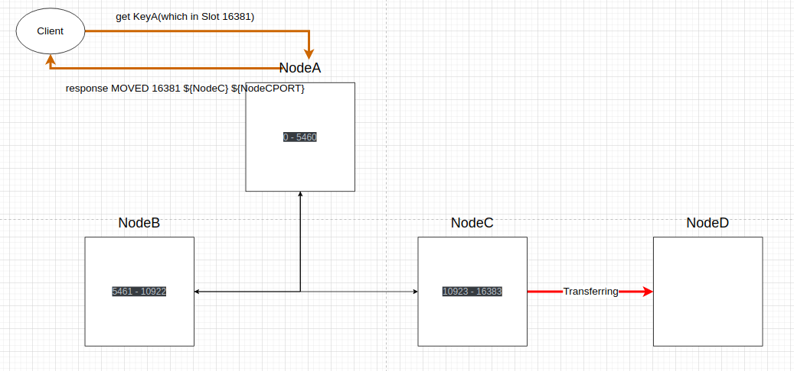
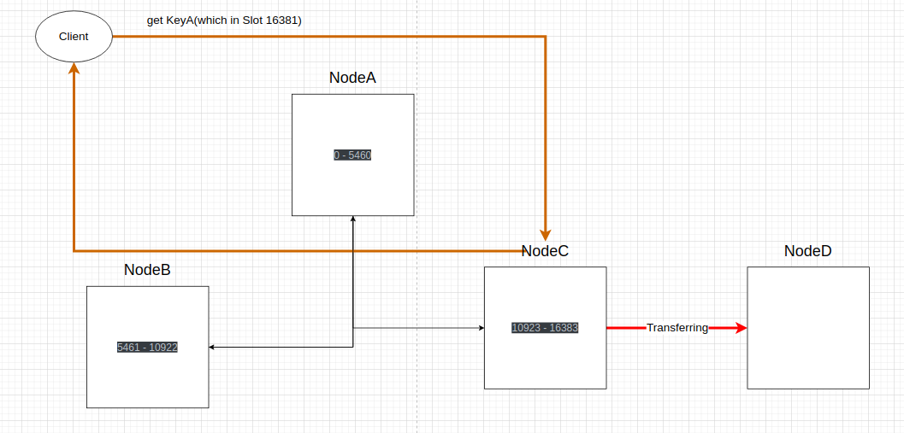
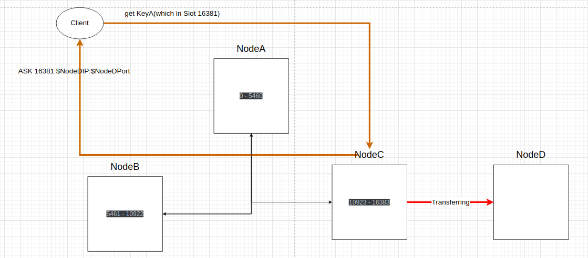
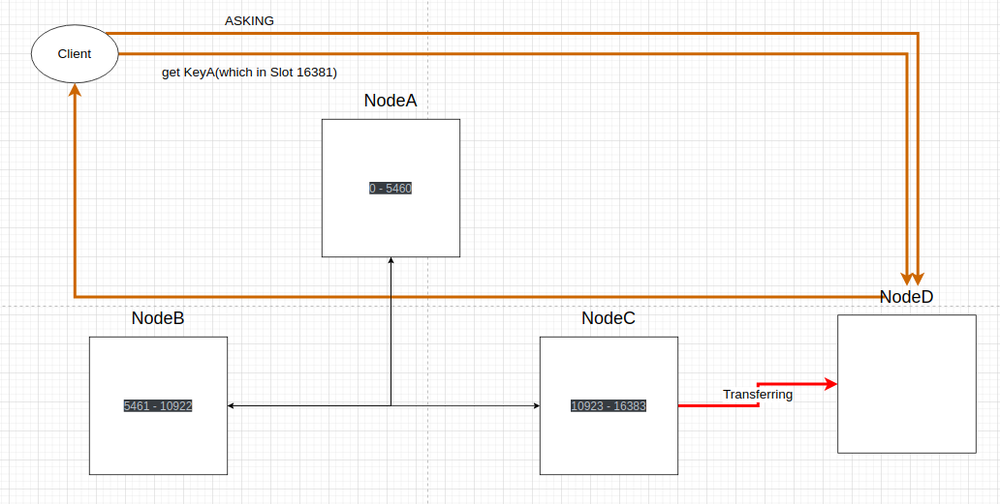

# 总结（看完再看）

## Redis Cluster的无感动态扩缩容

不管Redis Cluster有多少个节点，一个Cluster内固定有16384的Slot，它不像传统数据库的hash分库分表法会随着扩容和缩容影响hash基数，可以理解为：**对于Redis Cluster来说，它的hash基数固定为16384，扩容只是改变了Slot的分布情况**。

对于手动扩缩容，redis-trib通过MOVED错误和ASK错误保证Redis Client能够准确定位Key随着Slot扩缩容而改变的位置。

对于故障转移，在Slot成功被从节点或其他节点接管之前，Redis Client确实会请求这些Slot失败，但这毕竟是故障，所以不考虑在扩缩容的范围内。

## 一定要配置从节点

当NodeA在没有配置从节点的情况下发生宕机，即使Redis Cluster已经将NodeA标记为FAIL，也不会故障转移，**因为故障转移是由从节点主动发起和完成的，主节点在这个过程中只负责发现失效节点、广播FAIL、选举这3步**。在没有从节点的情况下只能进行手动缩容，并且数据会丢失。

## TODO

每个Redis Node维护了一个ClusterState的结构体，它包含了Slot在集群内的分布情况和可用状态。

每个Redis Node之前通过`消息`进行通信，`消息`是Redis Cluster中比较重要的结构。消息通过Gossip协议发送，每个节点通过消息更新自己的ClusterState，从而保证每个节点的集群视图是相对一致的。

# 定义一个Redis Cluster

集群名叫R-Demo，有必要强调一点：Redis Cluster只是提供了数据分片能力，本身是不提供数据备份能力的，R-Demo的每个节点均无配置从节点。

| 节点名 |   Slot范围    |
| :----: | :-----------: |
| Node A |   0 - 5460    |
| Node B | 5461 - 10922  |
| Node C | 10923 - 16383 |

# Redis Cluster处理请求的过程

以R-Demo为例，它的处理请求流程如下：

1. 计算key属于哪个Slot。
2. 判断Slot是否属于自身节点？
   1. 是：执行命令，返回结果
   2. 不是：向Redis客户端返回MOVED响应。Redis客户端根据MOVED响应重新请求目标节点。

**也就是说：其他Slot的请求并不是由Redis Cluster的某个节点进行转发，而是交给Redis客户端自行重定向**：

# 客观下线

在R-Demo中，Node之间会定期进行心跳检测，以维持集群的状态信息和高可用性。也就是说，每个Node都会定期向其他Node发送PING消息，其他Node在接收到PING消息后会回复PONG消息。如果一段时间内，一个Node没有回应其他节点的PING消息，或者没有主动发送PING消息，那么这个节点可能被认为是不可达或者宕机了。

假设NodeA发生了宕机，或者网络故障，NodeB和NodeC无法与NodeA通信，B和C发给A的PING请求没有及时得到PONG响应，它们将开始疑问NodeA的状态。这种情况下，NodeB和NodeC会将NodeA标记为"疑似下线"(PFAIL)。

然后，NodeB和NodeC将NodeA的PFAIL消息通过集群的**Gossip协议**告知其他节点。如果集群中超过半数的主节点**（在R-Demo中只有NodeB和NodeC）**在给定的时间窗口内也标记NodeA为"PFAIL"，那么NodeA将会被标记为"FAIL"，即确定下线。

当NodeA被标记为FAIL后，某个主节点（这里假设为NodeB）会向R-Demo广播FAIL消息，广播对象包括NodeA的从节点，每个节点根据这个FAIL消息进行下一步操作，可能是在客户端请求时返回失败，也有可能是从节点开始Slot迁移。

# Slot迁移（故障）

## 无从节点

在NodeA没有配置从节点的情况下，R-Demo不会开始故障转移，最终会导致0 - 5460这个范围的Slot不可用，**Redis Client连接NodeB或者NodeC请求0 - 5460这个范围的Key时会响应CLUSTERDOWN错误，代表这些Slot不可用**。如果开启了cluster-require-full-coverage yes，那么整个R-Demo也不可用。这也强调了在部署Redis Cluster时，为每个主节点配置至少一个从节点的重要性，以提高系统的可用性和容错能力。

在这种情况下，只能通过手动Slot迁移（下面会介绍）来恢复集群的可用性。

## 有从节点

除了在创建R-Demo时会节点的从节点信息会被其他节点接收以外，在R-Demo运行期间为某个节点（NodeA）新增从节点时，新从节点的信息会随着心跳报文和Gossip传播到其他节点。这样，当NodeA宕机时，从节点会发起选举，主节点可以根据NodeA的从节点的偏移量状态选出一个新NodeA，新NodeA将会接管NodeA的所有Slot，同时新NodeA会作为原NodeA主从集群的Master，**这意味着Redis Cluster还承载了Sentinel Cluster的主从切换功能**。

值得注意的是，NodeA的新从节点信息随着心跳包文和Gossip传播到其他节点的**这个过程是AP行为**，可能由于网络原因NodeB接收不到这个心跳，如果在下一次心跳报文周期之前NodeA发生了宕机，那么在投票阶段NodeB眼中不存在这个NodeA的新从节点，这个新从节点也不会考虑在候选者的范围内（当然这种情况比较少见，也比较极端）。如果希望更主动地通知NodeB，那么可以考虑在NodeB上执行一些操作来刷新它的集群状态。比如，在NodeB上执行`CLUSTER MEET ${NodeA新从节点的IPPort}`命令，让NodeB和NodeA的新从节点进行一次握手。

## 选举

1. 在上面的例子中，NodeB会广播R-Demo所有节点NodeA已下线的情况，当NodeA1（从）和NodeA2（从）收到NodeA宕机消息后，会向R-Demo所有节点广播一条CLUSTERMSG_TYPE_FAILOVER_AUTH_REQUEST消息。
2. 具有投票权的主节点收到CLUSTERMSG_TYPE_FAILOVER_AUTH_REQUEST消息后，先检查自己是否已投票，如果没有再确定自己的投票节点，最后向投票节点返回CLUSTERMSG_TYPE_FAILOVER_AUTH_ACK消息。
3. 当NodeA1或NodeA2在一定时间内没有收到CLUSTERMSG_TYPE_FAILOVER_AUTH_ACK，会向主节点重新广播CLUSTERMSG_TYPE_FAILOVER_AUTH_REQUEST，直到收到某个从节点的晋升广播或某个主节点的CLUSTERMSG_TYPE_FAILOVER_AUTH_ACK。

## 晋升

1. NodeA1或NodeA2收到CLUSTER MSG_FAILFAILOVER_AUTH_ACK，统计自己的票数，当发现自己的票数＞N/2 + 1时（这保证了只会有一个从节点的票数最多），就会认为自己是新的主节点，假设现在NodeA1的票数最多。
2. NodeA1将自己的节点标识设置为PFAIL和FAILOVER状态，表示自己正在尝试进行故障转移。
3. NodeA1接管原主节点的所有槽，这个过程包括更新自身的槽映射信息，以及向集群广播CLUSTER MSG_UPDATE消息，告知其他节点自己已经接管了这些槽。直到所有其他主节点都确认接收到这个消息。这一步是为了确保所有节点都能知道NodeA1已经接管了0 - 5460。**已经收到UPDATE信息的主节点可以正确响应0 - 5460的MOVED信息给客户端。**
4. NodeA1将自己的节点标识状态改为UP，表示已经成功晋升为主节点。

**不管从选举还是晋升角度上看，故障转移的主要发起方是从节点，由从节点来发起投票，发起晋升。在故障转移的过程中主节点只负责发现失效节点、广播FAIL消息、投票。**

## Slot的整体性

`cluster-require-full-coverage`是Redis Cluster的一个配置，当它为`yes`时，那么只有当所有的16384个slot都被集群中的节点所覆盖时，集群才能提供服务。如果有任何一个slot未被覆盖，那么整个Redis Cluster将无法正常对外提供服务。在上面的例子中，从`NodeA发生宕机`到由`故障恢复领导者迁移Slot成功`的过程中真个R-Demo将无法对外提供服务。

这个设置的目的是为了防止在Slot未完全覆盖的情况下进行数据操作，从而导致数据不一致。如果一个Slot的主节点下线，而这个Slot又没有被其他节点覆盖，那么对这个Slot的数据操作就会失败，如果允许这种操作，就可能会导致数据不一致。

所以，cluster-require-full-coverage 是一个权衡可用性和数据一致性的选项。如果更关心数据一致性，那么可以将其设置为yes。如果更关心可用性，那么可以将其设置为no，但这样可能会在某些情况下导致数据不一致。

# Slot迁移（手动）

## 案例介绍

在Redis Cluster中，添加一个新的节点时，新的节点默认是不持有任何Slot的。也就是说，新节点在被添加到集群后，除非**通过命令**显式地将Slot迁移到该节点，否则它不会自动承担任何数据负载。常用的手动迁移Slot工具是redis-trib，**值得注意的是：redis-trib和failover leader（故障恢复领导者）的Slot迁移过程并不相同**，接下来重点介绍redis-trib的迁移过程。

| 节点名 |   Slot范围    |
| :----: | :-----------: |
| Node A |   0 - 5460    |
| Node B | 5461 - 10922  |
| Node C | 10923 - 16383 |
| Node D |       ~       |

在R-Demo额外引入Node D节点，默认情况下新加入的节点不持有任何Slot，为了方便演示，接下来通过CLUSTER ADDSLOTS将NodeC的16381 - 16383的Slot迁移到Node D，形成以下分布：

|   节点名   |     Slot范围      |
| :--------: | :---------------: |
|   Node A   |     0 - 5460      |
|   Node B   |   5461 - 10922    |
|   Node C   |   10923 - 16380   |
| **Node D** | **16381 - 16383** |

## 手动迁移过程

上面从NodeC迁移3个Slot到NodeD，redis-trib的Slot迁移过程是针对**单个Slot**进行的，也就是说，可以将上面的案例看成redis-trib先迁移16381 Slot，再迁移16382 Slot，再迁移16383 Slot，每个Slot的迁移逻辑相同，以16381 Slot为例：

1. redis-trib通过CLUSTER SETSLOT 16381 IMPORTING NodeC通知NodeD**接下来NodeC会迁移Slot 16381过来**。
2. redis-trib通过CLUSTER SETSLOT 16381 MIGRATING NodeD通知NodeC**接下来将Slot 16381迁移给NodeD**。
3. redis-trib对NodeC执行CLUSTER GETKEYSSINSLOT 16381 $count命令，获取最多$count个在NodeC属于Slot 16381的Key。举个例子，在NodeC迁移Slot之前Slot 16381一共有15个Key，如果$count = 5，那么每次都会从这15个Key里**依次获取5个Key**。
4. redis-trib逐个遍历3.获取的Key，然后对NodeC执行MIGRATE $NodeDIP $NodeDPort $Key 0 $timeout命令，将Key和Value**原子性地**从NodeC迁移到NodeD，要么迁移成功（NodeC不存在，NodeD存在），要么迁移失败（NodeC不存在）。
5. 反复执行3和4，直到NodeC中Slot 16381的所有Key和Value都被迁移到NodeD。**此时NodeD才真正认为Slot 16381迁移成功（在3和4的步骤中只认为“正在迁移”）。**
6. redis-trib通过CLUSTER SETSLOT 16381 NODE $NodeDIP将SLOT 16381的迁移情况广播给所有节点。

## 手动迁移与客户端访问

还是以迁移Slot 16381为例，假如此时Redis客户端访问Slot 16381的KeyA会发生什么？这里先假设Redis向NodeA发起GET KeyA：

1. Redis客户端向NodeA发起GET KeyA请求。

2. NodeA计算KeyA的Slot位置，发现KeyA在Slot 16381并且Slot 16381在NodeC。**注意！此时Slot 16381正在迁移，NodeA还不知道这个Slot的迁移目标节点是NodeD。**于是返回MOVED 16381 $NodeCIP:$NodeBPort。

3. Redis客户端根据2.的MOVED错误，重新向NodeC发起GET KeyA请求。

4. NodeC先判断KeyA是否存在，如果不存在再判断KeyA是否已经迁移到NodeD了（**注意上面说到迁移Key是原子操作**），如果未迁移，则直接向Redis客户端返回KeyA的Value；如果已迁移，则返回ASK错误。

   ASK错误的格式是`ASK $Slot $NodeIp:$NodePort`。

5. 客户端根据ASK错误重新向Node D发起ASKING请求和GET KeyA请求，最终获得KeyA的Value。

假设Redis客户端连接NodeA，获取正在迁移的Slot 16381的KeyA，流程图会是这样：

Client向NodeA获取KeyA，虽然此时NodeC和NodeD正在做Slot迁移，但对于NodeA来说Slot 16381仍在NodeC，于是返回MOVED。

于是Client向NodeC获取KeyA，NodeC会先判断这个KeyA是否已迁移到NodeD了，假设还在NodeC，那么NodeC会直接返回结果。

如果KeyA已经被迁移到NodeD，那么NodeC会给Client响应ASK错误，告知Client去找NodeD。

于是Client先向NodeD发出ASKING命令，接着获取KeyA，最终NodeD直接返回结果。

## ASK与MOVED

MOVED错误是`连接节点`发现Key计算出来Slot位置不在自身时，告知Client正确位置用的。而ASK错误是`源节点`发现Key已经被迁移出去时，告知Client `Key的目标节点`用的。

对于`Key目标节点`的数据访问请求，在默认情况下会找不到这个Key，并返回一个MOVED，陷入`目标节点`和`源节点`的死循环。但如果在数据访问前Client向目标节点发送了ASKING请求，目标节点会标记Client为`REDIS_ASKING`。这样当下次数据访问请求到达时，目标节点发现Key不存在，但Client有`REDIS_ASKING`标识，于是目标节点会检查正在迁移的SLOT是否存在Key并返回结果。值得注意的是，REDIS_ASKING是一次性的，执行完命令后目标节点会reset这个Client的REDIS_ASKING标识，**这意味着每次ASK请求之前都要发送一次ASKKING请求**。

# Slot迁移后故障机恢复

首先说结论：恢复后的故障机不会重新接管Slot，分析如下：

1. 如果故障机配置了从节点，从主从集群的角度考虑，当Master宕机后Slave会被晋升为New Master，当Old Master恢复后会自动成为New Master的Slave（原本是Sentinel Cluster的功能，后面Redis Cluster也实现了）。从Redis Cluster的角度考虑，它已经认为Old Master为Slave了，只要New Master还在，它仍然是承载Slot的节点。
2. 如果故障机没有配置从节点，只要完成了Slot手动迁移，即使故障机恢复，Redis Cluster也不会将迁移成功的Slot归还回去。
