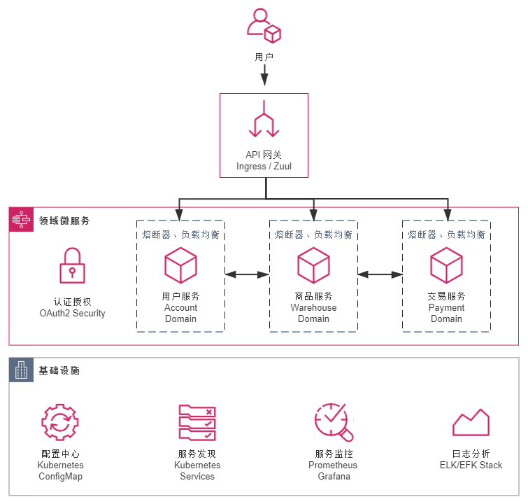
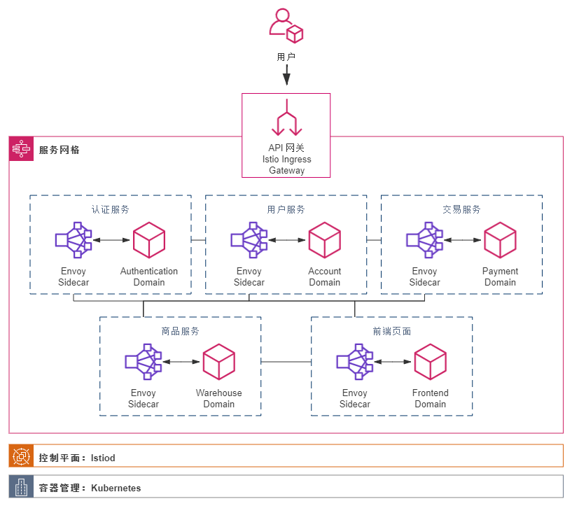

# 单体

常见的普通SSH、SSM、SpringBoot应用。

# 普通集群

`单体`的replica版，提升了系统的可用性，通过成熟的网关（如Nginx + Lua）提供类似Failover的能力。

# 微服务集群

是一个很大的概念，SpringCloud只是一个由Spring定义的微服务工程规范，SpringCloud Netflix和SpringCloud Alibaba是基于SpringCloud规范派生出来的具体实现。从广义上看，gRPC应用（或者Dubbo）+第三方服务注册发现组件+第三方网关组件+第三方服务治理组件也能称为一个微服务架构。微服务的价值是`业务拆分`，将不同业务的代码解耦到不同业务系统，运行在微服务工程框架上，使得整个业务流程串联起来。

集群是微服务的高可用体现，当然可以做到一个应用只部署一台实例，但生产往往会采用集群部署。

微服务最大的痛点是将`进程内不同线程`或`物理机内不同进程`的通信转变为`跨网段通信`，这受到`可靠通信`的限制，同一个业务流程落实到微服务上，会比单体面临更多问题，如服务不可用兜底、分布式事务、限流措施、安全认证、分布式存储等...

微服务集群（以SpringCloud为例）解决了扩容缩容、独立部署、运维和管理等问题，但开发运维的成本却提高了，不仅是开发，连运维也要明白什么是配置中心、服务发现、网关、熔断、负载均衡，并且这些组件都是有独立的进程或非异构语言依赖运行，如Nacos、Gateway、Sentinel、Hystrix、Ribbon、Feign。

总的来看：普通微服务工程的基础设施与业务系统耦合度较高，且不同语言，甚至同语言不同生态的组件也不太一样。

# 后微服务集群

通过K8S+容器化部署的组合，实现微服务的`基础设施层`，K8S和SpringCloud在功能上有许多相似、甚至重合的地方，这是毋容置疑的。但总的来看，K8S的层级更偏向`基础设施层`，而非业务系统的一部分。通过容器化部署打通业务系统与K8S的桥梁，使得K8S展现出类似`微服务的操作系统`的作用。

总的来说，使用K8S + SpringBoot可以实现近似SpringCloud全家桶的效果： 

|               |    K8S    | SpringCloud Alibaba |
| :-----------: | :-------: | :-----------------: |
|   配置中心    | ConfigMap |        Nacos        |
|   服务发现    |  Service  |        Nacos        |
|   负载均衡    |  Service  |       Ribbon        |
|   远程调用    |  Service  |      OpenFeign      |
|   服务网关    |  Ingress  |       Gateway       |
| 服务熔断/限流 |    无     |      Sentinel       |
|   认证授权    |    无     |   Spring Security   |

关于远程调用，业务系统仍可使用OpenFeign，但作用仅是在url属性标注目标服务的K8S Service Name，从而触发运行在K8S环境的容器的HTTP请求路由，并由OpenFeign代码完成RPC的功能。

熔断与限流是K8S无法完美实现的功能，它将会被后面的`服务网格`所完善与增强。至于认证授权，本质是强业务耦合的功能，即使是SpringCloud也无法完美解决，还是需要独立开发代码（基于Spring Security）。

# 服务网格

服务网格可以分为2大模块：

1. 数据平面

   即请求的入口，出口，也就是Sidecar本身，通过流量挟持将容器内的HTTP请求转发到目标K8S Service上，最终落到某个Pod的业务系统上。除了请求转发、负载均衡外，还能提供熔断降级、请求监控等高级功能。

2. 控制平面

   可以理解为数据平面的注册中心，由控制平面提供服务发现功能。

这份笔记主要讲服务架构的迭代，服务网格的重点放在后面细讲，在K8S的基础上，加入了服务网格，增强了远程调用、限流、熔断、监控的功能，服务网格的侧重点在`可靠、可监控、可降级的远程通信`，旨在配合K8S打一套组合拳，全面覆盖SpringCloud提供的功能。

**落实到每个应用系统本身，已经与单体应用没有太大区别了**，因为许多高级的微服务特性已交由容器化部署、K8S、Istio帮我们实现了。开发人员可以花更多时间在业务代码上，由专业的DEVOPS工程师（虽然大概率和开发人员是同一人）来统筹和管理这些单体业务系统。

|               |     K8S + Istio + Envoy      | SpringCloud Alibaba |
| :-----------: | :--------------------------: | :-----------------: |
|   配置中心    |          ConfigMap           |        Nacos        |
|   服务发现    | Service + Istiod（控制平面） |        Nacos        |
|   负载均衡    | Envoy（数据平面，即Sidecar） |       Ribbon        |
|   远程调用    | Envoy（数据平面，即Sidecar） |      OpenFeign      |
|   服务网关    |    Istio Ingress Gateway     |       Gateway       |
| 服务熔断/限流 | Envoy（数据平面，即Sidecar） |      Sentinel       |
|   认证授权    |   Istio + Spring Security    |   Spring Security   |

# 无服务

无服务架构（Serverless）与微服务架构本身没有继承替代关系，它们并不是同一种层次的架构。但TODO