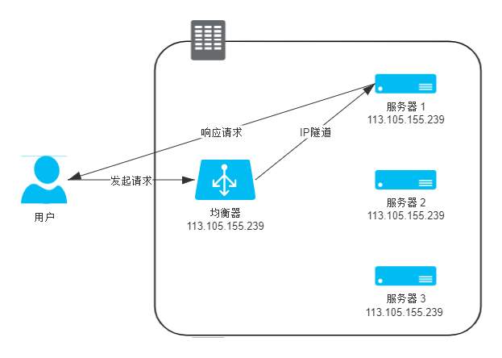
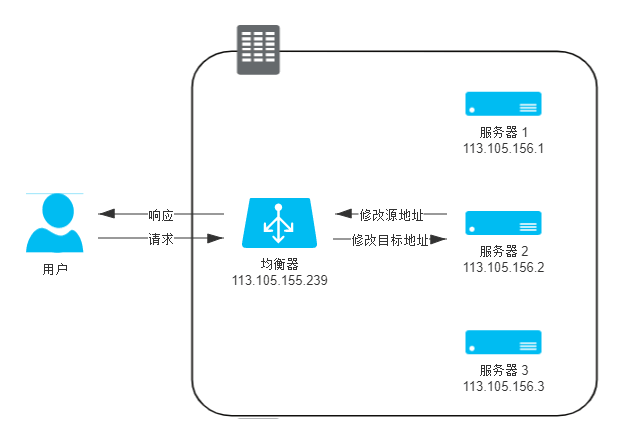

# RPC

It makes remote call appear like native call by abstracting some details,  which makes us don't find that some API invocations trigger an HTTP request(or other high-level protocol over TCP/IP). Actually, RPC doesn't present a certain tech stack or third-party component, rather, it presents a technical thought, so there is no necessity to discuss the differences between RPC and HTTP.

RPC is transparent across different processes or business-systems, but it also raises many questions which could be divided to 2 categories:

1. HOW TO HANDLE THE EXCEPTION WHILE PRODUCER PROCESS THE BUSINESS FLOW.
2. HOW TO HANDLE THE EXCEPTION OF NETWORK.

As a consumer, we need to consider about above questions and deal with them in some suitable ways, **which usually invades the content of business-code**. 

A mature RPC component should focus on some features like `message compression ratio`, `message compress performance`, `object-oriented invocation`. There are various and mature RPC components like OpenFeign, Dubbo, gRPC, etc. Some of them are confined to specific language, while the others support across heterogeneous language. some of them are based on HTTP, while the others base on the other protocol over TCP/IP.

# Global Transaction

Distributed Transaction like 2PC and 3PC has a major drawback which it thinks all results are consistent only when all nodes do commit their native transaction.

Traditional Distributed Transaction needs a `coordinator` to complete the whole process. one of the most famous ones is Seata, which include four mode like XA(2PC), AT(rely on the usage of application-level for global lock), TCC(completing transaction over coordinator schedules code, it also invade code deeply), SAGA(is off the beat).

There also be an untraditional coordinator like MQ , it can make whole process of transaction asynchronous base on soft-state and eventual consistency. **But it needs the support of soft-state from requirement and design like A, A-ing(soft-state), B instead of A, B.** besides, the eventual consistency of this kind of global transaction depends on the availability of MQ.

It is same as RPC, Global Transaction also has availability question as request pass through different processes and it is unavoidable, so it is important for mature coordinator to have some extra features like `failure monitoring`, `failure retry`, `failure alarm` so that we could fix it easily to achieve eventual consistency  as a developer, **not just give it to coordinator and let it go unchecked**.

# HTTP

## features

HTTP1.1 has a feature of reuse of TCP connection, but it also raise a blocking queue question, that acts like the request in the back will be blocked when the head request is blocking as they all use same connection.

in HTTP2, the min-unit of message is changed from `request` to `frame`, it means one logical request can be divide into multiple frames and send them out through different actual requests. frames from same logical request can prove itself which logical request it belongs to by a header called a name like `streamId`(or the other, I forgot it) and they can be sent out by different times in one connection, it achieves the effect of avoiding blocking queue question(of course, the Server also be needed to assemble frames to completable stream)

## compression

In previous time, It is like file was compressed in advance and was put in file system, and recording a compression type in Response Header while responding data to client, and client will also decompress response data through what compression type presents, what I say above is called `Static Precompression`.

But now it is almost basically using Compress-In-Time(like Just-In-Time) while transferring data, but there is a drawback like client doesn't recognize exactly what size this resource is. Therefore, A Response Header named `Transfer-Encoding: chunked` was added while HTTP1.1, it represents this kind of Response is named `Chunked Transfer` and TCP/IP frame will record data through type similar to `TLV`, it means every chunk contain both length value through hexadecimal and corresponding data payload, the length occupy first line, and the second line begins with data, the resource is ended with the chunk recoding zero, like sending:

```
This is the data in the first chunk
and this is the second one
```

above text, it will finally send following response messages:

```http
HTTP/1.1 200 OK
Date: Sat, 11 Apr 2020 04:44:00 GMT
Transfer-Encoding: chunked
Connection: keep-alive

25(as 0x25, which is the hexadecimal of 37, the same below)
This is the data in the first chunk\r\n
```

```http
HTTP/1.1 200 OK
Date: Sat, 11 Apr 2020 04:44:00 GMT
Transfer-Encoding: chunked
Connection: keep-alive

1C
and this is the second one
```

```http
HTTP/1.1 200 OK
Date: Sat, 11 Apr 2020 04:44:00 GMT
Transfer-Encoding: chunked
Connection: keep-alive

0
```

# Load Balance

## Data Link layer Load Balance

It is like client sends out request to Load Balancer(hereafter call LB) and then LB could modify the MAC addr In MAC message through load balance strategy, so it achieves the effect of transferring message to destination server, and it only affect the process of sending out, not responding, destination server still respond directly with data to the client , it means client can not be deployed across different network segment from server and LB, and all servers need to use the same virtual IP as LB's. this kind of load balance mode construct a relationship like triangle, so it is also called `Direct Server Return`, it is like:


## Network Layer Load Balance-IP Tunnel

Layer 3 Switch regards original IP message as a payload, and set additional headers into it, and the new headers contain the destination server's ip addr after applying load balance strategy(it seems like nesting dolls). But it means the destination server should also have the capacity of disassembling the additional headers from IP message through IP tunnel protocol(and nearly all the released linux have it). it is similar to what I said above about `Data Link layer Load Balance`, they are both like `Direct Server Return`, just to turn over the consumption of disassembling from LB to server, and their drawbacks are same. 



## Network Layer Load Balance-NAT

It is like it getting rid of `Direct Server Return`, so it doesnt need disassembling and same virtual IP as LB. it just needs have its destination addr changed to real addr by LB during sending data and responding data . no need for IP tunnel protocol and same virtual IP, just need to change the addr in IP message. and there also is a similar method named SNAT to achieve this by changing both source addr and destination addr in IP message . though NAT and SNAT both eliminate `Direct Server Return`, it is obvious that basically all the stress are concentrated on NAT-LB, so there will be significant consumption lost when the pressure of NAT-LB is high. This is often reflected in the situation like some people is downloading movies and the others may experience slower speeds.



